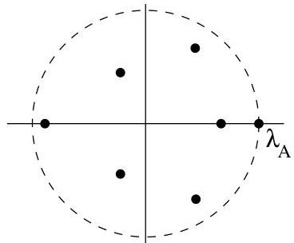

II.2. Théorie de Perron-Frobenius

En conclusion, dans  $G$ , les sommets de  $V_{1}$  (resp. de  $V_{2}$ ) sont joints entre eux par des chemins de longueur paire exclusivement. En particulier, il n'y a aucune arête entre deux sommets de  $V_{1}$  (resp.  $V_{2}$ ). De plus, les sommets de  $V_{1}$  sont joints aux sommets de  $V_{2}$  par des chemins de longueur impaire exclusivement. Ceci montre que  $G$  est biparti.

Dans le cas d'une matrice primitive, les assertions du théorème de Perron-Frobenius sont encore renforcées (les trois premières étant inchangées).

Théorème II.2.7 (Perron). Soit  $A \geq 0$  une matrice carrée primitive de dimension  $n$ .

$\triangleright$  La matrice  $A$  possède un vecteur propre  $v_{A} \in \mathbb{R}^{n}$  (resp.  $w_{A} \in \mathbb{R}^{n}$ ) dont les composantes sont toutes strictement positives et correspondant à une valeur propre  $\lambda_{A} &gt; 0$ ,

$A v_{A} = \lambda_{A} v_{A}$  (resp.  $\widetilde{w_{A}} A = \lambda_{A} \widetilde{w_{A}}$ ).

$\triangleright$  Cette valeur propre  $\lambda_{A}$  possède une multiplicité algébrique (et géométrique) simple.
$\triangleright$  Tout vecteur propre de  $A$  dont les composantes sont strictement positives est un multiple de  $v_{A}$ .
Toute autre valeur propre  $\mu \in \mathbb{C}$  de  $A$  est telle que  $|\mu| &lt; \lambda_A$ .
$\triangleright$  Soit  $B$  une matrice réelle à coefficients positifs ou nuls de même dimension que  $A$ . Si  $B \leq A$ , alors pour toute valeur propre  $\mu$  de  $B$ , on a  $|\mu| \leq \lambda_A$  et l'égalité a lieu si et seulement si  $A = B$ .

Ainsi, la valeur propre de Perron  $\lambda_{A}$  est l'unique valeur propre dominante. Toute autre valeur propre de  $A$  a un module strictement inférieur à  $\lambda_{A}$ . On a donc un résultat plus fort que dans le cas irréductible (c'est assez naturel puisque les hypothèses sont plus fortes).

FIGURE II.5. Disposition des valeurs propres d'une matrice primitive.

Traitons à présent deux exemples. Nous y avons choisi des graphes orientés. Des constatations analogues peuvent naturellement être obtenues dans le cas non orienté.