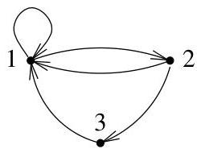
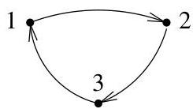

Chapitre II. Un peu de théorie algébrique des graphes

FIGURE II.6. Un graphe avec une matrice d'adjacency primitive.

$A(G) = \left( \begin{array}{lll}1 &amp; 1 &amp; 0\\ 1 &amp; 0 &amp; 1\\ 1 &amp; 0 &amp; 0 \end{array} \right)$

Example II.2.8 (Cas primitif). Considérons le graphe de la figure II.6 et la matrice d'adjacence correspondante. La matrice  $A(G)$  est primitive. En effet, on a

$A(G)^{2} = \left( \begin{array}{lll}2 &amp; 1 &amp; 1\\ 2 &amp; 1 &amp; 0\\ 1 &amp; 1 &amp; 0 \end{array} \right)$  et  $A(G)^{3} = \left( \begin{array}{lll}4 &amp; 2 &amp; 1\\ 3 &amp; 2 &amp; 1\\ 2 &amp; 1 &amp; 1 \end{array} \right) &gt; 0.$

Il existe donc un chemin de longueur 3 joignant toute paire de sommets. Par exemple, on a les chemins suivants :

$1\to 1\to 1\to 1$  ，  $1\to 1\to 1\to 2$  ，  $1\to 1\to 2\to 3$
$2\to 1\to 1\to 1$  ，  $2\to 1\to 1\to 2$  ，  $2\to 1\to 2\to 3$
$3\to 1\to 1\to 1$  ，  $3\to 1\to 1\to 2$  ，  $3\to 1\to 2\to 3$

Des valeurs approchées de valeurs propres de  $A(G)$  sont

$\lambda_{A}\simeq 1.83929$  ，  $\lambda_{2}\simeq -0.41964 + 0.60629i$  et  $\lambda_3\simeq -0.41964 - 0.60629i$  et  $|\lambda_2| = |\lambda_3| &lt;   \lambda_A$

Example II.2.9 (Cas irreductible). Considérons à présent le graphe de la figure II.7 et la matrice d'adjacence correspondante. Il est clair que le

FIGURE II.7. Un graphe avec une matrice d'adjacence irreductible.

$A(G) = \left( \begin{array}{lll}0 &amp; 1 &amp; 0\\ 0 &amp; 0 &amp; 1\\ 1 &amp; 0 &amp; 0 \end{array} \right)$

graphe est f. connexe et donc, la matrice  $A(G)$  est au moins irréductible. Cependant, un chemin de longueur  $k$  joint les sommets 1 et 2 si et seulement si un chemin de longueur  $k + 1$  joint les sommets 1 et 3. Il n'existe donc pas d'entier  $n$  pour lequel tout sommet peut être joint à tout autre sommet par un chemin de longueur  $n$ . La matrice  $A(G)$  n'est donc pas primitive. On pourrait aussi s'en convaincre en montrant que, pour tout  $n$ ,

$A(G)^{3n} = \left( \begin{array}{lll}1 &amp; 0 &amp; 0\\ 0 &amp; 1 &amp; 0\\ 0 &amp; 0 &amp; 1 \end{array} \right), A(G)^{3n + 1} = \left( \begin{array}{lll}0 &amp; 1 &amp; 0\\ 0 &amp; 0 &amp; 1\\ 1 &amp; 0 &amp; 0 \end{array} \right), A(G)^{3n + 2} = \left( \begin{array}{lll}0 &amp; 0 &amp; 1\\ 1 &amp; 0 &amp; 0\\ 0 &amp; 1 &amp; 0 \end{array} \right).$