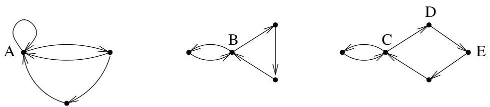

II.2. Théorie de Perron-Frobenius

Ainsi, si on pose  $\mathcal{N} = \sup_{i,j} N_{i,j}$ , alors  $A^{\mathcal{N}} &gt; 0$  et  $A$  d'être primitive.

Réciproquement si  $A$  est primitive,  $A$  est nécessairement irréductible et pour  $k$  suffisamment grand et pour tout indice  $i$  de  $A$ ,  $[A^k]_{i,i} &gt; 0$  et  $[A^{k+1}]_{i,i} &gt; 0$ . Le p.g.c.d. de  $k$  et de  $k+1$  étant 1, la conclusion en découle.

Exemple II.2.22. Terminons par une application des résultats precedents et considérons les graphes représentés à la figure II.8. Le sommet  $A$  appar-

FIGURE II.8. Trois graphes f. connexes.

tient visiblement à un cycle de longueur 1 (une boucle). Par conséquent, sa période vaut 1 et le graphe est primitif au vu de la proposition précédente. Le sommet  $B$  appartient quant à lui à un cycle de longueur 2 et à un cycle de longueur 3. Ainsi, le p.g.c.d. des longueurs des cycles passant par  $B$  vaut 1 et le graphe est encore une fois primitif. En particulier, cela signifie que pour tout  $n$  suffisamment grand, il existe un chemin de longueur  $n$  entre tout couple de sommets. Enfin, tout cycle contenant  $C$  est de longueur  $4p + 2q$ ,  $p, q \geq 0$ . On en conclus que la période des différents sommets de ce dernier graphe vaut 2. Pour terminer cet exemple, notons encore que les chemins joignant  $D$  à  $E$  sont de longueur 1, 5, 7, 9, ... ainsi on dispose d'un chemin entre  $D$  et  $E$  si et seulement si sa longueur est de la forme  $1 + 2n$  avec  $n \geq 2$  ce qui illustré parfaitement la seconde partie du théorème II.2.19.

Signalons sans démonstration un dernier résultat, sorte de réciproque au théorème de Perron-Frobenius.

Proposition II.2.23. Si  $A \geq 0$  est une matrice irréductible possédant une valeur propre dominante  $\lambda$  (i.e., pour toute valeur propre  $\mu \neq \lambda$  de  $A$ ,  $|\mu| &lt; \lambda$ ), alors  $A$  est primitive.

2.2. Estimation du nombre de chemins de longueur  $n$ . Le théorème de Perron permet de donner le comportement asymptotique du nombre de chemins de longueur  $n$  joignant deux sommets quelconques d'un graphe dont la matrice d'adjacence est primitive.