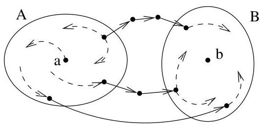
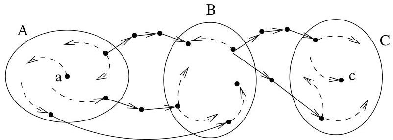

Chapitre II. Un peu de théorie algébrique des graphes

FIGURE II.9. Deux composantes f. connexes.

- Si  $\lambda_{A} = \lambda_{B}$ , alors
$c_{a,b}(n)\asymp n\lambda^n$

- Sinon,  $\lambda_A \neq \lambda_B$  et

$$
\sum_ {i = 0} ^ {n} \lambda_ {A} ^ {i} \lambda_ {B} ^ {n - i} = \frac {\lambda_ {A} ^ {n + 1} - \lambda_ {B} ^ {n + 1}}{\lambda_ {A} - \lambda_ {B}} \asymp [ \max (\lambda_ {A}, \lambda_ {B}) ] ^ {n}.
$$

Nous détaillons à présent le cas d'un graphe fini ayant trois composantes f. connexes  $A$ ,  $B$  et  $C$ . Nous désirons estimer le nombre  $c_{a,B,c}(n)$  de chemins de longueur  $n$  joignant  $a \in A$  à  $c \in C$  en passant par un sommet quelconque de  $B$ . Le lecteur pourra aisément adapter les raisonnements au cas général.

FIGURE II.10. Trois composantes f. connexes.

Avec les mêmes notations que ci-dessus, puisque le nombre de sommets de  $B$  est fini, le nombre de chemins recherché est proportionnel à

$$
\sum_ {i = 0} ^ {n} \sum_ {j = 0} ^ {n - i} \lambda_ {A} ^ {i} \lambda_ {B} ^ {j} \lambda_ {C} ^ {n - i - j}. \tag {4}
$$

Nous traitons trois cas.

- Si  $\lambda_{A} = \lambda_{B} = \lambda_{C}$ , alors (4) devient

$$
\lambda_ {A} ^ {n} \sum_ {i = 0} ^ {n} (n + 1 - i) = \lambda_ {A} ^ {n} \left[ (n + 1) ^ {2} - \frac {n (n + 1)}{2} \right] \asymp n ^ {2} \lambda_ {A} ^ {n}.
$$