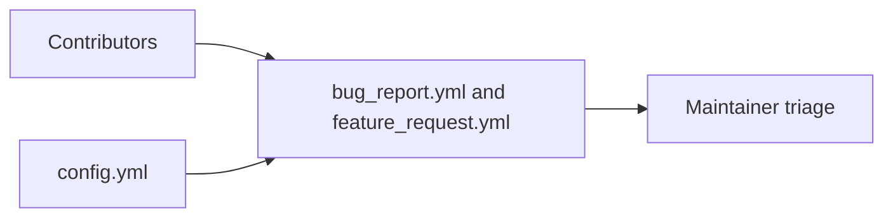

# Issue Template Context

## Local Purpose

This directory defines how repository issues are opened on GitHub. It shapes the intake path for bugs, feature requests, and issue routing, so its wording directly affects what maintainers learn from contributors.

## What Belongs Here

- issue forms for current bug and feature intake;
- issue-template configuration that controls links and issue creation behavior.

## What Does Not Belong Here

- broad contributor process guidance better kept in docs;
- migration messaging that turns intake forms into strategy documents;
- fields that imply GraphClaw migration is already complete.

## File Map

- `bug_report.yml` - bug intake form
- `feature_request.yml` - feature intake form
- `config.yml` - issue-template configuration and redirects

## Routing

- issue intake behavior belongs here
- PR guidance belongs in `pull_request_template.md` or `docs/contributing/`
- workflow automation reacting to issues belongs in `.github/workflows/` if present

## Intake Flow

## References

- `.github/CONTEXT.md` - GitHub subtree boundary
- `docs/contributing/CONTEXT.md` - contributor-process documentation boundary

## Current Inherited State

These forms serve the current repository and its inherited implementation reality. They may still refer to existing `zeroclaw` surfaces, commands, or workflows where contributors are expected to report against those systems.

## GraphClaw Migration Relationship

Issue templates should evolve only when repository intake needs change. They may acknowledge the GraphClaw transition, but they should not force contributors to speak in future-state terms that the implementation does not yet expose.

## Cautions

- forms shape maintainer signal quality, so wording changes matter
- keep required fields tied to information contributors can actually provide today
- avoid duplicating troubleshooting steps better documented elsewhere

## Agent Workflow

1. Confirm the change is truly about issue intake structure or wording.
2. Check current maintainer workflow expectations before adding or removing fields.
3. Preserve inherited terminology where reporters still encounter it in the product.
4. Keep templates concise, factual, and aligned with the current repo state.
