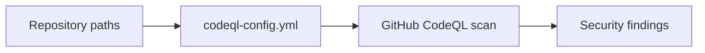

# CodeQL Context

## Local Purpose

This directory contains GitHub CodeQL scanning configuration. It exists to define code-scanning scope and exclusions for the repository's current implementation, not to carry general security narrative.

## What Belongs Here

- CodeQL configuration that controls scan scope, paths, and exclusions for GitHub code scanning.

## What Does Not Belong Here

- general security documentation;
- speculative migration experiments;
- casual exclusion changes made only to silence noise.

## File Map

- `codeql-config.yml` - CodeQL scan configuration

## Routing

- GitHub-hosted code scanning configuration belongs here
- broader security posture documentation belongs in `docs/security/`
- workflow execution details belong in `.github/workflows/`

## Scan Scope Flow

## References

- `.github/CONTEXT.md` - GitHub subtree boundary
- `docs/security/CONTEXT.md` - security documentation boundary

## Current Inherited State

This is inherited security automation serving the current repository layout and code mix. It should be treated as live operational infrastructure rather than as a place to express GraphClaw's target architecture.

## GraphClaw Migration Relationship

Migration may eventually require scan-scope updates, but those changes should follow real repository movement or language-surface changes. Do not use this directory to imply migration progress that code scanning configuration does not actually enforce.

## Cautions

- scan exclusions are high-sensitivity changes
- keep configuration aligned with the actual repository tree
- do not hide real findings pressure by broadening ignores without justification

## Agent Workflow

1. Confirm the requested change is about scan scope or exclusions.
2. Verify the affected paths or languages still exist in the repo.
3. Treat CodeQL config as production security infrastructure.
4. Prefer explicit rationale over convenience when adjusting coverage.
