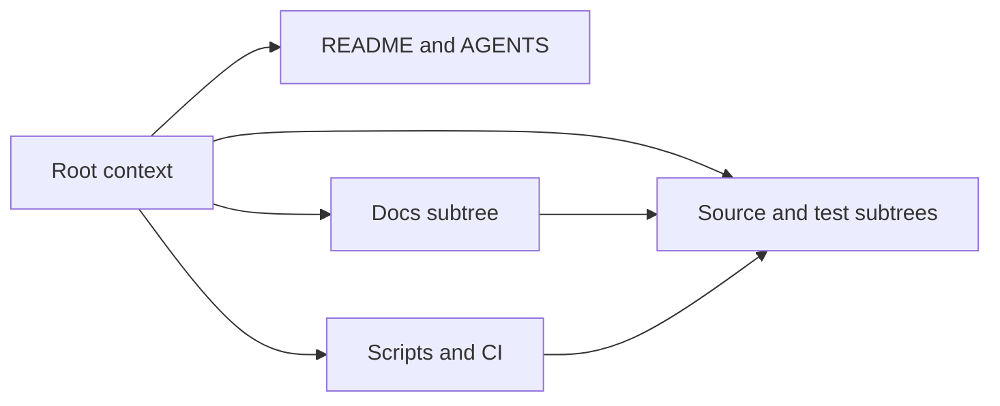

# Root Context

## Purpose

This repository is GraphClaw: a transitional fork baseline being evolved from ZeroClaw toward a graph-native context engine.

At the root level, documentation is expected to fix meaning before it fixes implementation details.

Reference documentation under `docs/` defines concepts. `AGENTS.md` and `CONTEXT.md` route readers and contextualize how those concepts appear in the codebase.

## What Belongs Here

- repo-wide narrative and agent rules;
- top-level entry documents and workspace metadata;
- framing that applies across multiple subtrees;
- routing into the conceptual architecture and backend reference branches under `docs/`.
- repo-wide rules that separate canonical concept reference from local codebase contextualization.

## What Does Not Belong Here

- low-level subsystem instructions that belong in local `CONTEXT.md` files;
- speculative architecture written as if already implemented.

## Key Files

- `README.md` - canonical GraphClaw root README
- `AGENTS.md` - repo-wide agent contract
- `docs/architecture/concepts/graph-context-engine.md` - conceptual architecture reference
- `docs/architecture/concepts/definition-governance.md` - canonical-definition policy and concept registry
- `docs/architecture/migration/zero-to-graphclaw-transition.md` - transition thesis and seam-first migration reference
- `docs/architecture/concepts/views-and-sets.md` - operational semantics for views, sets, and packability
- `docs/architecture/playground/set-system-spec-v0.md` - Set System v0 (lifecycle, algebra, LLM export) for playground
- `docs/architecture/playground/view-system-spec-v0.md` - superseded redirect to set-system-spec-v0.md
- `docs/architecture/concepts/context-artifacts.md` - context artifact boundaries, explicit planning artifacts, and budget layers
- `docs/architecture/runtime/turn-runtime-logic.md` - logical turn phases, strategy resolution, and runtime mapping
- `docs/architecture/migration/future-integration-seams.md` - future interface families, strategy seams, and orchestration hooks
- `docs/architecture/interfaces/session-window-interface.md` - interface fiche for governed visible-context runtime state
- `docs/architecture/interfaces/context-pack-interface.md` - interface fiche for final model-visible packed context
- `docs/architecture/interfaces/strategy-resolver-interface.md` - interface fiche for explicit turn-time strategy selection
- `docs/architecture/interfaces/graph-context-store-and-retriever-interface.md` - interface fiche for graph-aware and memory-aware context supply seams
- `docs/architecture/interfaces/mutation-guard-interface.md` - interface fiche for validating visible-context edits before state changes
- `docs/architecture/interfaces/orchestration-policies-interface.md` - interface fiche for routing, spawn, bounded sub-agent runtime, aggregation, and hooks
- `docs/architecture/interfaces/hook-bus-interface.md` - interface fiche for lifecycle-event publication and observability seams
- `docs/architecture/concepts/glossary.md` - concept routing index and stable terminology lookup
- `docs/backends/memgraph.md` - Memgraph backend reference
- `memgraph/` - Memgraph stack (Compose, config, init scripts); see `memgraph/CONTEXT.md`
- `src/`, `docs/`, `tests/`, `web/`, `python/`, `firmware/` - main working areas

## Current State

The repo still builds and runs through inherited `zeroclaw` technical surfaces. The new context layer exists to make the transition explicit and navigable without forcing a risky rename-first migration.

Do not interpret target-architecture references as proof of implementation. The architecture docs under `docs/architecture/` are design references for migration direction, not statements that the graph-native context engine already exists in the current runtime.

## Root File Map

| File or path | Role |
| --- | --- |
| `README.md` | repo identity, current state, top-level map, and validation entry point |
| `AGENTS.md` | repo-wide agent operating rules and reading order |
| `CONTEXT.md` | root routing map for where to read before changing areas |
| `Makefile` | convenience entrypoint for common local build, test, docs, web, CI, and dev commands |
| `CONTRIBUTING.md` | contributor workflow, scope control, and validation expectations |
| `docs/README.md` | documentation hub and docs-specific routing |
| `docs/architecture/` | stable concept definitions, glossary, and target runtime framing |
| `docs/backends/` | backend integration references and coupling guidance |
| `memgraph/` | Memgraph graph DB and Lab stack; run via `make memgraph-up` etc. |
| `src/`, `crates/`, `web/`, `python/`, `firmware/`, `tests/` | primary implementation surfaces |
| `scripts/`, `dev/`, `.github/` | automation, CI, and repository maintenance surfaces |

## Routing Diagram

## Task Routing

Start at the root, then move inward:

1. Read `README.md` and this file for repository-wide framing.
2. Read the closest local `CONTEXT.md` before changing a subtree.
3. Use the nearest area entry document if the subtree has one.

Use these routes:

| Task | Read next |
| --- | --- |
| root documentation or repo framing | `README.md`, `AGENTS.md`, `CONTRIBUTING.md` |
| Graph Context Engine concepts, strategy families, explicit planning artifacts, or first-seam interface fiches | `docs/architecture/README.md`, `docs/architecture/concepts/graph-context-engine.md`, `docs/architecture/concepts/context-artifacts.md`, `docs/architecture/interfaces/session-window-interface.md`, `docs/architecture/interfaces/context-pack-interface.md`, `docs/architecture/interfaces/strategy-resolver-interface.md`, `docs/architecture/interfaces/graph-context-store-and-retriever-interface.md`, `docs/architecture/interfaces/mutation-guard-interface.md`, `docs/architecture/interfaces/orchestration-policies-interface.md`, `docs/architecture/interfaces/hook-bus-interface.md` |
| canonical-definition policy or concept source routing | `docs/architecture/concepts/definition-governance.md`, `docs/architecture/concepts/glossary.md` |
| migration thesis, strategy/interface families, or future seams | `docs/architecture/migration/zero-to-graphclaw-transition.md`, `docs/architecture/migration/future-integration-seams.md` |
| views, sets, artifacts, strategy resolution, budget, or turn-logic semantics | `docs/architecture/concepts/views-and-sets.md`, `docs/architecture/concepts/context-artifacts.md`, `docs/architecture/runtime/turn-runtime-logic.md` |
| backend integration framing | `docs/backends/README.md`, `docs/backends/memgraph.md` |
| Memgraph stack (start/stop, config, init) | `memgraph/CONTEXT.md`, `make memgraph-up` |
| common local build/test/dev entrypoints | `Makefile`, `dev/CONTEXT.md`, `scripts/CONTEXT.md` |
| documentation trees | `docs/README.md`, `docs/CONTEXT.md` |
| Rust runtime behavior | `src/CONTEXT.md` |
| crate-level work | `crates/CONTEXT.md` |
| web work | `web/CONTEXT.md` |
| Python tooling | `python/CONTEXT.md` |
| firmware | `firmware/CONTEXT.md` |
| tests | `tests/CONTEXT.md` |
| CI, release, or helper scripts | `scripts/CONTEXT.md`, `dev/CONTEXT.md`, `.github/CONTEXT.md` |

## References

- `README.md` for the canonical top-level repository narrative
- `docs/README.md` for documentation navigation
- `docs/architecture/concepts/definition-governance.md` for single-definition policy
- `CONTRIBUTING.md` for contribution workflow and validation
- `docs/architecture/concepts/graph-context-engine.md` for migration framing
- `docs/backends/memgraph.md` for backend reference mapping
- local `CONTEXT.md` files for area-specific expectations

## Canonical Concept Policy

At the repo level:

- concept definitions belong to `docs/architecture/`;
- `AGENTS.md` and `CONTEXT.md` must reference canonical definitions instead of restating them;
- local context files should explain how concepts are represented or constrained in their subtree.

## Migration Track

Use the repository as a progressive migration scaffold, not as a finished graph-native implementation.

The practical sequence is:

1. clarify area boundaries and navigation through local `CONTEXT.md` files;
2. isolate where turn context is assembled in the inherited runtime;
3. document which runtime processes should become interfacable seams rather than remain implicit inherited flows;
4. introduce explicit runtime artifacts for task intent, strategy resolution, context selection, packing, orchestration, and traceability;
5. add graph-facing and strategy-facing interfaces behind stable Rust traits and bounded runtime contracts;
6. migrate packaging, binding, and portable knowledge surfaces after those seams exist;
7. rename inherited `zeroclaw` technical surfaces only when the implementation has truly crossed the boundary.

When a task touches migration design, read both this file and `docs/architecture/concepts/graph-context-engine.md`, then move to the nearest runtime-area `CONTEXT.md`.

## How Agents Should Work Here

Use this file to orient yourself, then move to the nearest local `CONTEXT.md` before changing a specific area.
