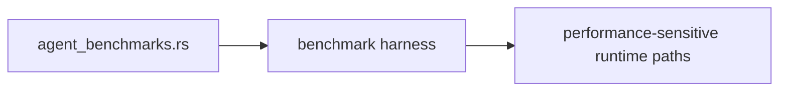

# Benches Context

## Scope

Benchmark harnesses for performance-sensitive runtime behavior.

## File Map

- `agent_benchmarks.rs` - current benchmark entrypoint

## Routing

This directory routes performance measurement through a small number of explicit benchmark files instead of mixing benchmark code into normal tests.

## Benchmark Path

## Current State

Bench coverage describes the inherited implementation baseline and is intentionally narrow.

## GraphClaw Relevance

Benchmarks matter during migration because they anchor performance expectations while higher-level architecture and documentation are still in flux.

## Cautions

- Do not treat benchmarks as correctness tests.
- Avoid adding synthetic benches that do not reflect a real performance question.

## Agent Guidance

- Use this subtree when performance is part of the task, not by default.
- Keep benchmark scenarios tied to concrete runtime concerns and explain why each one exists.
