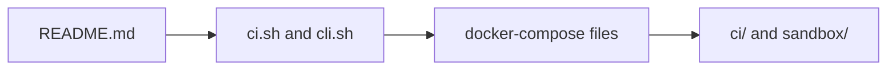

# Dev Context

## Scope

Contributor-facing local workflow assets: compose files, helper scripts, templates, and development references.

## File Map

- `README.md` - local workflow reference
- `ci.sh`, `cli.sh` - contributor convenience entrypoints
- `docker-compose.yml`, `docker-compose.ci.yml` - local environment routing
- `config.template.toml` - baseline local config template
- `recompute_contributor_tiers.sh` - repo-maintenance helper
- `ci/`, `sandbox/` - local CI parity and sandbox images

## Routing

Local development usually enters through the docs, helper scripts, or compose files at this level, then branches into `dev/ci/` or `dev/sandbox/` for container definitions.

## Local Workflow Routing

## Current State

This subtree supports working on the inherited runtime safely and predictably; it should not redefine product behavior.

## GraphClaw Relevance

Contributor workflow is part of the migration because GraphClaw needs clean onboarding and validation paths even while the codebase still exposes inherited names and surfaces.

## Cautions

- Prefer tightening existing workflows over layering on more environment complexity.
- Keep local tooling honest about the current runtime and CI behavior.

## Agent Guidance

- Read the nearest child context before changing container definitions.
- If a local workflow changes, update the adjacent docs or template in the same pass.
