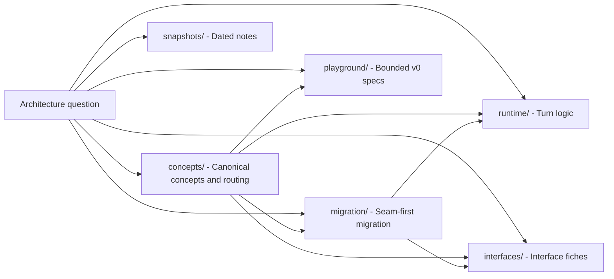

# Docs Architecture Context

## Local Purpose

This subtree holds the architecture documentation for GraphClaw. It routes readers to the right documentation family for concepts, migration framing, interfaces, runtime logic, playground specs, and dated snapshots.

## What Belongs Here

- Graph Context Engine concepts and invariants;
- canonical-definition governance and concept-source routing;
- canonical concept sources and shared terminology routing;
- migration-facing architecture references;
- runtime, interface, playground, and snapshot docs that belong to architecture documentation.

## File Map

- `README.md` - entrypoint for conceptual architecture docs
- `concepts/` - canonical concept sources, governance, terminology routing, and maturity tracking
- `migration/` - transition framing and future seam placement
- `interfaces/` - migration-facing interface fiches
- `runtime/` - logical runtime and turn-phase references
- `playground/` - bounded playground specifications and redirects
- `snapshots/` - dated architecture alignment material

## Routing

- concept definitions, terminology routing, and maturity tracking belong in `concepts/`
- transition-thesis and seam-framing docs belong in `migration/`
- interface fiches for first migration seams belong in `interfaces/`
- logical runtime and turn-flow references belong in `runtime/`
- bounded playground specifications belong in `playground/`
- dated alignment notes belong in `snapshots/`
- backend capability mapping belongs in `docs/backends/`
- repo-wide doc routing belongs in parent `docs/CONTEXT.md`

## Mermaid Convention

Architecture docs in this subtree use Mermaid only to clarify routing, concept boundaries, or migration seams.

- keep each diagram scoped to one purpose;
- use solid arrows for reading routes, conceptual dependency, or current documentation structure;
- use dotted arrows for future seam placement or coexistence targets that are not yet implemented;
- include explicit `current`, `target`, or `future` wording where omission could blur repository truth.

These diagrams must not imply that a documentation relationship is the same thing as an implemented runtime relationship.

## Routing Diagram

Use this map to pick the next document from an architecture question.

## Cautions

- do not redefine a concept here when its canonical source lives under `concepts/`
- do not move backend explanation into architecture docs when it belongs in `docs/backends/`
- do not duplicate child-directory routing that belongs in local `CONTEXT.md` files

## Agent Workflow

1. Read this file before editing conceptual architecture docs in this subtree.
2. Move to the nearest child `CONTEXT.md` before editing inside `concepts/`, `migration/`, `interfaces/`, `runtime/`, `playground/`, or `snapshots/`.
3. Keep this file focused on architecture-doc structure and branch routing.
4. Update linked routing docs when a new architecture-doc family changes the expected reading path.
