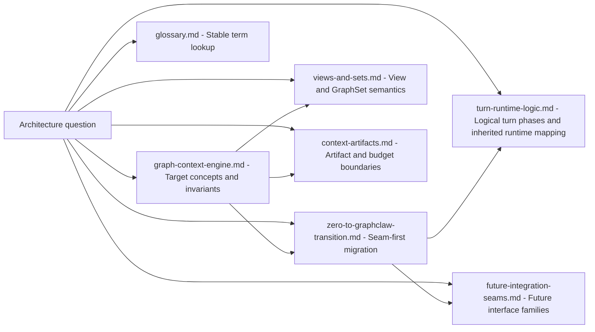

# Docs Architecture Context

## Local Purpose

This subtree holds the stable conceptual architecture for GraphClaw. It defines the target vocabulary, invariants, and logical runtime model that should remain meaningful even while the inherited implementation changes.

## What Belongs Here

- Graph Context Engine concepts and invariants;
- Graph Engine framing as governed context resolution plus strategy resolution;
- stable definitions for shared vocabulary;
- variable strategy families for reflection, exploration, packing, and orchestration;
- explicit runtime planning and trace artifacts such as task intent, strategy resolution, and bounded execution plans;
- architecture-level references that explain the target model without claiming it is already implemented.

## What Does Not Belong Here

- source-level implementation notes that belong next to code;
- backend-specific operational detail that belongs in `docs/backends/`;
- speculative code plans written as if already approved runtime work.

## File Map

- `README.md` - entrypoint for conceptual architecture docs
- `graph-context-engine.md` - reference model for the Graph Context Engine, including governed strategy resolution as a target seam
- `zero-to-graphclaw-transition.md` - migration framing from inherited runtime to interfacable context engine
- `views-and-sets.md` - operational semantics for `View`, `GraphSet`, and packability
- `context-artifacts.md` - distinctions between context artifacts, explicit planning artifacts, and budget layers
- `turn-runtime-logic.md` - logical turn phases, strategy resolution points, current runtime mapping, and cross-cutting sequential paths (current inherited vs future governed)
- `future-integration-seams.md` - future interface families, orchestration seams, and likely seam placement
- `session-window-interface.md` - interface fiche for governed visible-context state
- `context-pack-interface.md` - interface fiche for final packed model-visible context
- `strategy-resolver-interface.md` - interface fiche for coherent turn-time strategy choice
- `graph-context-store-and-retriever-interface.md` - interface fiche for context supply seams across graph and memory sources
- `mutation-guard-interface.md` - interface fiche for validating, rejecting, or degrading requested context edits
- `orchestration-policies-interface.md` - interface fiche for routing, spawn, sub-agent runtime, aggregation, and orchestration hooks
- `hook-bus-interface.md` - interface fiche for lifecycle-event publication across orchestration, packing, and degradation
- `glossary.md` - shared terminology and concise definitions

## Routing

- concept definitions and invariants belong here
- strategy families, strategy-resolution framing, and orchestration-modularity concepts belong here
- transition-thesis and seam-framing docs belong here when they stay above source-level ownership
- artifact, plan, trace, and turn-logic references belong here when they must remain stable even if code moves
- interface fiches for first migration seams belong here when they define role, invariants, fallbacks, and likely source areas without freezing code signatures
- backend capability mapping belongs in `docs/backends/`
- repo and subtree ownership boundaries belong in the nearest `CONTEXT.md` files

## Mermaid Convention

Architecture docs in this subtree use Mermaid only to clarify routing, concept boundaries, or migration seams.

- keep each diagram scoped to one purpose;
- use solid arrows for reading routes, conceptual dependency, or current documentation structure;
- use dotted arrows for future seam placement or coexistence targets that are not yet implemented;
- include explicit `current`, `target`, or `future` wording where omission could blur repository truth.

These diagrams must not imply that the target Graph Context Engine already exists in runtime code.

## Routing Diagram

Use this map to pick the next document from an architecture question.

## References

- `docs/README.md` - top-level docs routing
- `README.md` - repo identity and migration framing
- `AGENTS.md` - repo-wide rules and vocabulary expectations

## Current Inherited State

The current runtime still uses inherited `zeroclaw` technical surfaces. This subtree does not override that truth. It explains the target architecture the repo is moving toward, including variable strategy selection and modular orchestration as migration-facing concepts rather than code facts.

## GraphClaw Migration Relationship

This area should make the migration legible before the runtime is fully reworked. It exists to stabilize meaning and reduce architecture drift across docs, code discussions, and future implementation seams.

## Cautions

- do not describe target concepts as if they already exist in runtime code
- do not let backend details redefine GraphClaw business concepts
- do not collapse declarative strategy definitions into hidden runtime behavior when documenting target seams
- do not duplicate subtree boundary guidance that belongs in local `CONTEXT.md` files

## Agent Workflow

1. Read this file before editing conceptual architecture docs in this subtree.
2. Check whether the task is about stable meaning, strategy families, transition framing, runtime logic, or backend support.
3. Keep definitions backend-agnostic unless a backend reference is explicitly required.
4. Update linked routing docs when a new architecture reference is added here or when new first-class concept families change the expected reading path.
