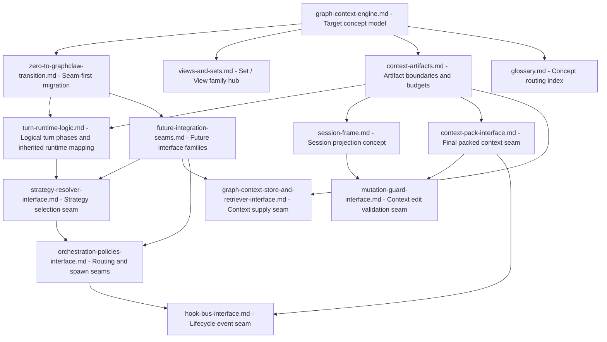

# GraphClaw Architecture Docs

This subtree documents the stable concept model for GraphClaw.

Use it when the question is not "what does the inherited runtime do today?" but rather "what meanings and invariants are we trying to stabilize before implementation hardens?"

## Branches

This subtree is now organized by documentation family:

- `concepts/` - canonical concept sources, terminology routing, and maturity tracking
- `migration/` - transition thesis and seam-first evolution
- `interfaces/` - first-seam interface fiches
- `runtime/` - logical runtime flow and turn sequencing
- `playground/` - bounded v0 playground specs
- `snapshots/` - dated alignment or archive material

## Start Here

- canonical-definition governance: [`definition-governance.md`](concepts/definition-governance.md)
- Graph Context Engine reference: [`graph-context-engine.md`](concepts/graph-context-engine.md)
- conceptual maturity tracker: [`conceptual-maturity-tracker.md`](concepts/conceptual-maturity-tracker.md)
- transition framing from the inherited runtime: [`zero-to-graphclaw-transition.md`](migration/zero-to-graphclaw-transition.md)
- sets (persisted), views (runtime), and packability family: [`views-and-sets.md`](concepts/views-and-sets.md), [`set.md`](concepts/set.md), [`resolved-set.md`](concepts/resolved-set.md), [`view.md`](concepts/view.md), [`packability.md`](concepts/packability.md)
- frame-oriented context composition: [`context-frame.md`](concepts/context-frame.md), [`session-frame.md`](concepts/session-frame.md), [`context-pack-interface.md`](interfaces/context-pack-interface.md)
- graph theory, projection governance, `Graph of Thoughts`, and mono-agent loop framing: [`graph-governed-agentics.md`](concepts/graph-governed-agentics.md), [`projection-governance.md`](concepts/projection-governance.md), [`got.md`](concepts/got.md), [`agent-loop.md`](concepts/agent-loop.md)
- Set System v0 (lifecycle, algebra, LLM export) for the playground: [`set-system-spec-v0.md`](playground/set-system-spec-v0.md)
- context artifacts, planning artifacts, and budgeting: [`context-artifacts.md`](concepts/context-artifacts.md)
- logical turn phases, strategy resolution, current insertion points, and cross-cutting sequential paths (current vs future): [`turn-runtime-logic.md`](runtime/turn-runtime-logic.md)
- future integration seams, strategy seams, and interface families: [`future-integration-seams.md`](migration/future-integration-seams.md)
- interface fiches for likely first seams: [`context-pack-interface.md`](interfaces/context-pack-interface.md), [`strategy-resolver-interface.md`](interfaces/strategy-resolver-interface.md), [`graph-context-store-and-retriever-interface.md`](interfaces/graph-context-store-and-retriever-interface.md), [`mutation-guard-interface.md`](interfaces/mutation-guard-interface.md), [`orchestration-policies-interface.md`](interfaces/orchestration-policies-interface.md), [`hook-bus-interface.md`](interfaces/hook-bus-interface.md). [`session-window-interface.md`](interfaces/session-window-interface.md) remains only as a retired migration note.
- terminology index: [`glossary.md`](concepts/glossary.md)

## Mermaid Convention

Architecture diagrams in this subtree are orientation aids, not implementation claims.

- use one Mermaid diagram per question or document purpose;
- label nodes as `current inherited runtime`, `target concept`, or `future seam` when that distinction matters;
- use solid arrows for reading order, conceptual structure, or current routing;
- use dotted arrows for migration adjacency, future seam placement, or coexistence targets that are not yet implemented.

If a diagram could be misread as a code-level runtime graph, add a short sentence that restates its status.

## Orientation Diagram

Use this map to choose the right architecture reference before reading in detail.

## Scope

This subtree is for:

- stable definitions such as `Set`, `View`, `ResolvedSet`, `ContextFrame`, `SessionFrame`, and `ContextPack`;
- strategy families for reflection, exploration, packing, and orchestration as target-architecture concepts;
- explicit planning and trace artifacts such as `TaskIntent`, `StrategyResolution`, `ReflectionPlan`, `ExplorationPlan`, and `OrchestrationPlan`;
- framing for the Graph Engine as governed context resolution plus strategy resolution, rather than only retrieval;
- global invariants for context resolution;
- migration framing that explains how the inherited runtime can gain graph-native seams progressively;
- logical turn-phase descriptions that stay useful even if the code moves;
- documentation of future interface families without freezing class signatures too early.

This subtree is not for:

- source-level implementation walkthroughs;
- backend-specific procedure catalogs;
- process or contributor workflow guidance.

## Recommended Reading Order

1. [`definition-governance.md`](concepts/definition-governance.md) for the single-definition rule and canonical registry.
2. [`graph-context-engine.md`](concepts/graph-context-engine.md) for the top-level reference frame.
3. [`zero-to-graphclaw-transition.md`](migration/zero-to-graphclaw-transition.md) for the migration thesis and coexistence model.
4. [`views-and-sets.md`](concepts/views-and-sets.md), then the split concept files under `concepts/`, and [`context-artifacts.md`](concepts/context-artifacts.md) for operational concept detail.
5. [`turn-runtime-logic.md`](runtime/turn-runtime-logic.md) and [`future-integration-seams.md`](migration/future-integration-seams.md) when the task touches runtime boundaries or future interface placement.
6. The interface fiches when the task needs a concrete first seam: [`context-pack-interface.md`](interfaces/context-pack-interface.md), [`strategy-resolver-interface.md`](interfaces/strategy-resolver-interface.md), [`graph-context-store-and-retriever-interface.md`](interfaces/graph-context-store-and-retriever-interface.md), [`mutation-guard-interface.md`](interfaces/mutation-guard-interface.md), [`orchestration-policies-interface.md`](interfaces/orchestration-policies-interface.md), and [`hook-bus-interface.md`](interfaces/hook-bus-interface.md). Read [`session-window-interface.md`](interfaces/session-window-interface.md) only as a retired migration note.
7. [`glossary.md`](concepts/glossary.md) for concept routing.

## Architecture Map

| Document | Primary question |
| --- | --- |
| `definition-governance.md` | where does the single-definition rule live and which document is canonical for each concept |
| `graph-context-engine.md` | what target model is GraphClaw trying to stabilize, including governed strategy choice |
| `conceptual-maturity-tracker.md` | what is already conceptually stable, what needs precision, and what remains open |
| `zero-to-graphclaw-transition.md` | how does the inherited runtime migrate without a rewrite-first strategy |
| `views-and-sets.md` | where should a reader start for the split `Set` / `View` / packability family |
| `set.md` | what is the canonical meaning of `Set` |
| `resolved-set.md` | what is the canonical meaning of `ResolvedSet` |
| `view.md` | what is the canonical meaning of `View` |
| `packability.md` | how should packability and packable subgraphs work conceptually |
| `graph-governed-agentics.md` | where should a reader start for graph-governed agentics framing |
| `projection-governance.md` | how should projectability and NL projection be framed |
| `context-frame.md` | how should invocation-oriented context composition be structured from governed graph projections |
| `session-frame.md` | how should session-scoped provider context be projected from the active View |
| `got.md` | how should mono-agent Graph-of-Thought reasoning be framed |
| `agent-loop.md` | how should the mono-agent loop be read conceptually |
| `set-system-spec-v0.md` | Set System v0: lifecycle, composition algebra, LLM export (playground slice) |
| `context-artifacts.md` | which context and planning artifacts are distinct and how do budget concerns relate to them |
| `turn-runtime-logic.md` | how should a turn resolve logically, including strategy resolution, where does the current runtime fit, and how do gateway/agent/memory/tools/providers/runtime/security articulate in current vs future paths |
| `future-integration-seams.md` | which interface families, orchestration seams, and runtime seams should emerge next |
| `context-pack-interface.md` | what should become the final model-visible packed context artifact |
| `strategy-resolver-interface.md` | how should turn-time strategy choice become an explicit runtime seam |
| `graph-context-store-and-retriever-interface.md` | how should graph-aware and memory-aware context supply be separated from higher-level context governance |
| `mutation-guard-interface.md` | how should visible-context edits be validated, rejected, or degraded before state changes |
| `orchestration-policies-interface.md` | how should routing, spawn, bounded sub-agent runtime, aggregation, and hooks become explicit seams |
| `hook-bus-interface.md` | how should lifecycle events become observable without owning orchestration or packing policy |
| `glossary.md` | where should a reader jump to find the canonical definition of a term |

## Directory Map

| Path | Purpose |
| --- | --- |
| `concepts/` | canonical concept sources and concept-governance docs |
| `migration/` | transition framing and future seam placement |
| `interfaces/` | migration-facing interface fiches |
| `runtime/` | logical runtime and turn-phase references |
| `playground/` | bounded playground specifications and redirects |
| `snapshots/` | dated architecture alignment notes |
