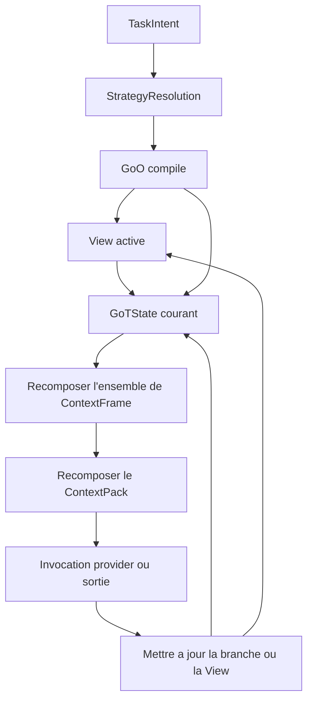

# Agent Loop

## Statut

Ce document cadre la boucle mono-agent dans l'architecture cible de GraphClaw.

Il releve de la documentation d'architecture cible.

## But

Le but est de remplacer une lecture purement lineaire et prompt-first par une boucle gouvernee basee sur :

- la matiere portee par les [`Set`](set.md) ;
- la composition runtime de la [`View`](view.md) ;
- la selection, la reutilisation, ou la composition d'un [`GoO`](goo.md) ;
- la projection gouvernee en langage naturel ;
- l'evolution de pensee de type GoT ;
- la recomposition du sous-graphe de travail suivant.

## Ancrages De Reference

- reference de theorie des graphes : [`../../../.agents/skills/graphclaw/main_graphes/markdown.md`](../../../.agents/skills/graphclaw/main_graphes/markdown.md)
- chemins et plus courts chemins pour l'exploration bornee et le raffinement sensible aux parcours : [`../../../.agents/skills/graphclaw/main_graphes/pages/page-22/markdown.md`](../../../.agents/skills/graphclaw/main_graphes/pages/page-22/markdown.md), [`../../../.agents/skills/graphclaw/main_graphes/pages/page-25/markdown.md`](../../../.agents/skills/graphclaw/main_graphes/pages/page-25/markdown.md)
- connectivite et composantes fortement connexes pour la coherence des zones de travail et la separation des branches : [`../../../.agents/skills/graphclaw/main_graphes/pages/page-37/markdown.md`](../../../.agents/skills/graphclaw/main_graphes/pages/page-37/markdown.md), [`../../../.agents/skills/graphclaw/main_graphes/pages/page-38/markdown.md`](../../../.agents/skills/graphclaw/main_graphes/pages/page-38/markdown.md)
- coupes, articulation et Menger pour conserver la structure critique pendant le retrecissement : [`../../../.agents/skills/graphclaw/main_graphes/pages/page-44/markdown.md`](../../../.agents/skills/graphclaw/main_graphes/pages/page-44/markdown.md), [`../../../.agents/skills/graphclaw/main_graphes/pages/page-46/markdown.md`](../../../.agents/skills/graphclaw/main_graphes/pages/page-46/markdown.md), [`../../../.agents/skills/graphclaw/main_graphes/pages/page-49/markdown.md`](../../../.agents/skills/graphclaw/main_graphes/pages/page-49/markdown.md)
- reference GoT locale : [`../../../.agents/skills/graphclaw/graph-of-thought/markdown.md`](../../../.agents/skills/graphclaw/graph-of-thought/markdown.md)
- modele de graphe de raisonnement GoT : section 3.1 dans [`../../../.agents/skills/graphclaw/graph-of-thought/markdown.md`](../../../.agents/skills/graphclaw/graph-of-thought/markdown.md)
- transformations GoT : section 3.2 dans [`../../../.agents/skills/graphclaw/graph-of-thought/markdown.md`](../../../.agents/skills/graphclaw/graph-of-thought/markdown.md)
- scoring et ranking GoT : section 3.3 dans [`../../../.agents/skills/graphclaw/graph-of-thought/markdown.md`](../../../.agents/skills/graphclaw/graph-of-thought/markdown.md)

## Boucle

La boucle mono-agent cible peut etre lue ainsi :

1. deriver un `TaskIntent` minimal ;
2. resoudre le regime actif de reflexion, d'exploration, de packing, et d'orchestration ;
3. selectionner, reutiliser, composer, ou faire proposer un [`GoO`](goo.md) structure pour le turn ;
4. resoudre, expandre, puis compiler ce `GoO` en un seul graphe executable ;
5. activer un ou plusieurs [`Set`](set.md) de depart et composer une [`View`](view.md) initiale ;
6. executer le `GoO` sur la [`View`](view.md) active en faisant evoluer le `GoTState` ;
7. utiliser ces sorties pour recomposer la `View` suivante si necessaire ;
8. iterer jusqu'a ce qu'une branche de travail soit suffisante dans le cadre du meme `GoO` compile ;
9. choisir la phase d'invocation et sa strategie de projection ;
10. deriver l'ensemble de [`ContextFrame`](context-frame.md) utile a cette invocation ;
11. deriver un [`ContextPack`](../interfaces/context-pack-interface.md) ;
12. enregistrer le chemin de selection dans une `ResolutionTrace`.

## Diagramme De Boucle

Ce diagramme est conceptuel uniquement.

Il montre que :

- la `View` reste l'espace de travail ;
- le `GoO` compile reste unique pour le turn ;
- le `GoTState` courant et la strategie selectionnee peuvent changer les frames utiles ;
- le [`ContextPack`](../interfaces/context-pack-interface.md) peut donc etre recompose plusieurs fois a l'interieur d'une meme chaine GoT.

## Regle De Lecture

Cette boucle doit etre lue avec :

- [`got.md`](got.md) pour l'orchestration du graphe de pensee ;
- [`goo.md`](goo.md) pour le graphe d'operations du turn ;
- [`projection-governance.md`](projection-governance.md) pour les regles de projectabilite ;
- [`context-artifacts.md`](context-artifacts.md) pour les distinctions entre artefacts ;
- [`../runtime/turn-runtime-logic.md`](../runtime/turn-runtime-logic.md) pour la sequence plus large du turn.

Elle doit etre lue comme :

- ancree dans la theorie des graphes via le travail sur sous-graphes bornes, chemins, composantes, et coupes ;
- ancree dans GoT via une evolution de pensee en graphe plutot qu'une seule chaine lineaire ;
- ancree dans GraphClaw via la recomposition de la [`View`](view.md) suivante plutot que l'empilement de texte.

## Lecture Phase-Aware Du Payload

La boucle doit aussi etre lue comme phase-aware au moment des invocations provider.

La lecture stable est :

- l'entree de turn peut demander une forme de payload differente de la progression GoT ;
- la progression GoT peut demander une forme de payload differente de la formation de reponse finale ;
- deux steps GoT differents d'une meme phase peuvent aussi demander des payloads differents si la strategie selectionnee change l'ensemble utile des operations ou le focus de branche ;
- ces differences doivent etre modelees par une composition phase-aware des [`ContextFrame`](context-frame.md) dans le [`ContextPack`](../interfaces/context-pack-interface.md), pas par une redefinition de la [`View`](view.md) a chaque fois.

Cette lecture preserve la distinction entre :

- l'etat de travail dans le graphe ;
- la projection en langage naturel ;
- le payload final envoye au provider.
