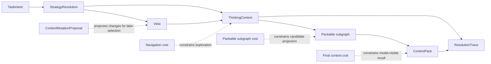

# Context Artifacts

## Status

This document separates the major context artifacts GraphClaw needs to reason about during migration.

These artifacts are conceptual references for documentation and future seams. They are not yet a claim that the inherited runtime already exposes each artifact explicitly.

## Why Artifact Separation Matters

The current inherited runtime often assembles useful context through a mix of prompt sections, memory loading, tool results, and runtime state.

GraphClaw needs clearer artifact boundaries so future work can answer:

- what is being explored;
- what is merely a candidate;
- what is actually packable;
- what is finally injected into the model;
- what is recorded for audit or later reuse.

Without that separation, context creation remains implicit and difficult to interface cleanly.

## Artifact Chain

The conceptual chain should be documented as:

1. `TaskIntent` frames the minimum structured task;
2. `StrategyResolution` selects the governing strategies for the turn;
3. one or more `View` objects are built or refined from resolved Sets;
4. `ThinkingContext` uses those Views and plans to explore, compare, and arbitrate;
5. a packable subgraph is derived from the candidate working sets;
6. the final `ContextPack` is budgeted and assembled;
7. `ResolutionTrace` records how the result was chosen;
8. `ContextMutationProposal` can request changes to what remains visible or packable for later turns.

These artifacts are adjacent, but they are not synonyms.

## Artifact Flow Diagram

This is a target-architecture artifact map. It clarifies conceptual flow, not the current code path of the inherited runtime.

## `View`

A `View` is the reusable logical runtime working set. It is useful for navigation, filtering, comparison, and derivation.

It can exist before anything is ready for model injection.

For deeper View semantics, see [`views-and-sets.md`](views-and-sets.md).

## Planning Artifacts

GraphClaw should distinguish context artifacts from the planning artifacts that govern them.

The most important planning-side artifacts are:

- `TaskIntent`: the minimum structured interpretation of the task;
- `StrategyResolution`: the selected coherent strategy set for the turn;
- `ReflectionPlan`: the explicit reasoning plan;
- `ExplorationPlan`: the explicit graph-navigation plan;
- `ContextEditPlan`: the explicit plan of requested context changes;
- `OrchestrationPlan`: the explicit delegation and aggregation plan when the turn is not purely single-agent.

These planning artifacts do not replace `ThinkingContext`, `ContextPack`, or `ResolutionTrace`. They make the path toward those artifacts more legible and governable.

## `ThinkingContext`

`ThinkingContext` is the temporary reflection context used before final response packing.

Its role is to:

- explore candidate sets;
- compare alternatives;
- estimate trade-offs;
- consider summarization or degradation;
- prepare proposals for what should survive into the final packed context.

This should be documented as a system phase. It may use operations that resemble tools or backend calls, but it should not be reduced to an ordinary user-facing tool.

## Packable Subgraph

A packable subgraph is the bounded candidate projection that stands close to the final `ContextPack`.

It exists because:

- some navigational structures are useful during exploration but should never be directly injected into the model;
- some attached content is readable only in summary or excerpt form;
- budget, policy, and rights may force a narrower representation than the original working sets.

The packable subgraph is therefore a staging artifact between exploration and final packing.

## `ContextPack`

The `ContextPack` is the final budgeted artifact retained for response generation.

It should represent what the runtime is actually willing to expose to the model after:

- rights and policy checks;
- budget decisions;
- ranking and prioritization;
- condensation or summarization;
- exclusions and degradations.

The `ContextPack` is not the whole `ThinkingContext`, and it is not the entire session-visible graph.

## `ContextMutationProposal`

A `ContextMutationProposal` is a structured proposal to change the visible or packable context.

Typical examples include:

- add or remove a focus area;
- pin or unpin important material;
- switch to a narrower or broader view;
- compact or summarize a heavy area;
- expand a currently summarized zone;
- preserve some traceable context result for later reuse.

This artifact matters because context evolution should become governable instead of being hidden inside ad hoc prompt edits.

## `ResolutionTrace`

A `ResolutionTrace` records how the runtime moved from candidate exploration to the final packed result.

Typical trace elements may include:

- selection decisions;
- rejected candidates;
- degradation choices;
- summarization or condensation steps;
- policy or rights-based exclusions;
- final packing rationale.

The docs do not yet need to fix a storage schema for this trace, but they should make the need for explicit decision recording visible.

## Budget Layers

GraphClaw should distinguish at least three kinds of cost:

### Navigation Cost

The cost of exploring or evaluating candidate graph material during `ThinkingContext`.

This can be larger or broader than what eventually reaches the model.

### Packable Subgraph Cost

The cost of a bounded candidate projection that is close enough to the final pack to support policy and budget decisions.

This is narrower than unconstrained exploration.

### Final Context Cost

The cost of what the model actually receives in the `ContextPack`.

This is the budget that must be treated as hard or governing for response generation.

## Artifact Ownership Boundaries

The repo should document these boundaries carefully:

- `src/agent/` is the likely consumer of a future `ContextPack`, but should not be documented as the sole owner of context semantics;
- `src/memory/` may supply stored evidence and retrieval inputs, but should not absorb the whole artifact chain;
- `src/tools/` may produce evidence useful to later context resolution, but tool execution is not itself the full reflection phase;
- `src/runtime/` may help persist artifacts, but execution adapters should not define their meaning.

## Open Questions

The docs should continue to surface unresolved points such as:

- which artifacts must be persistable versus transient only;
- whether every packable subgraph needs explicit materialization;
- how detailed `ResolutionTrace` should become for routine turns;
- which forms of `ContextMutationProposal` remain local to a turn versus affecting longer-lived visibility.
