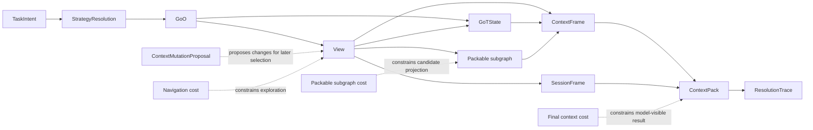

# Context Artifacts

## Status

This document separates the major context artifacts GraphClaw needs to reason about during migration.

These artifacts are conceptual references for documentation and future seams. They are not yet a claim that the inherited runtime already exposes each artifact explicitly.

## Why Artifact Separation Matters

The current inherited runtime often assembles useful context through a mix of prompt sections, memory loading, tool results, and runtime state.

GraphClaw needs clearer artifact boundaries so future work can answer:

- what is being explored;
- what is merely a candidate;
- what is actually packable;
- what is finally injected into the model;
- what is recorded for audit or later reuse.

Without that separation, context creation remains implicit and difficult to interface cleanly.

## Reference Anchors

This document is not the canonical source for every concept it names, but it should still be read against explicit local references:

- graph theory reference: [`../../../.agents/skills/graphclaw/main_graphes/markdown.md`](../../../.agents/skills/graphclaw/main_graphes/markdown.md)
- mono-agent `Graph of Thoughts` reference: [`../../../.agents/skills/graphclaw/graph-of-thought/markdown.md`](../../../.agents/skills/graphclaw/graph-of-thought/markdown.md)

The most relevant local graph-theory pages here are:

- paths and shortest paths: [`page-22`](../../../.agents/skills/graphclaw/main_graphes/pages/page-22/markdown.md), [`page-25`](../../../.agents/skills/graphclaw/main_graphes/pages/page-25/markdown.md)
- connectivity and strongly connected components: [`page-37`](../../../.agents/skills/graphclaw/main_graphes/pages/page-37/markdown.md), [`page-38`](../../../.agents/skills/graphclaw/main_graphes/pages/page-38/markdown.md)
- cuts, articulation, Menger: [`page-44`](../../../.agents/skills/graphclaw/main_graphes/pages/page-44/markdown.md), [`page-46`](../../../.agents/skills/graphclaw/main_graphes/pages/page-46/markdown.md), [`page-49`](../../../.agents/skills/graphclaw/main_graphes/pages/page-49/markdown.md)
- ranking intuition through PageRank: [`page-87`](../../../.agents/skills/graphclaw/main_graphes/pages/page-87/markdown.md)

The most relevant GoT sections here are:

- section 3.1 for reasoning as a directed thought graph;
- section 3.2 for `Generate`, `Aggregate`, and refinement transformations;
- section 3.3 for scoring and ranking;
- section 4.5 for the distinction between `Graph of Operations` and `Graph Reasoning State`.

## Artifact Chain

The conceptual chain should be documented as:

1. `TaskIntent` frames the minimum structured task;
2. `StrategyResolution` selects the governing strategies for the turn;
3. one `GoO` is selected, reused, composed, or proposed in structured form for the turn;
4. GraphClaw resolves, expands, and compiles that proposal into one final executable `GoO`;
5. one or more `View` objects are built or refined from resolved Sets;
6. GoT-style reasoning and runtime reflection operate on the active `View`, producing `GoTState` during `GoO` execution;
7. a packable subgraph is derived from the candidate working sets;
8. one or more [`ContextFrame`](context-frame.md) objects are distilled from the relevant governed graph portions for a given provider invocation;
9. a [`SessionFrame`](session-frame.md) may be derived when session material must be exposed;
10. a governed composition derives the final [`ContextPack`](../interfaces/context-pack-interface.md) for the current invocation and turn phase;
11. `ResolutionTrace` records how the result was chosen;
12. `ContextMutationProposal` can request changes to what remains visible or packable for later turns.

These artifacts are adjacent, but they are not synonyms.

## Artifact Flow Diagram

This is a target-architecture artifact map. It clarifies conceptual flow, not the current code path of the inherited runtime.

## `View`

A `View` is the reusable logical runtime working set. It is useful for navigation, filtering, comparison, and derivation.

It can exist before anything is ready for model injection.

For deeper View semantics, see [`view.md`](view.md) and the family hub [`views-and-sets.md`](views-and-sets.md).
For the current cross-concept framing around `ProjectionRegistry` and `NLProjection`, see [`projection-governance.md`](projection-governance.md).

## `SessionFrame`

`SessionFrame` est le [`ContextFrame`](context-frame.md) specialise qui projette en langage naturel les noeuds et relations de session retenus dans la [`View`](view.md) active.

Il n'est pas un espace de manipulation runtime distinct. L'agent continue de manipuler les noeuds et relations dans la [`View`](view.md), puis le `SessionFrame` declare seulement quel sous-graphe de session est projete pour l'invocation courante.

## Planning Artifacts

GraphClaw should distinguish context artifacts from the planning artifacts that govern them.

The most important planning-side artifacts are:

- `TaskIntent`: the minimum structured interpretation of the task;
- `StrategyResolution`: the selected coherent strategy set for the turn;
- [`GoO`](goo.md): the typed graph of operations selected, reused, or proposed for the turn;
- `ReflectionPlan`: the explicit reasoning plan;
- `ExplorationPlan`: the explicit graph-navigation plan;
- `ContextEditPlan`: the explicit plan of requested context changes;
- `OrchestrationPlan`: the explicit delegation and aggregation plan when the turn is not purely single-agent.

These planning artifacts do not replace `ContextPack` or `ResolutionTrace`. They make the path toward those artifacts more legible and governable.

## Packable Subgraph

A packable subgraph is the bounded candidate projection that stands close to the final `ContextPack`.

It exists because:

- some navigational structures are useful during exploration but should never be directly injected into the model;
- some attached content is readable only in summary or excerpt form;
- budget, policy, and rights may force a narrower representation than the original working sets.

The packable subgraph is therefore a staging artifact between exploration and final packing.

## `ContextFrame`

A [`ContextFrame`](context-frame.md) is the invocation-oriented distillation layer between governed graph state and final packed provider context.

Its role is to:

- distill one relevant portion of the active [`View`](view.md) or adjacent governed set state;
- reconcile that portion with an authorized natural-language projection;
- carry the governance metadata needed for later ordering, inclusion, exclusion, or trace.

The stable reading is that GraphClaw does not jump directly from `View` membership to final provider payload. It first derives typed frames, then composes them into the final pack.

## `ContextPack`

The `ContextPack` is the final budgeted artifact retained for response generation for one provider invocation.

In the current architecture reading, it should be understood as a natural-language projection derived from the retained response-side `View`, not as the graph schema and not as the whole working graph.

It should represent what the runtime is actually willing to expose to the model after:

- rights and policy checks;
- budget decisions;
- ranking and prioritization;
- condensation or summarization;
- exclusions and degradations.

The `ContextPack` is not the entire working graph and it is not the entire session-visible graph.

It should now also be read as a composition of ordered [`ContextFrame`](context-frame.md) objects rather than as one undifferentiated text export.

## `ContextMutationProposal`

A `ContextMutationProposal` is a structured proposal to change the visible or packable context.

Typical examples include:

- add or remove a focus area;
- pin or unpin important material;
- switch to a narrower or broader view;
- compact or summarize a heavy area;
- expand a currently summarized zone;
- preserve some traceable context result for later reuse.

This artifact matters because context evolution should become governable instead of being hidden inside ad hoc prompt edits.

## `ResolutionTrace`

A `ResolutionTrace` records how the runtime moved from candidate exploration to the final packed result.

Typical trace elements may include:

- selection decisions;
- rejected candidates;
- degradation choices;
- summarization or condensation steps;
- policy or rights-based exclusions;
- final packing rationale.

The docs do not yet need to fix a storage schema for this trace, but they should make the need for explicit decision recording visible.

## Budget Layers

GraphClaw should distinguish at least three kinds of cost:

### Navigation Cost

The cost of exploring or evaluating candidate graph material inside the active [`View`](view.md) and the GoT process it supports.

This can be larger or broader than what eventually reaches the model.

This layer maps naturally to the graph-theory intuition of bounded exploration over paths, neighborhoods, and connected zones.

### Packable Subgraph Cost

The cost of a bounded candidate projection that is close enough to the final pack to support policy and budget decisions.

This is narrower than unconstrained exploration.

### Final Context Cost

The cost of what the model actually receives in the `ContextPack`.

This is the budget that must be treated as hard or governing for response generation.

This separation also matches the GoT reading where scoring and ranking of intermediate thoughts do not automatically imply final exposure to the model.

## Artifact Ownership Boundaries

The repo should document these boundaries carefully:

- `src/agent/` is the likely consumer of a future `ContextPack`, but should not be documented as the sole owner of context semantics;
- `src/memory/` may supply stored evidence and retrieval inputs, but should not absorb the whole artifact chain;
- `src/tools/` may produce evidence useful to later context resolution, but tool execution is not itself the full reflection phase;
- `src/runtime/` may help persist artifacts, but execution adapters should not define their meaning.

## Open Questions

The docs should continue to surface unresolved points such as:

- which artifacts must be persistable versus transient only;
- which `GoO` motifs deserve selective promotion into reusable persisted `GoO`;
- whether every packable subgraph needs explicit materialization;
- how detailed `ResolutionTrace` should become for routine turns;
- which forms of `ContextMutationProposal` remain local to a turn versus affecting longer-lived visibility.
