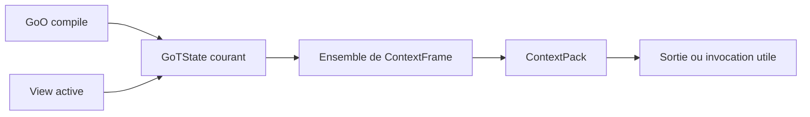
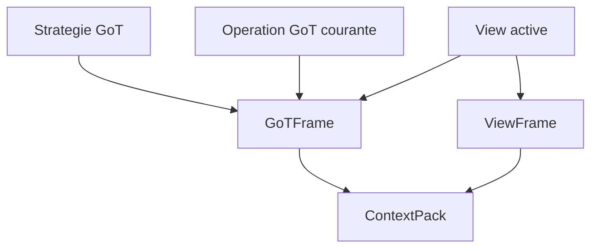

# Graph Of Thoughts

## Statut

Ce document cadre l'usage mono-agent de `Graph of Thoughts` dans GraphClaw.

Il releve de la documentation d'architecture cible.

Il ne pretend pas que la runtime heritee execute deja cette boucle.

## Ancrage De Reference

- reference GoT locale : [`../../../.agents/skills/graphclaw/graph-of-thought/markdown.md`](../../../.agents/skills/graphclaw/graph-of-thought/markdown.md)

Les sections les plus utiles sont :

- section 1 pour la structure de graphe arbitraire et les transformations supportees par graphe ;
- section 3.1 pour le modele dirige du raisonnement ;
- section 3.2 pour `Aggregate`, `Refine`, et `Generate` ;
- section 3.3 pour le scoring et le ranking ;
- section 4.5 pour la distinction entre `Graph of Operations` et `Graph Reasoning State`.

Les pages de theorie des graphes les plus utiles ici sont :

- graphe comme relation dirigee sur un ensemble de sommets : [`../../../.agents/skills/graphclaw/main_graphes/pages/page-5/markdown.md`](../../../.agents/skills/graphclaw/main_graphes/pages/page-5/markdown.md), [`../../../.agents/skills/graphclaw/main_graphes/pages/page-6/markdown.md`](../../../.agents/skills/graphclaw/main_graphes/pages/page-6/markdown.md) ;
- ordre topologique et lecture acyclique des dependances : [`../../../.agents/skills/graphclaw/main_graphes/pages/page-46/markdown.md`](../../../.agents/skills/graphclaw/main_graphes/pages/page-46/markdown.md) ;
- intuition de ranking : [`../../../.agents/skills/graphclaw/main_graphes/pages/page-87/markdown.md`](../../../.agents/skills/graphclaw/main_graphes/pages/page-87/markdown.md).

## Definition

Dans GraphClaw, `GoT` designe le graphe runtime des pensees, branches, raffinements, aggregations, rankings, et choix intermediaires produits pendant l'execution du [`GoO`](goo.md) final d'un turn.

## Est

GoT est :

- un mode d'orchestration de la reflexion ;
- un graphe de pensees runtime ;
- un support de branchement, de refinement, d'agregation, et de ranking ;
- un etat de raisonnement distinct du graphe d'operations ;
- un guide pour recomposer la [`View`](view.md) et les [`ContextFrame`](context-frame.md) utiles.

## N'est pas

GoT n'est pas :

- le [`GoO`](goo.md) ;
- le graphe semantique persiste ;
- la [`View`](view.md) elle-meme ;
- le [`ContextPack`](../interfaces/context-pack-interface.md) ;
- un simple chain-of-thought lineaire ;
- une seconde zone de travail distincte de la [`View`](view.md).

## Invariants

- la [`View`](view.md) reste l'espace de travail runtime ;
- GoT n'introduit pas un second graphe de travail a cote de la `View` ;
- le [`GoO`](goo.md) determine le flux d'operations ; GoT en porte l'etat runtime de raisonnement pendant l'execution ;
- les variations de contexte liees au raisonnement doivent passer par la recomposition des [`ContextFrame`](context-frame.md) et du [`ContextPack`](../interfaces/context-pack-interface.md), pas par une redefinition ad hoc du payload ;
- un meme turn peut produire plusieurs recompositions gouvernees de `ContextFrame` ou de `ContextPack` selon l'etape, la branche, ou l'operation utile, sans changer la nature unique du `GoO` compile suivi par le runtime ;
- le graphe des pensees reste distinct du graphe semantique persiste.

## Diagramme De Position

Ce diagramme est conceptuel uniquement.

Il montre que :

- la `View` fournit la matiere de travail ;
- le `GoO` compile gouverne le flux d'operations ;
- l'etat GoT courant contraint quels frames sont utiles pour l'invocation courante ;
- le `ContextPack` est la composition ordonnee de ces frames pour ce step.

## `GoTState`

### Definition

Un `GoTState` est l'etat runtime du graphe de pensees pendant l'execution du [`GoO`](goo.md) final d'un turn.

### Est

Un `GoTState` est :

- un etat d'execution transitoire ;
- le support des pensees, branches, scores, classements, et choix intermediaires ;
- lie a l'avancement d'un `GoO` compile ;
- exploitable pour recomposer la [`View`](view.md), les [`ContextFrame`](context-frame.md), et le [`ContextPack`](../interfaces/context-pack-interface.md) utiles.

### N'est pas

Un `GoTState` n'est pas :

- le [`GoO`](goo.md) lui-meme ;
- la [`View`](view.md) ;
- le graphe semantique persiste ;
- un artefact persiste par defaut ;
- un "workflow" distinct.

### Invariants

- un turn suit un seul `GoO` compile, mais ce `GoO` peut faire evoluer plusieurs etats `GoTState` successifs ;
- `GoTState` capture l'etat courant du raisonnement, pas la definition du flux d'operations ;
- `GoTState` reste distinct des artefacts de projection et de packing ;
- la promotion d'un motif reusable vers un [`GoO`](goo.md) persiste est selective et abstraite du run concret.

## Operations Utiles

Les operations de base du [`GoO`](goo.md) les plus utiles a conserver comme base documentaire pour l'orchestration GoT sont :

- `Generate` : ouvrir une ou plusieurs branches candidates depuis un etat courant ;
- `Refine` : retravailler une branche existante ;
- `Aggregate` : fusionner plusieurs branches ou plusieurs pensees ;
- `Score` : evaluer une branche ou une pensee ;
- `KeepBest` : conserver les branches priorisees ;
- `Repeat` : explorer des variantes.

Ces operations se rattachent surtout :

- aux transformations graphe de la section 3.2 de [`../../../.agents/skills/graphclaw/graph-of-thought/markdown.md`](../../../.agents/skills/graphclaw/graph-of-thought/markdown.md) ;
- au scoring et au ranking de la section 3.3 de cette meme reference.

## `GoTFrame`

Un `GoTFrame` est un [`ContextFrame`](context-frame.md) specialise qui expose, pour une invocation GoT donnee :

- les operations pertinentes du [`GoO`](goo.md) actif ;
- les contraintes de branche, d'etat, ou de strategie utiles ;
- les reperes necessaires pour comprendre quel type de transformation est attendu au step courant.

## Diagramme D'Invocation GoT

Ce diagramme est conceptuel uniquement.

Il montre que :

- `GoTFrame` ne remplace pas `ViewFrame` ;
- `GoTFrame` ajoute au [`ContextPack`](../interfaces/context-pack-interface.md) les instructions et reperes GoT utiles pour le step courant ;
- si la strategie ou l'operation change, le `GoTFrame` change aussi, et le `ContextPack` est recompose.

## Relations

- la [`View`](view.md) fournit le sous-graphe de travail ;
- le [`GoO`](goo.md) determine les operations a executer ;
- GoT orchestre la generation, la critique, l'agregation, et le ranking sur cette `View` pendant l'execution de ce `GoO` ;
- les sorties de GoT aident a recomposer la prochaine [`View`](view.md) ;
- le moteur peut recompiler un nouveau [`ContextPack`](../interfaces/context-pack-interface.md) a chaque step utile en changeant l'ensemble actif de [`ContextFrame`](context-frame.md), y compris `GoTFrame` si necessaire, sans introduire un second moteur d'execution.
