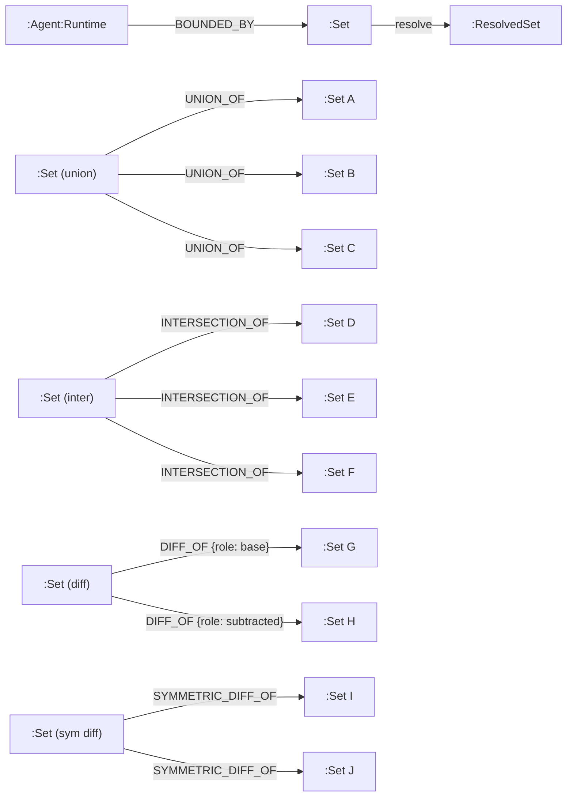

# Sets, Views, And Graph Operations

## Status

This document defines the operational meaning of `Set`, `View`, `ResolvedSet`, packability, and related semantics for GraphClaw.

It is target-architecture documentation. It does not claim that the inherited runtime already exposes these objects explicitly in code. The current playground implementation still uses `ViewTemplate` / `ResolvedView` naming; a future code migration will align those types with this vocabulary.

For the **first implementation slice** (playground): lifecycle Set → BoundSet → ResolvedSet → SetExport, v0 composition algebra, and LLM export formats are specified in [set-system-spec-v0.md](../playground/set-system-spec-v0.md). That spec is a deliberately bounded v0 subset of the concepts described here.

## Why This Document Exists

`Set` and `View` are too central to remain only brief glossary-routing entries. They need operational detail so the repository can reason clearly about persistence, navigation, composition, resolution, packability, and future integration seams.

## Vocabulary Pivot (Revision v0.1)

Prior to this revision, the word `View` was used for several distinct realities: a stored definition, a query, a composition, a resolved result, and a navigation surface. This overloading created confusion.

The revision establishes:

- **`Set`** = the persisted, governed, composable object stored in the graph database;
- **`View`** = a runtime-only, transient, first-class working object for exploration, navigation, and temporary composition (the earlier docs called this `GraphSet`; that name is now retired);
- **`ResolvedSet`** = a derived artifact from resolving a Set definition, serving as cache, trace, or export source.

Do not confuse:

- a stored `Set`;
- a runtime `View`;
- a `ResolvedSet` (derived);
- a resolution cache;
- the final `ContextPack`.

## `Set`

This section is the canonical definition source for `Set`.

### Definition

Un `Set` est l'objet graphe persiste, gouverne, composable et validable qui sert de brique de base pour les perimetres de contexte, les frontieres de navigation, et la composition d'ensembles dans GraphClaw.

### Est

Un `Set` est :

- persiste dans la base de graphes ;
- listable et referencable ;
- composable avec d'autres `Set` par relations de definition ;
- exploitable comme frontiere gouvernee ;
- validable par schema ;
- source d'un travail runtime ulterieur via des `View`.

### N'est pas

Un `Set` n'est pas :

- un simple alias de requete ad hoc ;
- un objet runtime transitoire ;
- un `View` ;
- un `ResolvedSet` ;
- un `ContextPack`.

### What a Set Is

A `Set` is:

- listable and referenceable by the engine;
- composable with other Sets via explicit relations;
- usable as a bounding frontier;
- exportable;
- validatable by schema;
- a building block for runtime Views.

### How a Set Is Defined

A `Set` can be defined in two ways:

#### Source Set

A Set with no composition relations is defined by a source Cypher expression carried as a property (`source_cypher`) on the `(:Set)` node itself.

Examples:

- `MATCH (n:Agent) RETURN n`
- `MATCH (n:Concept {type: "Finance"})<-[r]-(m) RETURN n, r, m`

These expressions must be read-only, bounded, documented, and validated.

#### Composed Set

A Set defined by composition has one or more outgoing composition relations, all of the same type, pointing to operand Sets.

The supported composition types, with their set-algebraic properties, are:

| Relation type | Set-algebraic operation | Arity | Associative | Commutative | Idempotent |
| --- | --- | --- | --- | --- | --- |
| `UNION_OF` | A ∪ B ∪ C ∪ ... | n-ary (N ≥ 2) | yes | yes | yes |
| `INTERSECTION_OF` | A ∩ B ∩ C ∩ ... | n-ary (N ≥ 2) | yes | yes | yes |
| `DIFF_OF` | A \ B | binary (N = 2, ordered) | no | no | no |
| `SYMMETRIC_DIFF_OF` | A △ B | binary (N = 2) | yes | yes | no |

Because `UNION_OF` and `INTERSECTION_OF` are associative and commutative, a single Set node can reference N ≥ 2 operands directly, without requiring intermediate binary nodes. The resolution order among operands does not affect the result.

Because `DIFF_OF` (relative complement, A \ B) is neither associative nor commutative, it is strictly binary and ordered. The composed Set must have exactly 2 outgoing `DIFF_OF` relations, and the operand order must be explicit (e.g., via a `role` property: `base` and `subtracted`, or via an `ordinal` property on the relation).

Because `SYMMETRIC_DIFF_OF` (A △ B = (A \ B) ∪ (B \ A)) is associative and commutative, it could in principle be n-ary. However, the n-ary symmetric difference has non-obvious semantics (elements in an odd number of operands), so it is restricted to binary (N = 2) for clarity. N-ary symmetric differences can be built by chaining binary compositions.

A composed Set may also carry an `additional_cypher` property that applies further adjustments to the composed result, such as including or excluding specific nodes.

### Composition Invariant

A `Set` must have either 0 or N (N ≥ 2) outgoing composition relations:

- 0 relations: the Set is a source Set, defined by `source_cypher`.
- N ≥ 2 relations of the same type: the Set is a composed Set.

Structural validity rules:

- A Set with exactly 1 composition relation is invalid (no unary composition).
- All composition relations on a single Set must be of the same type (homogeneous). Mixed types (e.g., one `UNION_OF` and one `DIFF_OF`) are invalid.
- For `DIFF_OF` and `SYMMETRIC_DIFF_OF`, N must be exactly 2.
- For `UNION_OF` and `INTERSECTION_OF`, N may be any value ≥ 2.

### Resolution Priority

The engine resolves a Set in this order:

1. If the Set has composition relations: resolve all operand Sets, then apply the composition operation. For n-ary operations (`UNION_OF`, `INTERSECTION_OF`), the result is the cumulative operation over all operands. For ordered binary operations (`DIFF_OF`), operand order is determined by the `role` or `ordinal` property on the relation.
2. If the Set has `additional_cypher`: apply it to the composed result.
3. If the Set has no composition relations: execute `source_cypher` as the primary definition.

### Set Labels

The node `(:Set)` can carry additional labels for domain or system classification:

- `(:Set:Named)` -- a user-named Set
- `(:Set:System)` -- a system-generated Set
- `(:Set:Identity)` -- identity-boundary Set
- `(:Set:Workspace)` -- workspace-scoped Set
- `(:Set:Codebase)` -- codebase-scoped Set
- `(:Set:AgentBoundary)` -- bounding Set for an agent

### Schema Validation

At creation or update, the engine should be able to:

1. resolve the Set on a subgraph or the current graph;
2. produce a schema of the result (labels, relation types, properties);
3. verify that the schema is acceptable for the intended runtime usage.

A Set can be marked as: valid, invalid, partially valid, or pending validation.

Validation metadata on the Set should include: validation status, validation date, schema version, definition hash, estimated cost, and cache policy.

### System Default Sets

When an agent is created, the engine may generate default system Sets:

- `(:Set:System:Identity)` -- identity surface
- `(:Set:System:Soul)` -- core personality/behavior
- `(:Set:System:Workspace)` -- workspace boundary
- `(:Set:System:Codebase)` -- codebase boundary

These serve to compose the agent's initial bounding perimeter and navigation paths.

## Relations Between Sets

### Definition Relations

Definition relations determine how a Set resolves. They are structural and must respect the composition invariant.

- `(:Set)-[:UNION_OF]->(:Set)` -- operand for union (n-ary, N ≥ 2)
- `(:Set)-[:INTERSECTION_OF]->(:Set)` -- operand for intersection (n-ary, N ≥ 2)
- `(:Set)-[:DIFF_OF {role: "base"|"subtracted"}]->(:Set)` -- operand for relative complement (binary, ordered)
- `(:Set)-[:SYMMETRIC_DIFF_OF]->(:Set)` -- operand for symmetric difference (binary)

For `DIFF_OF`, the `role` property (or equivalent `ordinal`) on the relation distinguishes the base set from the subtracted set. This is mandatory because A \ B ≠ B \ A.

### Navigation / Exposition Relations

Navigation relations express adjacency, containment, or semantic proximity between Sets without affecting resolution.

- `EXPOSES_SET` -- a Set exposes another for navigation
- `OVERLAPS_WITH` -- two Sets share some graph territory
- `NEIGHBORS_SET` -- semantic or structural proximity
- `TRAVERSES_TO` -- traversal path from one Set to another

The naming of these relations is not final but the distinction from definition relations is mandatory.

### Bounding Relation

- `(:Agent:Runtime)-[:BOUNDED_BY]->(:Set)` -- the agent's governed perimeter

`BOUNDED_BY` is reserved for agents. Other runtime nodes may use other relation types to reference their structuring Sets.

## `ResolvedSet`

This section is the canonical definition source for `ResolvedSet`.

### Definition

Un `ResolvedSet` est l'artefact derive produit par la resolution d'un `Set` sur l'etat courant du graphe.

### Est

Un `ResolvedSet` est :

- un resultat derive ;
- un support possible de cache, d'audit, de trace, ou d'export ;
- distinct dans son cycle de vie du `Set` qui l'a engendre.

### N'est pas

Un `ResolvedSet` n'est pas :

- la definition canonique du `Set` ;
- un objet de gouvernance primaire ;
- un substitut permanent au `Set`.

A `ResolvedSet` is the derived artifact produced by resolving a `Set` definition against the current graph state.

A `ResolvedSet`:

- is not the canonical definition;
- has a different lifecycle than the `Set` it derives from;
- can serve as cache, audit trail, export source, or resolution comparison.

A `ResolvedSet` should carry: the originating Set reference, resolution timestamp, schema snapshot, cost, and composition trace.

## `View`

This section is the canonical definition source for `View`.

### Definition

Une `View` est l'objet de travail runtime, transitoire, de premiere classe, utilise pour l'exploration, la navigation, le filtrage et la composition temporaire a partir d'un ou plusieurs `Set`.

### Est

Une `View` est :

- un objet runtime ;
- un support de navigation et de selection ;
- porteuse de provenance, de regles de construction, et d'implications de budget ;
- potentiellement lazy ou materialisee ;
- derivee, et non gouvernee comme un objet persiste.

### N'est pas

Une `View` n'est pas :

- un `Set` persiste ;
- un sous-graphe packable final ;
- un `ContextPack` ;
- une simple liste de fragments de prompt ;
- une identite du graphe tout entier.

A `View` is the runtime-only, transient, first-class working object used by the agent or the engine during exploration, navigation, and temporary composition. It is the runtime counterpart of a `Set`.

The earlier architecture docs used `GraphSet` for this concept. That name is now retired in favor of `View` to keep the runtime naming consistent.

### What a View Does

During a turn, an agent may:

- start from its bounding Set;
- reference several visible sub-Sets;
- perform temporary composition operations;
- produce multiple intermediate Views;
- persist none of these Views in the database.

### What a View Contains

Depending on the stage, a `View` may contain or reference:

- nodes;
- relations;
- provenance;
- construction rules;
- ranking or filtering metadata;
- references to attached documents or fragments;
- selection notes needed for later packing or audit;
- budget implications.

### Maximum Agent View

For a given agent, there can be a maximum active `View` representing the broadest runtime governed space that agent may navigate at that moment. This is derived from the agent's bounding Set(s) and their resolution.

### Intermediate Views

Narrower or composed views inside the maximum perimeter:

- focus on one concept neighborhood;
- focus on skills attached to a concept;
- focus on documents or notes associated with selected nodes;
- a composed working view assembled during `ThinkingContext`.

These are derived projections, not separate persisted worlds.

### Lazy Versus Materialized

#### Lazy `View`

Defined by a seed, rule, expression, or filter pipeline without immediate full evaluation.

Useful for: navigation, deferred expansion, policy-aware exploration, cheap recomputation when focus changes.

#### Materialized `View`

Evaluated and fixed as an explicit result for a given moment or audit horizon.

Useful for: traceability, repeatable packing, budget inspection, backend caching.

GraphClaw may need both forms. The docs should avoid treating definition and snapshot as the same thing.

## Referenced Content

Nodes in a `View` may refer to content that is not reducible to the node identifier itself.

Examples include:

- markdown documents;
- notes;
- summaries;
- attachments;
- derived fragments or excerpts.

The documentation should therefore allow for a `View` to reference not only graph structure, but also the conditions under which attached content becomes readable, summarizable, or packable.

## Packable Subgraph

A packable subgraph is not the same thing as a `View`.

The useful distinction is:

> a `View` is a governed logical runtime working set; a packable subgraph is a derived bounded projection prepared for possible inclusion in the final `ContextPack`.

This means:

- a `View` can be broader and more exploratory;
- a packable subgraph is closer to the final model-visible artifact;
- not every `View` becomes packable;
- some nodes or relations may remain useful for navigation but never appear in the final packed context.

## Packability

GraphClaw should not document packability as an intrinsic property of a node or relation.

Packability is conditional. It depends on at least:

- the active runtime `View`;
- the agent's bounding `Set` and policy constraints;
- turn-specific needs;
- budget;
- whether summary forms are allowed;
- whether attached content is readable in full, in excerpted form, or only through derived summary.

The same node can therefore be:

- navigable but not packable;
- packable in one View but not another;
- packable only through summary;
- packable only when accompanying relation context is preserved.

## Relationship Between `Set`, `View`, And Packability

The sequence to keep stable in docs is:

1. the `Set` defines the persisted governed perimeter;
2. the runtime `View` derives from one or more resolved Sets;
3. Views are manipulated, composed, filtered, and refined at runtime;
4. a packable subgraph is derived from some of those Views;
5. the final `ContextPack` retains only the budgeted result of that derivation.

## Set Operations

The following operations should remain conceptually stable even if the backend changes:

- union;
- intersection;
- difference;
- bounded complement;
- expansion;
- filtering by relation, type, and property;
- ranking;
- condensation;
- projection into a packable subgraph.

For persisted `Set` composition, `UNION_OF`, `INTERSECTION_OF`, `DIFF_OF`, and `SYMMETRIC_DIFF_OF` are supported as definition relations. The remaining operations (expansion, filtering, ranking, condensation, projection) apply at the runtime `View` level.

Those are GraphClaw operations first. Backend procedures may support them, but should not define their meaning.

## Runtime Nodes

Runtime nodes use multiple labels for domain clarity and runtime state:

- `(:Agent:Runtime)`
- `(:Workspace:Runtime)`
- `(:Codebase:Runtime)`
- `(:Session:Runtime)`
- `(:Turn:Runtime)`
- `(:Identity:Runtime)`

This allows finer filtering and more natural Set compositions.

## Conceptual Schema

This diagram is target architecture, not a claim that these nodes already exist in the current graph.

## Traces

Runtime operations should be traceable. Trace nodes or artifacts should record:

- which resolution was performed;
- from which Set;
- with which parameters;
- with which schema;
- with which cost;
- with which result.

Detailed trace modeling follows in later revisions but must be anticipated now.

## Open Questions

The docs should keep these questions visible rather than hiding them behind vague language:

- which navigation/exposition relation names should be finalized;
- when a `ResolvedSet` should be persisted versus recomputed;
- what exact form a runtime `View` should take: Rust-only object, or temporary traceable node;
- how far Cypher expressions should be allowed before a more structured DSL is needed;
- what minimal schema contract makes a Set valid for the runtime;
- how attached content should be represented when a node is packable only through excerpts or summaries;
- how rights and policy checks interact with composed Sets and derived Views.
