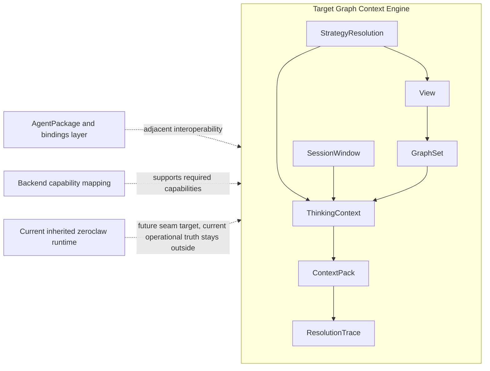

# GraphClaw Graph Context Engine Reference

## Status

This is a target-architecture reference for GraphClaw.

It defines the reference concepts and documentation boundaries the repository is trying to stabilize. It is not a class plan, not a ticket roadmap, and not proof that the inherited runtime already implements the model described here.

## Why This Document Exists

GraphClaw should not be documented as a renamed ZeroClaw and should not be reduced to a list of future modules.

This reference exists to:

- fix vocabulary before implementation hardens;
- separate concept model, project boundaries, runtime logic, backend mapping, and code reality;
- give maintainers and coding agents a shared model of where the project is moving;
- make assumptions, invariants, and constraints reviewable before they become scattered implementation details.

This document is the umbrella reference. Supporting documents under `docs/architecture/` break out the transition thesis, set semantics, artifact boundaries, turn logic, and future seams in more detail.

## Target Position

GraphClaw is intended to become a `Graph Context Engine`.

That means:

- context is a governed artifact rather than an implicit mix of prompts, memory recall, and opportunistic retrieval;
- the agent works against structured context objects rather than only receiving opaque text blobs;
- views, sets, budgets, policies, mutations, and traces become first-class concepts;
- reflection over context happens as a system phase before final response packing.

In the newer GraphClaw reading, `Graph Engine` is best treated as shorthand for this governed context-engine layer plus the turn-time strategy resolution it requires. It is not meant to name a separate backend product, nor to imply that every adjacent runtime concern belongs inside the engine.

That target should be read together with:

- [`zero-to-graphclaw-transition.md`](zero-to-graphclaw-transition.md) for seam-first migration framing;
- [`views-and-sets.md`](views-and-sets.md) for operational `View` and `GraphSet` semantics;
- [`context-artifacts.md`](context-artifacts.md) for artifact boundaries and budget layers;
- [`turn-runtime-logic.md`](turn-runtime-logic.md) for logical turn phases;
- [`future-integration-seams.md`](future-integration-seams.md) for future interface families.

## Reference Boundary Diagram

This diagram is conceptual only. Dotted arrows show adjacent layers or migration-facing support, not implemented ownership in the current runtime.

## Engine Reading Rule

When GraphClaw docs say `Graph Engine`, they should normally mean:

- the governed runtime layer that resolves what the agent can see, explore, mutate, and pack for a turn;
- the strategy-resolution layer that decides how reflection, exploration, packing, and orchestration should proceed;
- the explicit artifact chain that makes those decisions reviewable and traceable.

They should not mean:

- the graph database by itself;
- the entire agent runtime;
- the packaging layer by itself;
- a claim that the inherited runtime already exposes a complete standalone engine module in code.

## Documentation Levels

GraphClaw documentation should keep these layers distinct:

| Level | Question | Typical location |
| --- | --- | --- |
| intent | why GraphClaw exists | `README.md` |
| conceptual architecture | what concepts must stay stable | this file, `glossary.md` |
| project architecture | how the repo is divided | `CONTEXT.md`, local `CONTEXT.md` files |
| runtime logic | how a turn resolves logically | this file and runtime-area docs |
| backend integration | how a backend supports or constrains the model | `docs/backends/memgraph.md` |
| implementation | what code exists today | source-adjacent docs and code |

The required order is semantics first, boundaries second, mechanisms third, implementation last.

## Reference Concepts

### `View`

A `View` is a governed projection over the graph that can produce one or more accessible sets of nodes under explicit constraints such as type, relation, policy, ranking, and budget.

A `View` must be documented in terms of:

- what it exposes;
- what it does not expose;
- which policies and prerequisites apply;
- how it can degrade;
- which sets it produces or depends on.

A `View` is not a screen, not a label, and not a synonym for an arbitrary query.

The docs should distinguish between a maximum agent `View` and narrower composed or intermediate views derived inside that governed perimeter.

### `GraphSet`

A `GraphSet` is a first-class logical set of node references, with explicit provenance, combination rules, and budget implications.

Each documented set should state:

- origin;
- scope;
- construction rule;
- allowed relations and filters;
- policy constraints;
- estimated cost shape;
- role in final packing.

`GraphSet` should be documented as a working object for navigation and selection, not merely as a pre-export list of nodes.

GraphClaw should also distinguish:

- lazy sets defined by rules or seeds;
- materialized sets evaluated or persisted as explicit results;
- the `GraphSet` itself from a later packable subgraph derived from it.

### `SessionWindow`

The `SessionWindow` is the currently visible and mobilizable subgraph for a turn or short run of turns.

It is not:

- the entire conversation;
- the entire graph;
- the full memory store;
- the final prompt shown to the model.

### `ThinkingContext`

The `ThinkingContext` is the temporary reflection context used to explore, compare, test, and arbitrate before building the final `ContextPack`.

In the target model, this phase is mandatory. It should not be documented as a hidden chain-of-thought contract or as a merely optional skill.

It is better described as a system phase than as a standard tool.

### `ContextPack`

The `ContextPack` is the final budgeted context artifact retained for response generation after policy checks, ranking, degradation, summarization, and packing decisions.

It is the model-visible result, not the whole exploration space.

### `ContextMutationProposal`

A `ContextMutationProposal` is a structured proposal to modify visible or packable context. Typical examples include add, remove, pin, compact, summarize, expand, or switch view.

### `ResolutionTrace`

A `ResolutionTrace` is the explicit record of context-resolution decisions, including refusals, degradations, summaries, selections, and final packing choices.

### `TaskIntent`

A `TaskIntent` is the minimum structured interpretation of the incoming task before deeper planning or execution.

It should capture at least:

- goal;
- scope;
- ambiguity;
- risk level;
- likely delegation need.

### `StrategyResolution`

A `StrategyResolution` is the explicit result of choosing a coherent set of strategies for a turn.

At minimum, it should identify:

- the selected reflection strategy;
- the selected exploration strategy;
- the selected packing strategy;
- the selected orchestration strategy;
- any relevant constraints, degradations, or fallbacks.

### `AgentPackage`

An `AgentPackage` is a portable versioned unit of behavior and declared dependencies. It is not the same thing as a local instance, a live session, or a folder of files.

## Scope Boundary

The Graph Context Engine is not the whole GraphClaw architecture.

It owns:

- task interpretation and turn-time strategy resolution for governed context work;
- view resolution;
- set construction and manipulation;
- session-scoped visibility;
- reflective context arbitration;
- final context packing and traceability.

It does not by itself own:

- transport protocols;
- provider adapters;
- execution backends;
- portable package installation.

Portable agent packaging is an adjacent architecture layer. It must interoperate with the context engine, but it should not be used to blur the engine's conceptual boundary.

## Strategy Families

The Graph Context Engine should not be framed as a fixed retrieval pipeline with one hidden reasoning style.

The target model needs at least four declarative strategy families:

- `ReflectionStrategyDefinition`: how explicit reasoning is structured for a task kind;
- `ExplorationStrategyDefinition`: how graph exploration proceeds during reflection;
- `PackingStrategyDefinition`: how working results are transformed into visible or final packed context;
- `OrchestrationStrategyDefinition`: how work remains local, is routed, is decomposed, and is recombined.

The engine therefore resolves not only what context material is available, but also:

- how to think;
- how to explore;
- how to pack;
- how to delegate;
- how to make those choices auditable.

## Set Semantics

Set semantics are central to the model because views, navigation, packing, clustering, and package relationships all rely on them.

The documentation model should treat these as business operations before backend operations:

- union;
- intersection;
- difference;
- bounded complement;
- expansion;
- relation filtering;
- type filtering;
- property filtering;
- ranking;
- budget slicing;
- condensation;
- replacement by summary;
- projection into a packable subgraph.

For the fuller operational treatment of lazy versus materialized sets, referenced content, and packability, see [`views-and-sets.md`](views-and-sets.md).

The minimum meaning of the less obvious operators should stay fixed:

- `bounded complement`: remove a set from an explicitly bounded working universe such as the current `View`, `SessionWindow`, or policy-limited candidate set. Never interpret it as "everything in the database except this set."
- `condensation`: reduce a large or redundant set into a smaller representative structure while preserving the distinctions required for the current reasoning or packing task.
- `projection into a packable subgraph`: turn a logical set into a bounded subgraph candidate that includes the nodes, relations, provenance, and summary links needed to remain intelligible inside a `ContextPack`.

## Budget And Cost

GraphClaw should document context cost explicitly.

Every packable node or set should be described as having an estimated cost, with clear notes on:

- whether the estimate is shallow or expanded;
- whether a summarized form exists;
- whether the estimate is stable or backend-dependent;
- how budget influences ranking, selection, and degradation.

Without explicit cost, sets remain logical but not governable.

The docs should distinguish between:

- exploration cost inside `ThinkingContext`;
- candidate cost for a packable subgraph;
- final model-visible cost of the `ContextPack`.

## Logical Turn Pipeline

The target runtime should be described as a logical sequence, even before the implementation is finalized:

1. derive `TaskIntent` from the incoming turn;
2. identify the active session scope and current visibility constraints;
3. resolve the coherent strategy set for reflection, exploration, packing, and orchestration;
4. resolve or refresh relevant views;
5. build or refine candidate sets;
6. enter `ThinkingContext` to compare costs, propose mutations, and evaluate trade-offs;
7. apply policy and budget rules;
8. compile the final `ContextPack`;
9. record a `ResolutionTrace`;
10. pass the pack into response generation and any post-turn persistence flow.

This is a runtime logic description, not a commitment to a specific class layout.

For a more explicit mapping onto current runtime seams such as `src/agent/prompt.rs`, `memory_loader.rs`, `loop_.rs`, and `dispatcher.rs`, see [`turn-runtime-logic.md`](turn-runtime-logic.md).

## Project Invariants

These invariants should remain consistent across repository docs:

1. The context engine is not the memory system.
2. A `View` produces governed sets.
3. `GraphSet` objects are first-class.
4. Context cost is an explicit constraint.
5. Strategy resolution precedes bounded reflection, exploration, and packing.
6. Context reflection precedes final response packing.
7. The final `ContextPack` is distinct from the temporary `ThinkingContext`.
8. An `AgentPackage` is a versioned portable unit, not just a folder.
9. Memgraph is a reference backend, not the GraphClaw business model.
10. Directory-level docs should explain boundaries, not just contents.

## Relationship To The Current Repository

The current repository still runs through inherited `zeroclaw` runtime surfaces.

This document therefore serves as:

- migration framing for documentation and future runtime seams;
- a source of stable terminology for `README.md`, `AGENTS.md`, and local `CONTEXT.md` files;
- a guardrail against prematurely collapsing GraphClaw into backend-specific or implementation-specific language.

It does not claim that the current runtime already exposes a complete `SessionWindow`, `ThinkingContext`, `ContextPack`, or package protocol.

The migration target is coexistence through cleaner boundaries: some future runtime processes should be able to branch either to inherited pipelines or to graph-native implementations behind explicit seams.

## Relationship To Backend References

Backend documents must start from the GraphClaw concepts defined here and only then map them to required capability families and concrete backend mechanisms.

The correct direction is:

1. GraphClaw concept model
2. required capabilities
3. backend-specific mechanisms

Never reverse that order and let a backend procedure catalog define the GraphClaw architecture.

## Companion References

- [`zero-to-graphclaw-transition.md`](zero-to-graphclaw-transition.md)
- [`views-and-sets.md`](views-and-sets.md)
- [`context-artifacts.md`](context-artifacts.md)
- [`turn-runtime-logic.md`](turn-runtime-logic.md)
- [`future-integration-seams.md`](future-integration-seams.md)
- [`glossary.md`](glossary.md)
