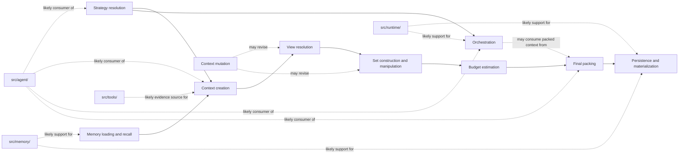

# Future Integration Seams

## Status

This document identifies the high-level interface families and migration seams GraphClaw should prepare next.

It does not freeze method signatures, Rust traits, or a final package layout. It explains what problems the seams isolate and why they matter.

## Why Seams Need To Be Documented

GraphClaw cannot migrate cleanly if the docs only describe the target concepts and never describe where the inherited runtime can actually receive them.

The role of this document is to answer questions such as:

- which process is being isolated;
- which layers the seam separates;
- which artifacts cross the seam;
- why the seam allows inherited and future strategies to coexist.

## Interface Families To Prepare

### Strategy Resolution

Problem isolated:

- the engine should not treat reflection, exploration, packing, and orchestration as hidden prompt habits or fixed code paths.

Boundary separated:

- turn interpretation and constraints versus downstream execution of a chosen strategy set.

Typical artifact flow:

- inputs such as task intent, session scope, policy state, provider capability profile, budget, and available views;
- outputs such as `StrategyResolution`, fallback decisions, and downstream planning requirements.

### Context Creation

Problem isolated:

- turn-time creation of model-usable context should not stay hard-wired to one inherited pipeline.

Boundary separated:

- turn orchestration versus context-resolution strategy.

Typical artifact flow:

- inputs such as session state, current request, memory-backed evidence, policy constraints, and active view hints;
- outputs such as candidate sets, packable subgraph, `ContextPack`, and `ResolutionTrace`.

Why it matters:

- it is the core seam that can later let the inherited path and a Graph Context Engine path coexist behind one conceptual boundary.

### View Resolution

Problem isolated:

- deciding which governed graph perimeter applies for a given turn or subtask.

Boundary separated:

- policy and visibility governance versus downstream set operations.

Typical artifact flow:

- inputs such as agent rights, session scope, policy state, and user focus;
- outputs such as a maximum or composed `View`.

### Set Construction And Manipulation

Problem isolated:

- building and refining `View` objects should be distinct from final packing.

Boundary separated:

- navigational working sets versus model-visible final context.

Typical artifact flow:

- inputs such as seeds, views, filters, ranking hints, and backend capabilities;
- outputs such as lazy or materialized `View` objects.

### Budget Estimation

Problem isolated:

- cost reasoning should not remain buried inside ad hoc prompt sizing or backend score interpretation.

Boundary separated:

- candidate exploration versus final context budget decisions.

Typical artifact flow:

- inputs such as candidate sets, summary options, view constraints, and packing rules;
- outputs such as exploration cost, packable subgraph cost, and final pack cost estimates.

### Final Packing

Problem isolated:

- the final model-visible artifact should be distinct from exploratory structures.

Boundary separated:

- packability analysis versus model injection.

Typical artifact flow:

- inputs such as packable subgraph candidates, summaries, rights checks, and budget decisions;
- outputs such as `ContextPack`.

### Memory Loading And Recall

Problem isolated:

- retrieval remains important, but it should become one input into context creation rather than the whole definition of context.

Boundary separated:

- persistence and retrieval providers versus the context engine or inherited context-creation pipeline.

Typical artifact flow:

- inputs such as session history, embeddings, memory stores, and retrieval queries;
- outputs such as recall candidates, evidence items, or seeds for `View` construction.

### Persistence And Materialization

Problem isolated:

- some artifacts may need storage or materialization without making persistence code own context semantics.

Boundary separated:

- artifact meaning versus backend-specific storage or graph mutation mechanisms.

Typical artifact flow:

- inputs such as materialized sets, traces, summaries, or mutation proposals;
- outputs such as persisted records, graph helper structures, or cached materializations.

### Context Mutation

Problem isolated:

- changes to what is visible or packable should become explicit and governable.

Boundary separated:

- candidate edits to context state versus immediate prompt rewriting.

Typical artifact flow:

- inputs such as user focus changes, internal prioritization, or policy outcomes;
- outputs such as `ContextMutationProposal` records and accepted mutations.

### Orchestration

Problem isolated:

- routing, spawn, bounded sub-agent runtime, and aggregation should not remain one implicit behavior inside the inherited loop.

Boundary separated:

- local turn execution versus governed multi-agent decomposition and recombination.

Typical artifact flow:

- inputs such as task intent, strategy resolution, current context state, and topology policy;
- outputs such as `OrchestrationPlan`, sub-agent assignments, aggregation outputs, and orchestration-relevant trace data.

## Sequential Path Comparison

For a step-by-step comparison of how gateway, channels, agent, memory, tools, providers, runtime, and security participate in a turn today versus under a future governed path (TaskIntent, StrategyResolution, Graph Engine seam, ContextPack, ResolutionTrace), see the [Cross-Cutting Sequential Paths](../runtime/turn-runtime-logic.md#cross-cutting-sequential-paths) section in `turn-runtime-logic.md`. That section documents the current inherited path and the target governed path without implying the future path is implemented.

## Future Interface Seam Diagram

This is a target seam map. Solid arrows show conceptual dependency between future interface families, while dotted arrows show likely supporting source areas rather than current ownership.

## Likely Source-Area Consumers

### `src/agent/`

Likely role:

- consume `ContextPack` and adjacent artifacts during turn execution.

Documentary caution:

- this area should consume several future interfaces more often than define all of them.

### `src/memory/`

Likely role:

- provide retrieval, persistence, and backend-facing support for context inputs and artifact storage.

Documentary caution:

- this area should not be documented as the owner of view semantics, packing policy, or the whole Graph Context Engine.

### `src/runtime/`

Likely role:

- support storage locations, capability reporting, and execution constraints relevant to future artifact handling.

Documentary caution:

- runtime adapters should support context work without becoming context-governance modules.

### `src/tools/`

Likely role:

- expose user- or agent-callable capabilities whose results may become structured evidence.

Documentary caution:

- reflective context resolution remains a system phase even when it uses tool-like operations internally.

## Relationship To Backend Docs

This document stays above backend-specific mapping.

The correct order is:

1. define the GraphClaw seam and artifact flow;
2. identify required capability families;
3. map backend-specific support in `docs/backends/`.

## Open Questions

The docs should keep these questions explicit:

- which interface family should be introduced first in runtime code;
- which artifacts should stay transient versus persistable;
- where composed views are resolved relative to turn orchestration;
- how much of trace persistence should be backend-optional versus required.
