# ZeroClaw To GraphClaw Transition

## Status

This document describes the migration thesis for GraphClaw.

It is a transition reference, not an implementation claim, not a rename checklist, and not a class-by-class design.

## Core Thesis

GraphClaw is an inherited ZeroClaw runtime being reorganized toward a `Graph Context Engine`.

The migration should proceed by documenting and introducing seams, artifacts, and interface boundaries. It should not begin with a repository-wide rewrite, a rename-first strategy, or a premature collapse of all context work into `memory/`.

The key coexistence rule is:

> some runtime processes must eventually be callable through stable conceptual interfaces so the inherited pipeline and the future Graph Context Engine can both sit behind the same high-level boundary for a time.

## Why A Seam-First Migration Matters

The inherited runtime still provides the operational truth for:

- prompt assembly;
- turn orchestration;
- memory loading and recall;
- tool execution;
- runtime execution and persistence plumbing.

If GraphClaw tries to replace all of that at once, the repository loses the ability to distinguish:

- what exists today;
- what is being stabilized conceptually;
- what seam is being prepared next;
- what future engine behavior is still speculative.

A seam-first migration keeps the inherited runtime usable while making future replacement points explicit and reviewable.

## Progressive Migration Strategy

The intended order is:

1. stabilize meaning in architecture docs and canonical concept sources;
2. document current subsystem boundaries through `CONTEXT.md` files;
3. make runtime artifacts explicit where the inherited loop currently uses implicit prompt concatenation or ad hoc recall;
4. add interface families that let the inherited pipeline and future engine coexist behind cleaner boundaries;
5. introduce graph-facing and backend-facing adapters without pretending the graph backend defines the whole architecture;
6. rename inherited `zeroclaw` technical surfaces only after the architectural seams are real.

## Seam-First Migration Diagram

This diagram shows migration order and coexistence intent. It does not claim that later phases already exist.

```mermaid
flowchart LR
    A["Inherited zeroclaw runtime - Current operational truth"]
    B["Architecture docs and canonical concept sources - Stabilize meaning"]
    C["Local CONTEXT.md files - Make boundaries explicit"]
    D["Explicit context artifacts - Reduce implicit prompt assembly"]
    E["Stable interface families - Prepare coexistence seams"]
    F["Coexistence boundary - Inherited path and future engine path"]
    G["Selective graph-native implementations - Behind explicit seams"]
    H["Rename inherited surfaces later - Only after boundary changes are real"]

    A --> B --> C --> D --> E --> F --> G --> H
```

## Interfacable Process Families

GraphClaw should not only document target concepts. It should document which runtime processes must eventually become interfacable.

The highest-priority families are:

- task interpretation and strategy resolution for a turn;
- context creation for a turn;
- view resolution;
- `View` construction and refinement;
- memory loading and recall as one input into context selection;
- budget estimation for packable candidates and final context;
- final packing of model-visible context;
- context mutation proposals and application policy;
- persistence or materialization of selected traces and graph-derived subsets.

The documentation goal is to explain what each family isolates, which artifacts it consumes or produces, and why the seam matters. The goal is not to freeze Rust trait signatures yet.

## Current Runtime Seams

### `src/agent/`

This area owns the inherited turn loop and is the clearest seam for:

- deriving structured task intent and resolving bounded strategies near turn entry;
- consuming a future `ContextPack` instead of relying only on implicit assembled prompt context;
- recording `ResolutionTrace` information adjacent to turn execution;
- separating orchestration from context-resolution policy.

### `src/memory/`

This area owns persistence and retrieval today.

It should remain a provider of stored evidence, recall, embeddings, chunking, and backend-facing support. It should not become the conceptual owner of the Graph Context Engine just because some future graph-backed data lives near memory-adjacent code.

### `src/runtime/`

This area owns execution environment and capability plumbing.

It may support artifact persistence, capability reporting, or storage locations needed by a future context layer, but it should not become the home of context governance.

### `src/tools/`

This area owns capability exposure and tool execution contracts.

Tool outputs may later become structured evidence that context resolution can consume, but the reflective context phase should still be documented as a system phase, not as a normal tool.

## Strategy And Orchestration Migration Rule

GraphClaw should not migrate only from implicit prompt context to explicit context artifacts.

It should also migrate from:

- implicit reasoning style to explicit strategy resolution;
- implicit exploration style to explicit exploration planning;
- implicit main-agent orchestration to explicit orchestration plans and policies.

The critical design rule is that the inherited behavior can remain the default preset for a time, but it should stop being treated as the only possible model of the system.

## Documentation Reorganization Direction

The architecture subtree should separate at least these subjects:

- top-level reference model;
- transition from inherited runtime;
- views and sets;
- context artifacts;
- turn-runtime logic;
- future integration seams.

That separation keeps each document reviewable and avoids one oversized architecture page trying to define every concept, every seam, and every runtime boundary at once.

## Repo Reorganization Direction

The repository does not yet need a final source-tree split, but the documentation should prepare for one.

The likely direction is:

- keep conceptual definitions in `docs/architecture/`;
- keep backend mapping in `docs/backends/`;
- keep current ownership boundaries in local `CONTEXT.md` files under `src/`;
- later introduce graph-facing and context-engine seams in runtime code only after the responsibilities are explicit enough to justify them.

## What This Transition Does Not Mean

This migration framing does not mean:

- the Graph Context Engine is already implemented;
- Memgraph defines the GraphClaw business model;
- the current memory subsystem should be renamed into a context engine;
- every reflective or navigational operation should be represented as a normal user-callable tool;
- the repo is ready for a package-wide ZeroClaw-to-GraphClaw rename.

## Open Questions To Keep Visible

The docs should keep these unresolved questions explicit:

- which node and relation types are navigable but never directly packable;
- which `View` forms should remain lazy and which should be materializable;
- how much trace granularity is required for `ResolutionTrace`;
- how rights and policies compose across agent, `View`, packable subgraph, and final `ContextPack`;
- which runtime seam should first host an alternative context-creation path beside the inherited one.
