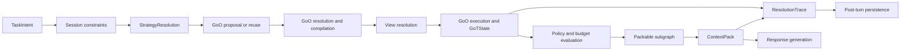
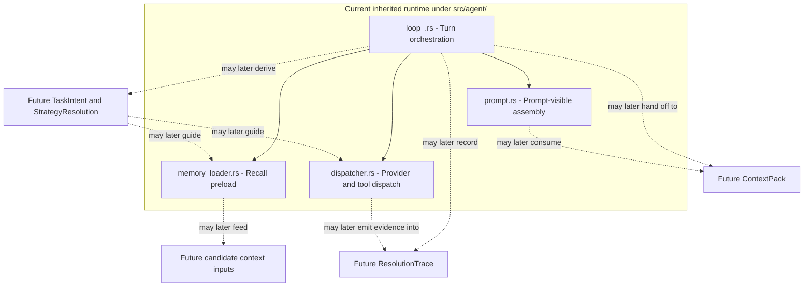
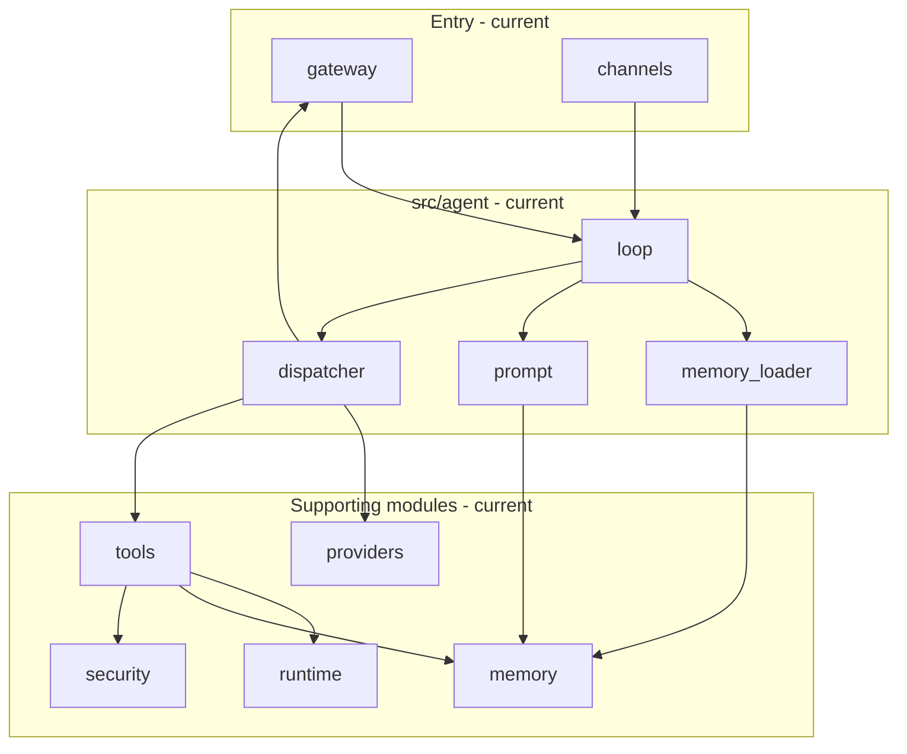
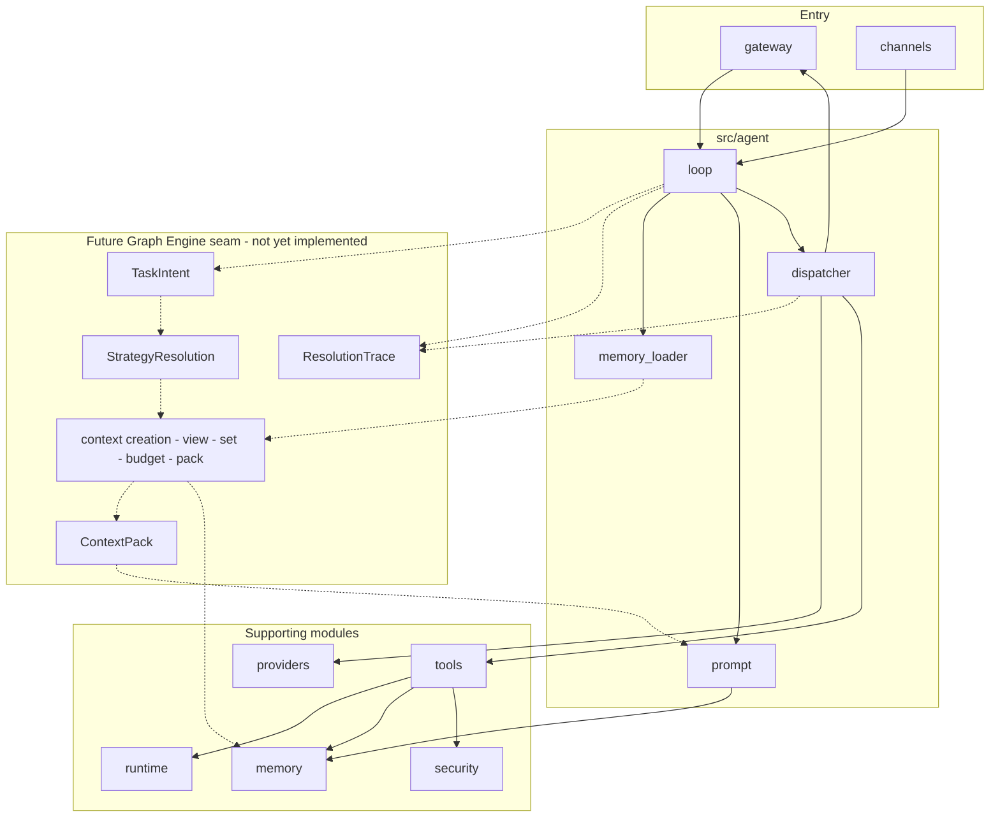

# Turn Runtime Logic

## Status

This document describes the logical turn phases GraphClaw is trying to stabilize and how they relate to the inherited runtime.

It is not a claim that the current runtime already exposes a complete graph-native turn pipeline in code.

## Why This Document Exists

The repo needs a shared way to talk about turn logic without confusing:

- the current inherited agent loop;
- the target Graph Context Engine;
- backend capabilities;
- source-level implementation details.

This document therefore describes the logical phases of a turn and then maps them to the current runtime seams that are most likely to host those concerns during migration.

When this document says "build the final `ContextPack`", read that as "build the current invocation-specific pack". A long turn may involve several provider invocations with different frame composition, even though the turn remains one logical unit.

When this document says "execute the turn", read that as "execute one final compiled [`GoO`](../concepts/goo.md) through the main runtime loop". This target model does not imply several concurrent execution loops or a nested workflow engine.

## Logical Turn Phases

The stable logical sequence should be documented as:

1. derive `TaskIntent` from the incoming turn;
2. determine the session-scoped constraints that bound what may be accessed;
3. resolve the coherent strategy set for reflection, exploration, packing, and orchestration;
4. select, reuse, compose, or request a structured [`GoO`](../concepts/goo.md) proposal for the turn;
5. validate, resolve, expand, and compile that proposal into one final executable `GoO`;
6. resolve or refresh the relevant [`View`](../concepts/view.md) scope;
7. execute the compiled `GoO`, producing `GoTState` on top of the active [`View`](../concepts/view.md);
8. evaluate packability, policy, and budget;
9. derive a packable subgraph candidate;
10. choose the current provider-invocation phase and frame composition;
11. build the invocation-specific `ContextPack`;
12. record a `ResolutionTrace`;
13. hand the result into response generation and any post-turn persistence flow.

These are logical phases, not a fixed class diagram.

## Logical Turn Diagram

This diagram shows the target logical sequence only. It should not be read as proof that the inherited runtime already exposes each artifact explicitly.

## Current Inherited Runtime Mapping

The current runtime is still organized primarily around `src/agent/`.

The important transition rule is:

> the inherited loop remains the operational path, but the docs should show where explicit context artifacts can later be inserted without rewriting the whole loop in one pass.

## Current Inherited Runtime Diagram

Solid arrows below show current module relationships at a high level. Dotted arrows mark likely future insertion points for explicit context artifacts.

## Cross-Cutting Sequential Paths

The following diagrams compare how the main runtime modules participate in a turn today versus how they are projected to articulate once explicit context and strategy seams exist. They are architecture-level orientation only; they do not imply that the future path is implemented.

### Current Inherited Path (sequential)

Solid arrows show the dominant sequential flow across subsystems. Gateway and channels feed the agent loop; the loop drives memory, prompt assembly, and dispatch; providers, tools, runtime, and security are used as the turn executes, without an explicit TaskIntent, StrategyResolution, or ContextPack.

### Future Governed Path (sequential, target)

Dotted boxes indicate future seams or artifacts not yet implemented. The same modules appear, but turn entry leads to TaskIntent and StrategyResolution; a Graph Engine seam (context creation, view resolution, set construction, budget, packing) produces ContextPack; the agent consumes ContextPack for prompt assembly and records ResolutionTrace; memory, tools, providers, runtime, and security remain but are orchestrated by strategy and context flow.

### How To Read The Comparison

- **Current path**: gateway/channels → agent loop → memory_loader, prompt, dispatcher → providers, tools, runtime, security. Context is implicit (prompt assembly and recall); there is no explicit strategy resolution or ContextPack.
- **Future path**: the same modules are used, but TaskIntent and StrategyResolution precede `GoO` selection or proposal; GraphClaw resolves and compiles one final `GoO`; a governed Graph Engine seam executes that `GoO` on the active `View`, then derives `ContextFrame` sets and produces `ContextPack`; prompt consumes `ContextPack`; `ResolutionTrace` is recorded along the way. Orchestration, memory, tools, providers, runtime, and security remain in their current ownership; the new behavior is the explicit strategy, operation-graph, and context layer between turn entry and prompt assembly, not a replacement of those modules.

For interface families and seam placement, see [future-integration-seams.md](../migration/future-integration-seams.md). For migration order and coexistence, see [zero-to-graphclaw-transition.md](../migration/zero-to-graphclaw-transition.md).

### `src/agent/prompt.rs`

Current role:

- assemble and format prompt-visible sections.

Future seam:

- consume a `ContextPack` or a more explicit context overlay rather than only implicit assembled fragments.

### `src/agent/memory_loader.rs`

Current role:

- preload memory or recall material before inference.

Future seam:

- obtain candidate context inputs from one or more providers, including legacy recall and future graph-backed resolution support.

This should become a seam for feeding context selection, not a place where the entire Graph Context Engine is conceptually absorbed.

### `src/agent/loop_.rs`

Current role:

- orchestrate the inherited turn loop and execution flow.

Future seam:

- own the handoff between turn orchestration and explicit context artifacts such as `ContextFrame`, `ContextPack`, and `ResolutionTrace`.

### `src/agent/dispatcher.rs`

Current role:

- handle dispatch decisions around providers, tool activity, and result flow.

Future seam:

- consume context artifacts produced upstream and emit execution outputs that can later contribute to trace or evidence handling.

## Reflection Is A System Phase

The reflective context phase should be documented as a system phase that precedes final response generation.

It may use:

- backend calls;
- retrieval operations;
- ranking;
- summarization;
- evidence gathering;
- tool-like internal operations.

But it should not be described as merely another ordinary tool alongside user-callable capabilities.

That distinction matters especially for `src/agent/` and `src/tools/` documentation.

The same discipline applies to reusable reasoning workflows:

- a reusable reasoning workflow is a reusable persisted [`GoO`](../concepts/goo.md);
- it does not imply a nested workflow engine;
- the turn still converges to one final compiled `GoO` followed by one execution machine.

## Budget In The Turn

The docs should keep these costs separate:

- broad exploration cost during GoT work on the active `View`;
- cost of a packable subgraph candidate;
- final model-visible cost of the `ContextPack`.

The inherited runtime may still blur some of these today. The architecture docs should make the target distinction explicit so future implementation can align to it.

## Transition Discipline

When source-adjacent docs describe turn logic, they should:

- describe what the inherited runtime does today;
- name the likely future insertion points for explicit artifacts;
- avoid claiming those artifacts already exist if the code does not support them;
- preserve the distinction between orchestration, memory loading, tool execution, and context governance.

## Open Questions

Important unresolved questions to keep visible include:

- where the first alternative context-creation path should branch beside the inherited one;
- how much `ResolutionTrace` detail should be captured during routine turns;
- which parts of turn-time exploration may safely remain transient versus materialized;
- which current prompt sections should later become explicit `ContextPack` components.
