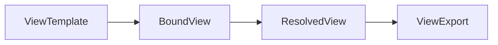

# View System Spec v0.1

## Status

This document is the **first documentary pass** on the View concept for GraphClaw. It defines the minimal View lifecycle, composition algebra, and LLM export formats for the initial playground implementation. It is a deliberately bounded v0: it does not specify the full Context Engine, SessionWindow, ContextPack, or governance.

For the broader operational semantics of View and GraphSet (governed perimeter, packability, lazy vs materialized), see [views-and-sets.md](views-and-sets.md). For stable terminology, see [glossary.md](glossary.md).

## Why This Document Exists

GraphClaw’s core is a **composable view system**, not just an agent wired to a graph DB. This spec stabilises, for the first implementation slice:

- what a View is and is not;
- the lifecycle from template to bound to resolved to export;
- the v0 composition algebra;
- the initial LLM export formats and their purpose.

The playground is the primary consumer: an atelier for composing and materialising views, not a generic graph visualiser or a full Context Engine UI.

---

## 1. Minimal Definition of View

A **View** is a **declarative expression of a set over the graph**.

It can be:

- **Extensional**: it explicitly enumerates certain nodes and/or relations.
- **Intensional**: it describes selection rules, filters, expansion, projection, or composition.

### What a View Is Not

A View is **not**:

- a raw permission;
- a plain Cypher query (though it may be resolved via Cypher);
- prompt text;
- a UI component;
- a rigid OO class hierarchy;
- a raw dump of query results.

### What a View Enables

A View describes a **logical surface** for access, exploration, grouping, or projection over a graph. It should support needs such as:

- “see only shared business logic”;
- “exclude brand-specific concepts”;
- “expand a neighbourhood along certain edge types”;
- “project a subset into a compact form for an LLM”.

### View vs Security

A View does not, by itself, carry the full security of the system. Real enforcement belongs to the engine. The View is the **logical surface** on which the engine relies to authorise or bound navigation.

---

## 2. View Lifecycle (Minimal)

A view is best thought of as a **cycle**, not a single object.



### 2.1 ViewTemplate

Source definition: reusable, editable, composable.

**Minimal fields**:

- `id`
- `name`
- `kind` (see §4)
- `description`
- `extends` (optional list of template IDs)
- `operations` (composition/transformation steps)
- `selectors` (how to select nodes/relations)
- `filters` (predicates)
- `projections` (optional)
- metadata: default cost/limits

### 2.2 BoundView

Local instantiation of a template with:

- **Anchors**: e.g. node IDs or labels to bind to.
- **Parameters**: key-value overrides.
- **Resolution scope**: which graph or workspace (and optionally agent/instance) to resolve against.

Example: a generic template `business_logic_shared` bound to workspaces `HIGHFINITY` and `MC_STUDIO`.

### 2.3 ResolvedView

The result of actually materialising the view on the graph.

**Minimal content**:

- nodes retained;
- relations retained;
- composition trace (how this set was built);
- completeness level;
- any degradations applied;
- estimated cost.

### 2.4 ViewExport

A projection of a ResolvedView into a form for external use. In v0, the primary consumer is:

- human inspection;
- explanation to a coding agent;
- injection into LLM context.

### 2.5 Resolution Invariants (v0)

For the playground slice, a `ResolvedView` should be treated as a **materialised graph snapshot** derived from a view resolution. It is still narrower than a future `GraphSet` family or `ContextPack`.

The minimum invariants are:

- **closed subgraph**: every retained relation must connect retained nodes;
- **bounded traversal**: expansion depth, relation families, and limits must stay explicit;
- **deterministic ordering**: nodes and relations should be emitted in a stable order whenever possible;
- **traceability**: the composition trace must explain the major resolution steps;
- **explicit degradation**: partial or conservative outcomes must be surfaced as degradations, not hidden behind silent behavior.

These invariants are the minimum needed to keep the result graph-theoretically sane while preserving the broader GraphClaw distinction:

1. the `View` defines a governed surface;
2. the playground materialises one resolved result from that surface;
3. the resulting export is still **not** a full `ContextPack`.

---

## 3. Minimal View Typology (v0)

Keep three categories; do not overload.

| Kind | Role | Examples |
|------|------|----------|
| **semantic** | Semantic or domain view | Business logic, product concepts, regulatory categories |
| **boundary** | Logical boundary view | Shared space HIGHFINITY + MC_STUDIO, “business only” subset |
| **projection** | Export/rendering oriented | Summary of retained concepts, compact LLM export, explanatory export |

A `runtime` kind may be introduced later; it is not in scope for this lot.

---

## 4. Composition Algebra (v0)

Composition is the heart of the playground. A view must be composable from other views and set operations in a traceable, bounded way.

### 4.1 Operations Supported in v0

The view engine must support at least:

| Operation | Description |
|-----------|-------------|
| `union(a, b)` | Set union of two view results |
| `intersection(a, b)` | Set intersection |
| `difference(a, b)` | Set difference (a minus b) |
| `expand(view, relation, depth)` | Expand from a view along a relation type to a given depth |
| `filter_nodes(view, predicate)` | Restrict nodes by predicate |
| `filter_edges(view, predicate)` | Restrict edges by predicate |
| `project(view, mode)` | Project view (e.g. nodes only, or summarised) |
| `slice(view, limit, order)` | Limit and order (e.g. top-k) |

### 4.2 Constraints

This algebra must remain:

- explicit;
- bounded;
- serialisable;
- traceable;
- as deterministic as possible.

Do not introduce an arbitrary DSL at this stage.

### 4.3 Inheritance / Extension

Avoid a heavy OO hierarchy. Prefer declarative composition:

- `extends: []` for light inheritance (e.g. extend a list of template IDs);
- `compose:` for union / intersection / difference;
- `operations:` for transform steps (expand, filter, project, slice).

---

## 5. LLM Export: Purpose and Form

### 5.1 Purpose

The goal is not yet to produce the final full prompt. It is to produce a **textual and structured artifact** that allows an LLM to understand:

- what the view represents;
- what it contains;
- how it was built;
- what it excludes;
- how to use it as context.

### 5.2 Two Export Formats

#### A. `llm_compact`

Dense, short, suitable for injection.

Example target shape:

```yaml
view_id: business_logic_shared
view_kind: projection
purpose: Shared business logic across bound workspaces
nodes:
  - Pricing
  - Margin
  - Forecasting
edges:
  - Pricing RELATES_TO Margin
  - Forecasting DEPENDS_ON Pricing
constraints:
  - business-only
  - no brand-specific nodes
usage_hint: Use for business reasoning only.
```

#### B. `llm_explained`

Narrative, more readable, for documentation and discussion with an agent.

Example target shape:

```md
# View Export — business_logic_shared

## Role
Shared business logic between bound workspaces.

## Included concepts
- Pricing
- Margin
- Forecasting

## Excluded concepts
- Brand-specific product identity
- Activity-specific operational details

## Relations
- Pricing RELATES_TO Margin
- Forecasting DEPENDS_ON Pricing
```

### 5.3 Rule

LLM export must **not** be a raw DB dump. It must be:

- compact;
- stable;
- traceable;
- understandable;
- usage-oriented.

---

## 6. Explicit v0 Limits

This lot does **not** fix or implement:

- full **ContextPack**;
- **SessionWindow**;
- **ContextMutationProposal**;
- full **PromptProjection**;
- the complete Context Engine.

Those can follow once the view system is clarified in practice.

`ViewExport` in this document is therefore a **playground-facing external artifact**, not the final model-visible packed context of the future engine.

---

## 7. Concrete Composition Examples

### 7.1 Example: Three Base Views

- **view_highfinity_core**: semantic view over HIGHFINITY concepts (e.g. nodes with label `Concept` and property `workspace: "HIGHFINITY"`).
- **view_mc_studio_core**: semantic view over MC_STUDIO concepts.
- **view_business_class**: boundary view that selects only “business” concepts (e.g. by label or tag), excluding brand-specific or activity-specific nodes.

### 7.2 Example: Composed View

1. **Union**: `union(view_highfinity_core, view_mc_studio_core)` → all concepts from both workspaces.
2. **Projection**: apply “business only” → restrict to nodes that belong to the business_class (intersection with view_business_class or filter_nodes by predicate).
3. **Exclusion**: remove brand-specific nodes (e.g. `difference(..., view_brand_specific)` or filter_nodes excluding certain labels).
4. **Resolve** the composed view on the current graph → ResolvedView.
5. **Export** as `llm_compact` and `llm_explained` for use as LLM context.

This is the kind of flow the playground must support end-to-end.

---

## References

- [views-and-sets.md](views-and-sets.md) — operational semantics of View and GraphSet, packability, lazy vs materialised.
- [glossary.md](glossary.md) — stable GraphClaw vocabulary.
- [graph-context-engine.md](graph-context-engine.md) — target concept model (View System v0 is a subset for the playground, not the full engine).
