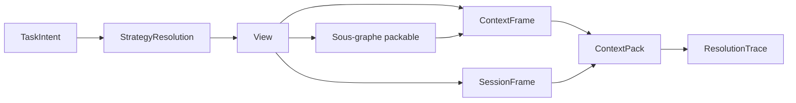
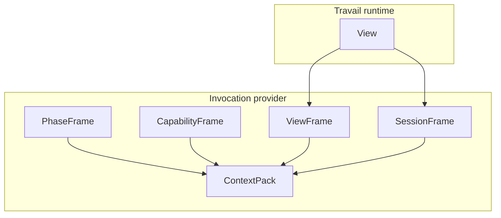
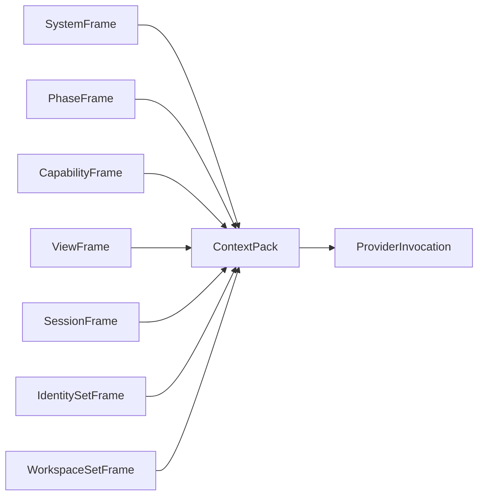
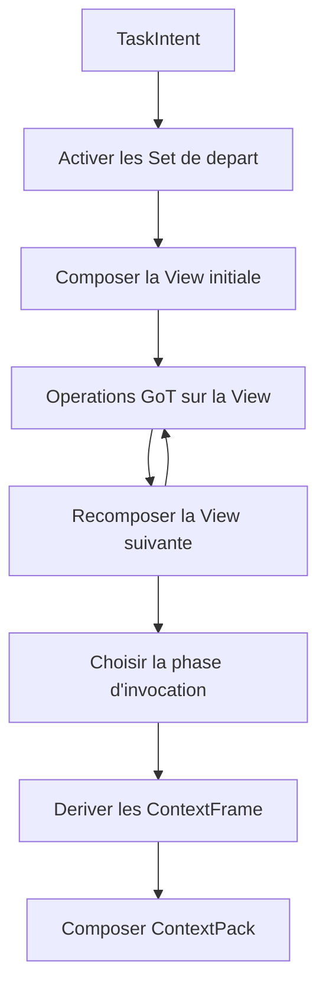

# GraphClaw Architecture Diagrams

Ce document regroupe des diagrammes GraphClaw separes des schemas herites de ZeroClaw.

Il ne decrit que des points conceptuellement assez matures pour etre representes sans laisser croire qu'ils sont deja implementes dans la runtime heritee.

## 1. Chaine D'Artefacts De Contexte

Lecture :
- la [`View`](../architecture/concepts/view.md) reste le sous-graphe de travail ;
- la [`SessionFrame`](../architecture/concepts/session-frame.md) est derivee de cette `View` quand un contexte de session doit etre expose ;
- le [`ContextPack`](../architecture/interfaces/context-pack-interface.md) est compose de [`ContextFrame`](../architecture/concepts/context-frame.md) ordonnes.

## 2. Distinction View / Session / Payload

Lecture :
- une `View` n'est pas un payload ;
- une `SessionFrame` n'est pas un espace de manipulation runtime ;
- les frames sont les unites de distillation qui entrent dans le `ContextPack`.

## 3. Composition D'Un ContextPack Par Invocation

Lecture :
- tous les frames ne sont pas obligatoires a chaque invocation ;
- `IdentitySetFrame` et `WorkspaceSetFrame` sont conditionnels ;
- le `ContextPack` est specifique a une invocation provider, pas a toute la session.

## 4. Lecture De Boucle Mono-Agent

Lecture :
- la boucle GraphClaw recompose la `View`, elle n'empile pas seulement du texte ;
- la selection de phase d'invocation intervient avant la composition finale du pack ;
- GoT reste distinct du graphe semantique persiste et du `ContextPack`, mais opere sur la `View`.
