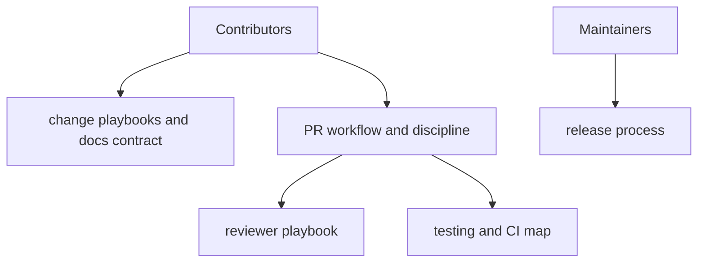

# Docs Contributing Context

## Local Purpose

This subtree documents how people change the repository: contribution rules, review expectations, CI shape, release process, testing guidance, and documentation discipline for the current GraphClaw codebase.

## What Belongs Here

- contributor workflow docs and reviewer playbooks;
- CI and PR process explanations;
- docs-writing contracts and change playbooks;
- release-process guidance that explains how the inherited system is operated.

## File Map

- `README.md` - contributing entrypoint
- `change-playbooks.md` - change categories and expected process
- `docs-contract.md` - documentation standards and expectations
- `pr-discipline.md` - PR quality and scope rules
- `pr-workflow.md` - PR handling flow
- `reviewer-playbook.md` - reviewer expectations and review operations
- `testing.md` and `testing-telegram.md` - testing guidance
- `ci-map.md` and `actions-source-policy.md` - CI structure and source-of-truth notes
- `release-process.md` - release procedure documentation

## Routing

- docs process or review expectations go here
- runtime operations belong in `docs/ops/`
- GitHub Actions behavior belongs in `.github/workflows/` and `.github/CONTEXT.md`
- repository-wide maintainer inventories belong in `docs/maintainers/`

## Interaction Map

## References

- `docs/CONTEXT.md` - docs-tree navigation and migration framing
- `.github/CONTEXT.md` - automation and repository metadata boundaries
- `AGENTS.md` - repo-wide agent contract

## Current Inherited State

This area still describes an inherited contribution model shaped around the existing `zeroclaw` baseline, current CI, and established release process. Some documents may use inherited runtime names because the implemented tooling and workflows still do.

## GraphClaw Migration Relationship

GraphClaw migration affects contributor expectations when repository structure, framing, or documentation rules change, but it does not justify rewriting contribution docs as if product migration were complete. Update process only when contributor-facing behavior actually changed.

## Cautions

- keep process guidance executable with the current repo layout
- do not move product details here just because a workflow mentions them
- distinguish repository framing changes from actual CI or release changes

## Agent Workflow

1. Confirm the change is about contributor process rather than product behavior.
2. Check linked automation or release files before documenting new process claims.
3. Preserve inherited terminology when it still matches current commands, jobs, or release steps.
4. Prefer editing one workflow document instead of duplicating guidance across several files.
