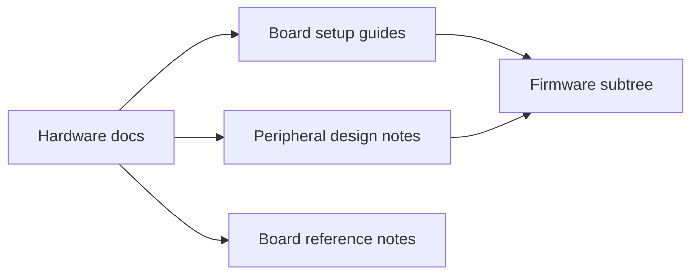

# Docs Hardware Context

## Local Purpose

This subtree contains hardware-facing documentation: board setup instructions, peripheral design notes, and device-specific reference material needed to operate or extend the inherited robotics and embedded surfaces in the repository.

## What Belongs Here

- board bring-up and device setup guides;
- hardware and peripheral design notes;
- datasheet-oriented support material for supported boards.

## What Does Not Belong Here

- general contributor workflow documentation;
- runtime API or CLI reference;
- broad GraphClaw architecture narrative unrelated to hardware setup.

## File Map

- `README.md` - hardware docs entrypoint
- `arduino-uno-q-setup.md` - Arduino Uno Q setup path
- `nucleo-setup.md` - Nucleo board setup path
- `android-setup.md` - Android-related setup material
- `hardware-peripherals-design.md` - hardware design and peripheral framing
- `datasheets/arduino-uno.md`, `datasheets/esp32.md`, `datasheets/nucleo-f401re.md` - board reference notes

## Routing Diagram

## Routing

- board-specific installation or cabling guidance goes here
- firmware implementation details belong under `firmware/`
- operator runtime procedures belong in `docs/ops/`
- setup steps for external services belong in `docs/setup-guides/`

## References

- `docs/CONTEXT.md` - docs-tree framing
- `firmware/CONTEXT.md` - firmware-side source boundary
- `docs/setup-guides/CONTEXT.md` - service/setup guidance boundary

## Current Inherited State

This area is mostly inherited hardware documentation from the ZeroClaw baseline. It remains useful because the repository still carries those hardware and firmware surfaces even though GraphClaw's long-term direction is broader than device setup.

## GraphClaw Migration Relationship

Hardware documentation is adjacent to the migration, not the primary driver of it. Add GraphClaw framing only where it clarifies repository direction; do not force graph-native language into board setup docs that still describe inherited hardware flows.

## Cautions

- keep hardware docs concrete, device-specific, and operational
- do not imply unsupported boards or unimplemented hardware abstractions
- avoid mixing future migration plans into step-by-step setup instructions

## Agent Workflow

1. Confirm the target document is about hardware setup or hardware reference.
2. Verify filenames, board names, and device assumptions against the current repo tree.
3. Preserve inherited terminology when it matches firmware, tooling, or board labels in use today.
4. Route non-hardware narrative changes back to the more appropriate docs subtree.
