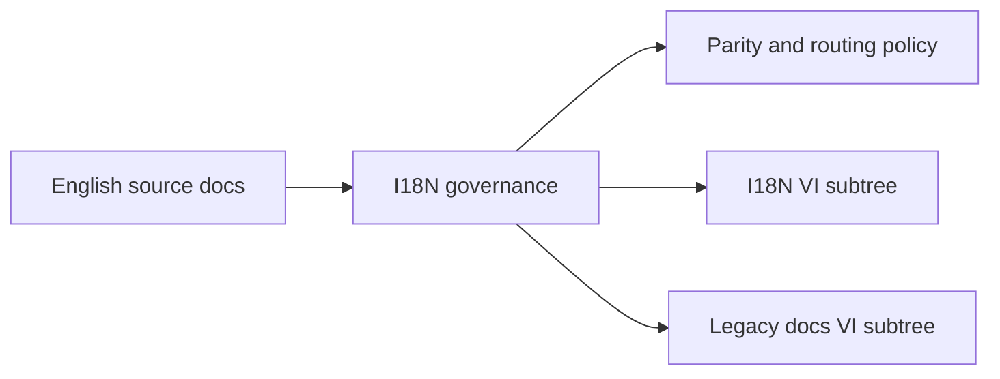

# Docs I18N Context

## Local Purpose

This subtree governs documentation localization: how translated docs are organized, what language-specific material is retained, and how translation work relates to the current English-first canonical documentation model.

## What Belongs Here

- localization structure and translation governance;
- translated documentation retained from the inherited baseline;
- language-specific navigation and parity notes.

## File Map

- `README.md` - i18n framing and localization entrypoint
- `vi/` - localized Vietnamese documentation retained in this subtree

## Routing Diagram

## Routing

- translation structure and parity policy belongs here
- Vietnamese legacy docs may live here in `i18n/vi/` or in the inherited `docs/vi/` subtree depending on the source structure
- source-language docs changes should usually start in the corresponding English docs area

## References

- `docs/CONTEXT.md` - primary docs-tree guidance
- `docs/vi/CONTEXT.md` - inherited Vietnamese subtree boundary
- `docs/i18n/vi/CONTEXT.md` - localized Vietnamese subtree guidance

## Current Inherited State

Localization in this repository is inherited. The repo now treats English root documentation as canonical at the top level, while translated documentation under `docs/` remains intentionally retained rather than being mass-removed.

## GraphClaw Migration Relationship

GraphClaw migration changes framing and terminology, but translation surfaces should only be updated where the source truth changed or where explicit localization work is requested. The presence of inherited `zeroclaw` terms in translated docs is often accurate because those implementation surfaces still exist.

## Cautions

- do not equate translation cleanup with migration progress
- preserve language-specific navigation unless there is a deliberate consolidation plan
- avoid creating false parity claims when only English docs were updated

## Agent Workflow

1. Determine whether the task is translation governance or actual localized content editing.
2. Check the English source page and local subtree before changing translated framing.
3. Preserve inherited terminology when the implementation still uses it.
4. Make parity gaps explicit instead of silently inventing translated content.
