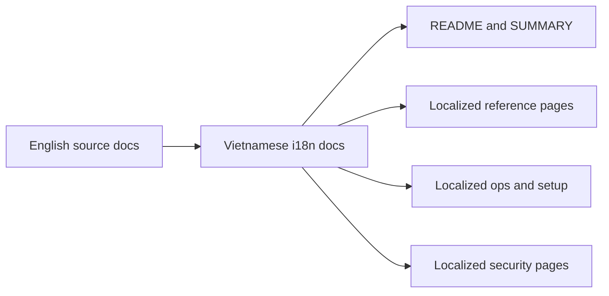

# Docs I18N VI Context

## Local Purpose

This subtree holds Vietnamese localized documentation within the `docs/i18n/` structure. It preserves translated operational, reference, setup, and contributor material derived from the inherited documentation system.

## What Belongs Here

- Vietnamese translations of English docs pages;
- localized navigation such as `README.md` and `SUMMARY.md`;
- language-specific organization for translated security, reference, operations, and setup pages.

## File Map

- `README.md` and `SUMMARY.md` - Vietnamese navigation and table-of-contents material
- `commands-reference.md`, `config-reference.md`, `providers-reference.md`, `channels-reference.md` - localized reference pages
- `operations-runbook.md`, `troubleshooting.md`, `resource-limits.md`, `proxy-agent-playbook.md` - localized ops material
- `one-click-bootstrap.md`, `mattermost-setup.md`, `zai-glm-setup.md` - localized setup guides
- `security-roadmap.md`, `sandboxing.md`, `audit-logging.md` - localized security pages
- `contributing/`, `reference/`, `security/`, `hardware/`, `operations/`, `project/`, `getting-started/` - localized sectional entrypoints

## Routing Diagram

## Routing

- translation edits specific to Vietnamese in the `i18n` structure belong here
- broad Vietnamese legacy-tree cleanup belongs in `docs/vi/`
- source behavior or process changes should usually be made in English docs first, then mirrored here if requested

## References

- `docs/i18n/CONTEXT.md` - localization governance for this subtree
- `docs/vi/CONTEXT.md` - related inherited Vietnamese docs area
- `docs/CONTEXT.md` - top-level docs routing

## Current Inherited State

This subtree is a retained translation surface from inherited documentation. Many pages still describe `zeroclaw`-named commands, references, and workflows because the repository still exposes those technical surfaces today.

## GraphClaw Migration Relationship

GraphClaw migration may eventually change terminology or structure, but this subtree should track source truth rather than anticipate future renames. Translation parity is a secondary concern to factual accuracy.

## Cautions

- avoid partial translation claims that imply complete parity
- do not normalize away inherited `zeroclaw` names if the implementation still uses them
- keep Vietnamese navigation coherent even when the English tree evolves

## Agent Workflow

1. Confirm the task explicitly calls for Vietnamese localization or parity work.
2. Check the source English page and the related Vietnamese page before editing.
3. Preserve technical names that remain current implementation detail.
4. Prefer precise, local edits over restructuring this subtree.
