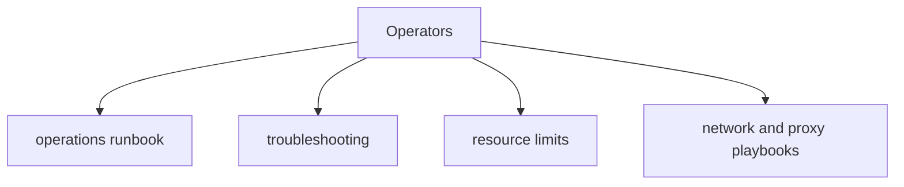

# Docs Ops Context

## Local Purpose

This subtree documents how to operate, troubleshoot, and deploy the current runtime. It is the operator-facing truth source for inherited behavior that still exists today.

## What Belongs Here

- operations runbooks and deployment notes;
- troubleshooting guidance and resource-limit notes;
- operator playbooks for runtime support and proxy/network setup.

## File Map

- `README.md` - operations docs entrypoint
- `ovh-vps-cloudflare-deployment.md` - first-production OVH VPS deployment guide for the current inherited runtime
- `operations-runbook.md` - main runtime operations guide
- `troubleshooting.md` and `troubleshooting.vi.md` - troubleshooting material
- `resource-limits.md` - runtime/resource envelope notes
- `proxy-agent-playbook.md` - proxy agent operation guidance
- `network-deployment.md` - network deployment notes

## Routing

- operator procedures and troubleshooting go here
- exact command reference belongs in `docs/reference/cli/`
- service-specific installation guides belong in `docs/setup-guides/`
- security posture and hardening details belong in `docs/security/`

## Interaction Map

## References

- `docs/CONTEXT.md` - docs-tree framing
- `docs/setup-guides/CONTEXT.md` - setup/install boundary
- `docs/security/CONTEXT.md` - security guidance boundary

## Current Inherited State

These documents primarily describe inherited runtime behavior, operating assumptions, and support workflows from the ZeroClaw baseline. They remain authoritative when they reflect what operators can do with the repository today.

## GraphClaw Migration Relationship

GraphClaw migration should be visible here only when it changes operational reality. Do not rewrite runbooks to match target architecture names or workflows before those are actually implemented.

## Cautions

- operational truth outranks branding consistency here
- distinguish verified operator procedure from aspirational future operations
- avoid duplicating setup steps that are already owned by dedicated setup guides

## Agent Workflow

1. Confirm the target document is about live operations, deployment, or troubleshooting.
2. Check current commands, service names, and file paths before editing procedural steps.
3. Preserve inherited `zeroclaw` terminology when it matches the present runtime.
4. Prefer precise corrections over broad narrative cleanup in runbooks.
