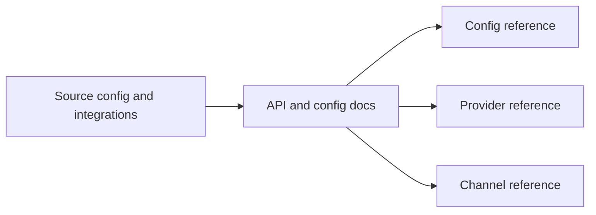

# Docs Reference API Context

## Local Purpose

This subtree documents the current configuration and integration surfaces exposed by the repository: config files, provider interfaces, and channel-related reference material that users and integrators must match exactly.

## What Belongs Here

- configuration reference for current keys and shapes;
- provider and channel reference tied to implemented behavior;
- localized API/config reference variants that mirror current docs structure.

## What Does Not Belong Here

- aspirational API design for GraphClaw's future architecture;
- operational playbooks or setup tutorials;
- source-code implementation discussion better handled near `src/`.

## File Map

- `config-reference.md` - canonical config reference
- `config-reference.vi.md` - localized config reference variant
- `providers-reference.md` - provider surface reference
- `channels-reference.md` - channel surface reference

## Routing Diagram

## Routing

- exact config keys and meanings go here
- command-line usage belongs in `docs/reference/cli/`
- operator procedures belong in `docs/ops/`
- security-specific controls may need cross-reference from `docs/security/`

## References

- `docs/reference/CONTEXT.md` - reference-tree guidance
- `src/config/CONTEXT.md` - source-side config boundary
- `src/providers/CONTEXT.md` and `src/channels/CONTEXT.md` - implementation-side source boundaries

## Current Inherited State

These pages still mostly describe inherited `zeroclaw`-era config, provider, and channel surfaces. That is expected because those technical contracts remain active in the codebase.

## GraphClaw Migration Relationship

GraphClaw migration may eventually reshape these interfaces, but until that work lands, this subtree must document the interfaces that exist today. Migration narrative belongs in broader docs; exact surface truth belongs here.

## Cautions

- track real wire and config surfaces only
- never rename fields, endpoints, or provider concepts in docs before code changes
- keep translated variants clearly secondary to canonical source truth

## Agent Workflow

1. Verify the config or integration fact against current implementation or authoritative docs.
2. Edit the owning reference page rather than sprinkling partial corrections elsewhere.
3. Preserve inherited names when they remain part of the real contract.
4. Flag uncertainty instead of guessing interface semantics.
