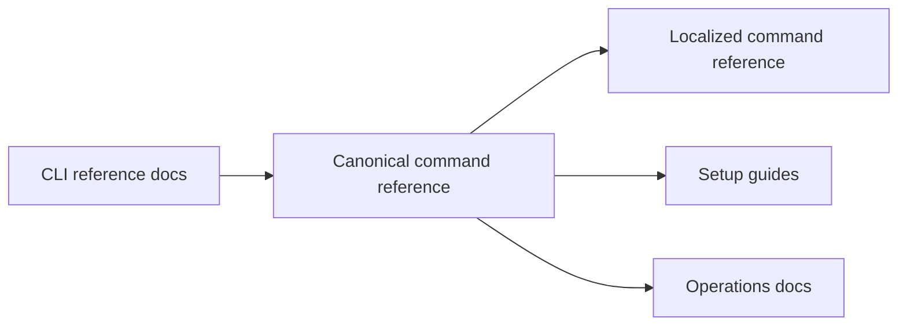

# Docs Reference CLI Context

## Local Purpose

This subtree is the command reference for the current CLI surface. It should let a reader answer "what command exists, what does it do, and what is it called right now" without interpretation.

## What Belongs Here

- command-level reference for the current CLI;
- localized command-reference variants that mirror the implemented command surface.

## File Map

- `commands-reference.md` - canonical command reference
- `commands-reference.vi.md` - localized command reference variant

## Routing Diagram

## Routing

- exact CLI commands and subcommands belong here
- setup and install steps belong in `docs/setup-guides/`
- runbooks that use commands in operational context belong in `docs/ops/`

## References

- `docs/reference/CONTEXT.md` - reference-tree guidance
- `.agents/skills/zeroclaw/references/cli-reference.md` - inherited CLI support reference used elsewhere in the repo

## Current Inherited State

The CLI is still exposed through inherited `zeroclaw` command naming and related behavior. This subtree is correct when it documents those names plainly rather than rebranding them early.

## GraphClaw Migration Relationship

CLI reference can mention that the repo is in transition, but it must not rewrite command text until the executable surface actually changes. Identity migration follows implementation, not the other way around.

## Cautions

- command spelling and invocation examples must stay exact
- do not substitute GraphClaw naming for live `zeroclaw` commands
- keep localized variants consistent with canonical command truth

## Agent Workflow

1. Confirm the command exists and the current name is correct.
2. Update the canonical reference first when command behavior changes.
3. Preserve inherited names until the binary and help surfaces change.
4. Route tutorial-style prose out to setup or ops docs when needed.
