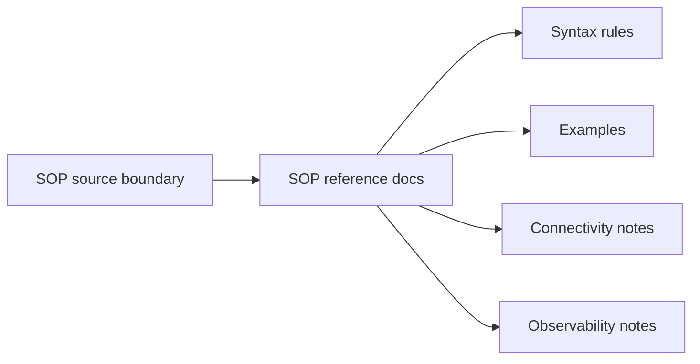

# Docs Reference SOP Context

## Local Purpose

This subtree documents the current SOP subsystem: its syntax, connectivity and observability behavior, and practical reference material for the engine as implemented today.

## What Belongs Here

- exact SOP syntax and subsystem reference;
- cookbook-style examples that remain grounded in current behavior;
- supporting notes for connectivity and observability within the SOP subsystem.

## What Does Not Belong Here

- generic operations guidance unrelated to SOP;
- future GraphClaw context-policy claims presented as implemented SOP behavior;
- contributor process documentation.

## File Map

- `README.md` - SOP reference entrypoint
- `syntax.md` - syntax and authoring rules
- `cookbook.md` - practical SOP examples
- `connectivity.md` - connectivity-related subsystem notes
- `observability.md` - visibility and observability notes

## Routing Diagram

## Routing

- SOP syntax and behavior belong here
- general CLI or API reference belongs in sibling reference subtrees
- broader architecture or migration narrative belongs in higher-level docs, not in subsystem reference

## References

- `docs/reference/CONTEXT.md` - parent reference guidance
- `src/sop/CONTEXT.md` - source-side SOP boundary

## Current Inherited State

This subtree documents a distinct inherited subsystem that remains part of the repository's live surface. It may intersect with future GraphClaw context-engine work, but those future relationships are not the current reference truth.

## GraphClaw Migration Relationship

SOP docs can acknowledge that the repo is evolving, yet they must remain anchored to present engine behavior. Do not project future context-engine capabilities onto the existing SOP subsystem.

## Cautions

- keep examples tied to behavior that exists today
- do not let migration narrative blur subsystem semantics
- preserve inherited terminology when it is still the implemented contract

## Agent Workflow

1. Verify the SOP fact against the current subsystem behavior or authoritative docs.
2. Update the specific owning page such as `syntax.md` or `observability.md`.
3. Distinguish current SOP behavior from future GraphClaw aspirations.
4. Keep the subtree reference-oriented rather than narrative-heavy.
