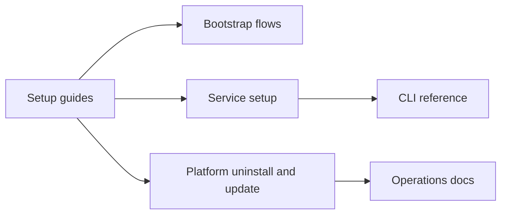

# Docs Setup Guides Context

## Local Purpose

This subtree holds installation and service-specific setup instructions. It is where readers should find step-by-step guidance that must work against the current repository, tooling, and inherited runtime surfaces.

## What Belongs Here

- executable setup instructions for services, platforms, and bootstrap flows;
- install and uninstall guidance;
- localized setup variants where the file structure already includes them.

## What Does Not Belong Here

- broad operations runbooks that assume a deployed system;
- exact CLI reference tables;
- future-state naming or setup flows that do not exist yet.

## File Map

- `README.md` - setup-guides entrypoint
- `one-click-bootstrap.md` and `one-click-bootstrap.vi.md` - bootstrap flows
- `mattermost-setup.md` - Mattermost setup
- `zai-glm-setup.md` - ZAI GLM setup
- `nextcloud-talk-setup.md` - Nextcloud Talk setup
- `macos-update-uninstall.md` - macOS update and uninstall guidance
- `README.vi.md` - localized setup landing page

## Routing Diagram

## Routing

- service and platform setup steps go here
- operator troubleshooting belongs in `docs/ops/`
- exact command reference belongs in `docs/reference/cli/`
- integration security caveats may need cross-reference from `docs/security/`

## References

- `docs/CONTEXT.md` - docs-tree routing
- `docs/ops/CONTEXT.md` - operations boundary
- `docs/reference/cli/CONTEXT.md` - command reference boundary

## Current Inherited State

These guides target the inherited runtime and its current commands, services, and bootstrap assumptions. Many instructions will still mention `zeroclaw`-named commands or related surfaces because that is the implemented reality today.

## GraphClaw Migration Relationship

Setup guidance should follow concrete product changes, not lead them. GraphClaw framing may explain why the repo is evolving, but setup steps must remain executable against the present implementation.

## Cautions

- every step should be runnable today
- do not replace inherited command names with future branding
- keep setup docs distinct from post-install operations guidance

## Agent Workflow

1. Confirm the target document is a setup flow rather than an operations or reference page.
2. Verify command names, filenames, and service identifiers before editing steps.
3. Preserve inherited terminology where it matches the current tooling surface.
4. Prefer correcting the smallest broken sequence rather than rewriting whole guides.
