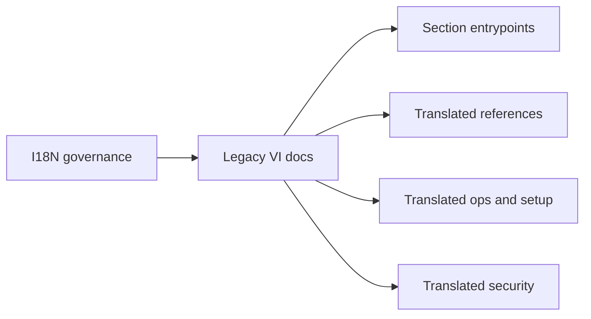

# Docs VI Context

## Local Purpose

This subtree is an inherited Vietnamese documentation tree retained from the baseline. It contains broad translated documentation across contributor, security, operations, setup, hardware, and reference topics outside the newer `docs/i18n/` organization.

## What Belongs Here

- inherited Vietnamese translated documentation and section landing pages;
- broad language-specific navigation retained for continuity;
- parity or cleanup work explicitly scoped to the legacy Vietnamese tree.

## What Does Not Belong Here

- casual repo-wide cleanup that removes or rewrites this subtree by default;
- English-source documentation ownership;
- migration claims that are not reflected in source docs or implementation.

## File Map

- `README.md` - inherited Vietnamese docs entrypoint
- `contributing/`, `hardware/`, `operations/`, `project/`, `reference/`, `security/`, `getting-started/` - Vietnamese section entrypoints
- `commands-reference.md`, `config-reference.md`, `providers-reference.md`, `channels-reference.md` - translated reference pages
- `operations-runbook.md`, `troubleshooting.md`, `resource-limits.md`, `proxy-agent-playbook.md` - translated ops pages
- `one-click-bootstrap.md`, `mattermost-setup.md`, `zai-glm-setup.md` - translated setup pages
- `sandboxing.md`, `audit-logging.md`, `security-roadmap.md` - translated security pages

## Routing Diagram

## Routing

- legacy Vietnamese tree work belongs here
- i18n-governance or structured translation work may belong in `docs/i18n/vi/`
- source English docs changes should usually happen outside this subtree first

## References

- `docs/CONTEXT.md` - top-level docs routing
- `docs/i18n/CONTEXT.md` - localization governance
- `docs/i18n/vi/CONTEXT.md` - related Vietnamese localization subtree

## Current Inherited State

This subtree overlaps with `docs/i18n/vi/` and exists because the repository still retains inherited translation infrastructure from the baseline. It should be treated as active documentation inventory, not as disposable residue.

## GraphClaw Migration Relationship

GraphClaw migration may eventually rationalize translation structure, but this subtree should not be rewritten as if that consolidation has already happened. Keep inherited `zeroclaw` terminology where it still matches real commands or interfaces.

## Cautions

- do not assume this subtree can be deleted or merged without an explicit task
- avoid inventing parity guarantees across both Vietnamese trees
- prefer truthful local framing over large structural claims

## Agent Workflow

1. Confirm the task explicitly targets the legacy Vietnamese subtree.
2. Check whether the same material also exists under `docs/i18n/vi/`.
3. Preserve technical names that remain current implementation detail.
4. Make scoped edits and avoid broad restructuring unless directly requested.
