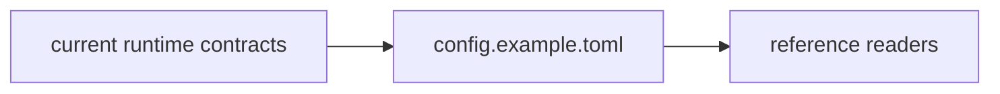

# Examples Context

## Scope

Reference examples that explain current configuration or usage patterns.

## File Map

- `config.example.toml` - example runtime configuration

## Routing

This subtree is reference-only: files here should point readers toward current configuration shapes without becoming a second source of truth for implementation details.

## Example Usage Path

## Current State

Examples still reflect inherited `zeroclaw` behavior and naming where the runtime does.

## GraphClaw Relevance

Examples are part of migration framing because they show what users can really do today; they should not imply that GraphClaw renaming or architecture changes have already landed.

## Cautions

- Keep examples minimal and runnable.
- Avoid speculative future configuration snippets.

## Agent Guidance

- Update examples only when the real baseline changes.
- Keep this directory aligned with current docs and runtime contracts, not future aspirations.
