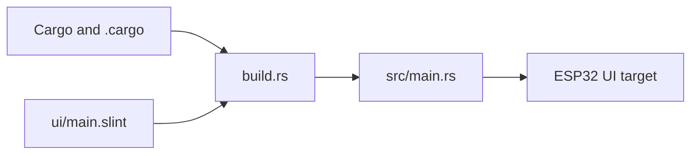

# ESP32 UI Firmware Context

## Scope

ESP32 firmware with an embedded UI layer built from Rust and Slint assets.

## File Map

- `Cargo.toml` - crate metadata
- `src/main.rs` - firmware entrypoint
- `ui/main.slint` - embedded UI definition
- `build.rs` - build-time asset integration
- `.cargo/config.toml`, `README.md` - toolchain and setup references

## Routing

Cargo and the local `.cargo` config drive the build, `build.rs` prepares assets, `src/main.rs` boots the firmware, and `ui/main.slint` defines the embedded interface.

## Current State

This subtree combines firmware and UI assets in one board-local workspace.

## GraphClaw Relevance

It is relevant as an inherited edge surface, not as a central expression of GraphClaw's context-engine direction.

## Cautions

- Keep embedded UI assumptions local to this directory.
- Do not mix desktop/web UI patterns into this hardware-specific stack.

## Agent Guidance

- Treat UI assets and firmware logic as one board-specific system.
- Update the local docs when build or asset routing changes.
