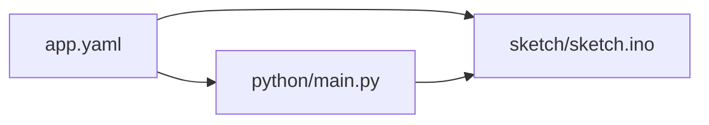

# UNO Q Bridge Context

## Scope

Hybrid bridge workflow for Arduino Uno Q support, combining deployment metadata, a sketch, and Python helper code.

## File Map

- `app.yaml` - top-level app/deployment metadata
- `python/main.py`, `python/requirements.txt` - helper-side runtime
- `sketch/sketch.ino`, `sketch/sketch.yaml` - board sketch and sketch metadata

## Routing

This directory splits by role: deployment metadata at the root, helper execution in `python/`, and board behavior in `sketch/`.

## Current State

The subtree is retained from the inherited baseline and intentionally spans more than one language/runtime.

## GraphClaw Relevance

It is a good example of why GraphClaw migration should not trigger blanket renames: hardware bridge workflows often depend on stable inherited filenames and assumptions.

## Cautions

- Keep Python helper logic, sketch logic, and deployment metadata clearly separated.
- Do not flatten this subtree into a single workflow unless a dedicated hardware task requires it.

## Agent Guidance

- Edit only the layer that the task actually targets.
- When documentation changes, state which part of the bridge flow a file belongs to so future agents do not cross the boundaries by accident.
