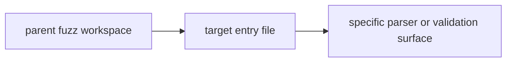

# Fuzz Targets Context

## Scope

Focused fuzz entrypoints for individual high-risk input surfaces.

## File Map

- `fuzz_config_parse.rs` - configuration parsing
- `fuzz_tool_params.rs` - tool parameter handling
- `fuzz_webhook_payload.rs` - webhook payload intake
- `fuzz_command_validation.rs` - command validation path
- `fuzz_provider_response.rs` - provider-response handling

## Routing

Each file is one targeted fuzz entrypoint invoked through the parent fuzz workspace rather than through the normal test tree.

## Target Invocation

## Current State

Targets cover a handful of inherited input surfaces and remain deliberately specific.

## GraphClaw Relevance

These entrypoints provide a safety net while migration work changes context and documentation around the runtime; they help ensure untrusted input handling does not regress.

## Cautions

- Add targets for concrete risk surfaces, not as generic completeness work.
- Keep each target scoped tightly enough that crashes still point to one boundary.

## Agent Guidance

- Map a target to a specific parser or validation boundary before creating it.
- If a new surface needs fuzzing, say why existing targets do not already cover it.
