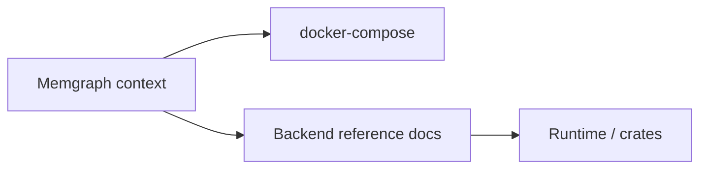

# Memgraph Context

## Local Purpose

This subtree runs the Memgraph graph database and Memgraph Lab as part of the GraphClaw ecosystem. It provides the reference graph backend for development, tests, and future adapter work. It does not implement the GraphClaw concept model; that lives in the architecture docs and runtime. Here we only operate the backend stack.

## What Belongs Here

- Docker Compose definition for Memgraph and Memgraph Lab;
- Memgraph configuration and init scripts (e.g. admin user, bootstrap Cypher);
- environment files for Memgraph and Lab (`.memgraph.env`, `.memlab.env`);
- local operational notes and routing to backend reference docs.

## What Does Not Belong Here

- GraphClaw concept definitions (those live in `docs/architecture/`);
- adapter or runtime code that talks to Memgraph (that lives in `src/`, `crates/`, or `python/`);
- redefinition of View, GraphSet, ContextPack, or other stable vocabulary.

## Key Files

| File or path | Role |
| --- | --- |
| `docker-compose.yml` | Memgraph (Bolt 7687, logs 7444) and Memgraph Lab (UI 9001) services |
| `.memgraph.env` | Memgraph auth and config (user, password, flags) |
| `.memlab.env` | Memgraph Lab connection and UI config |
| `memgraph.conf` | Optional Memgraph server config (currently not mounted) |
| `init-admin.cypherl` | Bootstrap Cypher run at startup (e.g. create admin user) |
| `seed-playground-demo.cypherl` | Optional demo seed for GraphClaw playground (run manually in Lab) |

## Backend Reference

For how Memgraph maps to GraphClaw concepts (View, GraphSet, SessionWindow, ContextPack, etc.) and for capability tiers and adapter guidance, read:

- [`docs/backends/README.md`](../docs/backends/README.md)
- [`docs/backends/memgraph.md`](../docs/backends/memgraph.md)

## Running Memgraph

From the **repository root** use the Makefile:

- `make memgraph-up` — start Memgraph and Memgraph Lab
- `make memgraph-down` — stop services
- `make memgraph-logs` — follow logs
- `make memgraph-shell` — open an `mgconsole` shell in the Memgraph container (if available) or exec into the container

From the **memgraph directory** you can run Docker Compose directly:

- `docker compose up -d`
- `docker compose down`
- `docker compose logs -f`

## Ports and Services

- **7687** — Bolt protocol (Cypher, drivers)
- **7444** — Logs streaming (Memgraph Lab)
- **9001** — Memgraph Lab web UI (mapped from container 3000)

Containers are named `graphclaw-memgraph` and `graphclaw-memgraph-lab` for clarity in the GraphClaw ecosystem.

## Routing Diagram

## Task Routing

| Task | Read or use next |
| --- | --- |
| start/stop/logs Memgraph | Makefile targets from repo root, or `docker compose` in this directory |
| GraphClaw concepts and Memgraph capability mapping | `docs/backends/README.md`, `docs/backends/memgraph.md` |
| changing Compose or env files | this file, then edit; keep `.memgraph.env` and `.memlab.env` out of version control if they contain secrets |
| building adapters or runtime integration | `src/CONTEXT.md`, `crates/CONTEXT.md`, `docs/backends/memgraph.md` |

## Cautions

- Do not commit real credentials. Use `.memgraph.env` and `.memlab.env` for local overrides and ensure they are listed in `.gitignore` if they contain secrets.
- Memgraph is the reference graph backend for GraphClaw; the current runtime may not yet use it for all context-resolution paths. See `docs/backends/memgraph.md` for the relationship to the current implementation.

## Agent Workflow

1. Read this file before changing anything under `memgraph/`.
2. For concept or capability questions, read `docs/backends/memgraph.md`.
3. For Makefile or repo-wide integration, ensure root `CONTEXT.md` and `Makefile` stay aligned with the Memgraph targets and routing.
