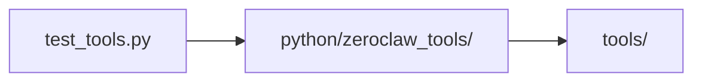

# Python Tests Context

## Scope

Python-side validation for the companion package.

## File Map

- `test_tools.py` - current automated coverage for Python tool behavior

## Routing

Tests in this directory exercise `python/zeroclaw_tools/` without owning package logic themselves.

## Coverage Map

## Current State

Coverage is intentionally small and focused on the inherited Python tool surface.

## GraphClaw Relevance

This directory matters for migration discipline because Python compatibility should stay verified while GraphClaw evolves elsewhere in the repo.

## Cautions

- Keep tests aligned with the current `zeroclaw_tools` API instead of speculative future names.
- Do not add product behavior here unless the Python package actually changed.

## Agent Guidance

- For behavioral Python changes, update or add tests here first.
- For documentation-only work, audit clarity and references instead of inventing new test cases.
