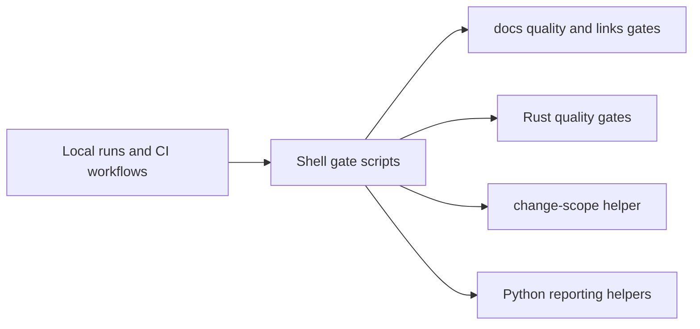

# CI Scripts Context

## Scope

Validation gates and CI support utilities used locally and in automation.

## File Map

- `docs_quality_gate.sh`, `docs_links_gate.sh`, `docs_canonical_concepts_gate.sh` - documentation validation entrypoints
- `rust_quality_gate.sh`, `rust_strict_delta_gate.sh` - Rust quality enforcement
- `check_binary_size.sh` - binary-size guard
- `detect_change_scope.sh` - change-scope routing helper
- `collect_changed_links.py`, `fetch_actions_data.py` - CI reporting/data helpers

## Routing

CI callers enter through shell gate scripts first; smaller Python helpers support reporting or data collection behind those checks.

## Interaction Map

## Current State

This is the main validation surface for doc-only cleanup and the most policy-sensitive script subtree in the repo.

## GraphClaw Relevance

These scripts keep GraphClaw migration work honest by enforcing inherited quality bars and documentation truthfulness during the transition.

## Cautions

- Change gates only when the validation policy truly changes.
- Keep failure modes explicit and auditable; opaque CI logic slows down migration work.

## Agent Guidance

- For documentation-only tasks, this subtree is the primary validation reference.
- If you alter a gate, describe the policy change locally so future agents can see why the enforcement moved.
