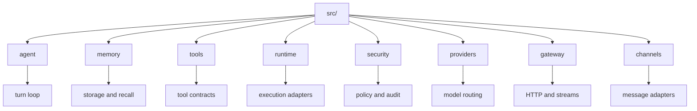
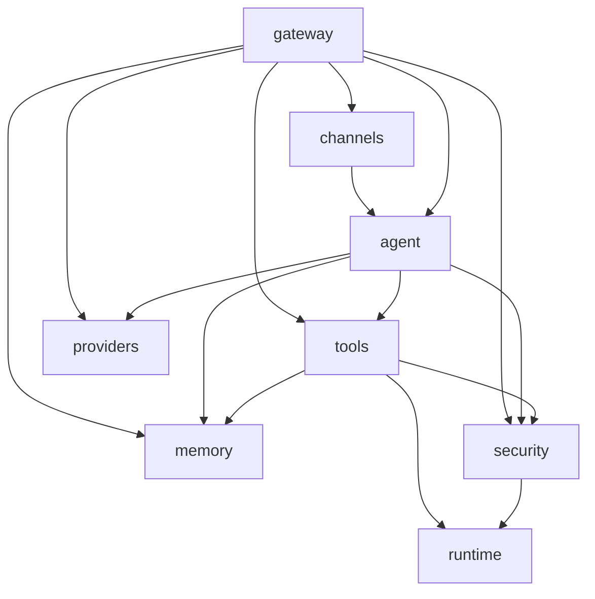
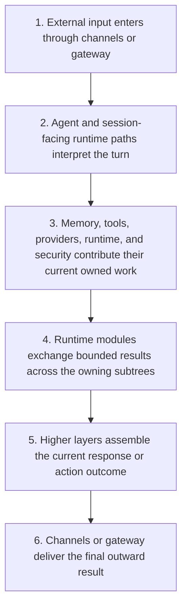

# Src Context

## Local Purpose

This is the main Rust runtime tree for GraphClaw. It still runs through inherited `zeroclaw` modules, commands, and config surfaces while the repository is being reshaped incrementally.

This subtree is where most future GraphClaw runtime seams will eventually land, but it is not yet a standalone graph-native context-engine tree. The modules here are current runtime owners and likely future seam consumers, not the Graph Engine itself.

## What Belongs Here

- inherited runtime behavior and subsystem boundaries;
- migration seams for future `SessionWindow`, `GraphSet`, packable-subgraph, `ContextPack`, `ResolutionTrace`, package/import artifacts, and graph-facing interfaces;
- source-adjacent `*.map.json` graph slices that document likely runtime seams, artifact flows, and technical-map pictures for `src/`;
- source-adjacent documentation that explains which subsystem owns which runtime concern.

## What Does Not Belong Here

- docs that present the target Graph Context Engine as already implemented here;
- backend reference catalogs that belong in `docs/backends/`;
- conceptual definitions that should stay stable in `docs/architecture/`.

## File / Folder Map

- `src/lib.rs` - library module graph and shared command enums
- `src/main.rs` - CLI entrypoint and top-level command dispatch
- `src/agent/` - interactive agent loop, prompt assembly, dispatch, memory loading
- `src/tools/` - built-in tool implementations and tool contracts
- `src/providers/`, `src/channels/`, `src/gateway/` - external model, messaging, and HTTP boundaries
- `src/memory/`, `src/runtime/`, `src/security/` - core execution, storage, and safety seams
- `src/agent-package-import-binding.map.json` - graph slice for portable package, import strategy, local binding, and `SessionWindow` attachment
- `src/**/*.map.json` - granular graph-map slices for technical mapping of runtime seams and future GraphClaw artifacts

## Go Here For

- Agent loop or prompt behavior: `src/agent/`
- Built-in tool behavior: `src/tools/`
- Provider adapters and routing: `src/providers/`
- Gateway, SSE, or WebSocket work: `src/gateway/`
- Memory backends and recall flow: `src/memory/`
- Runtime sandbox or execution adapters: `src/runtime/` and `src/security/`
- Source-adjacent technical-map slices for runtime seams: the nearest `*.map.json` in the owning subsystem
- Portable package/import/binding mapping for runtime-local activation: `src/agent-package-import-binding.map.json`
- GraphClaw concept definitions: `docs/architecture/`
- transition seams and interface families: `docs/architecture/zero-to-graphclaw-transition.md`, `docs/architecture/future-integration-seams.md`
- backend integration framing: `docs/backends/`

## Current State

The tree is broad, operational, and production-facing. Most modules are inherited from the ZeroClaw baseline, and the GraphClaw migration in this area is mainly about clearer seams, safer boundaries, and better context for future changes.

There is no dedicated `src/context_engine/`, `src/graph/`, or `src/memgraph/` subtree yet. Until such seams exist, documents in `src/` should describe current owners precisely instead of implying a consolidated GraphClaw runtime layer.

## Routing

- turn assembly and orchestration concerns belong in `src/agent/`
- persistence and recall concerns belong in `src/memory/`
- capability exposure belongs in `src/tools/`
- execution environment concerns belong in `src/runtime/`
- gateway and external session boundaries belong in `src/gateway/`

## Diagram Reading Guide

Use Mermaid diagrams in this subtree as compact current-state maps:

- node IDs stay short and machine-safe; labels name the owning file or module;
- solid arrows show current runtime call, dependency, or wiring direction at a documentation level;
- future seams stay in prose unless they are labeled explicitly as future work.

## Mermaid Maps

### Local Capacity Map

### Current Interaction Map

### Sequential Runtime Articulation Map

## GraphClaw Evolution Note

Do not describe this tree as if a graph-native context engine already exists here. Treat the current runtime as the baseline that future graph-oriented work will integrate with, not replace in one sweep.

The likely migration seams inside `src/` are:

1. turn assembly and prompt/context composition around `src/agent/`
2. memory and retrieval boundaries in `src/memory/`
3. tool exposure and action surfaces in `src/tools/`
4. runtime execution and sandbox boundaries in `src/runtime/` and `src/security/`
5. gateway/session-facing orchestration in `src/gateway/`, `src/service/`, and related modules
6. package/import/binding activation seams that later connect portable agent definitions to local runtime instances

Source-adjacent graph maps in `*.map.json` files should be used to document those seams granularity-first: each map should visualize one bounded responsibility, stay tied to a concrete code area, and avoid pretending the target GraphClaw runtime already exists.

When a seam is cross-cutting rather than owned by one subsystem, place the map at the highest `src/` level that still keeps its file origins explicit, as with `src/agent-package-import-binding.map.json`.

That means the first GraphClaw runtime work should usually add interfaces and explicit artifacts at those seams, not rename the tree or move everything into a new top-level module prematurely.

The key documentation discipline is that these areas should often consume future interfaces rather than all define them locally. Keep the artifact meanings stable in `docs/architecture/`, then map likely consumers in source-adjacent docs rather than collapsing them into a premature Graph Engine implementation claim.

## References

- `README.md` - repo identity and migration framing
- `docs/architecture/graph-context-engine.md` - stable GraphClaw concept model
- `docs/architecture/glossary.md` - shared vocabulary for runtime docs
- local subsystem `CONTEXT.md` files - owning boundaries for each runtime area

## Constraints / Cautions

- Do not mass-rename `zeroclaw` identifiers without an explicit migration task.
- Many modules are user-facing or protocol-facing; compatibility matters.
- Documentation should distinguish current behavior from target architecture.
- `memory`, `context`, `runtime`, and `tooling` are related but must not be collapsed into one catch-all description.

## How Agents Should Work Here

Read the nearest subsystem `CONTEXT.md` before editing. Keep changes narrow, identify the real boundary you are touching, and update local context docs when a directory's responsibilities or navigation materially change.
