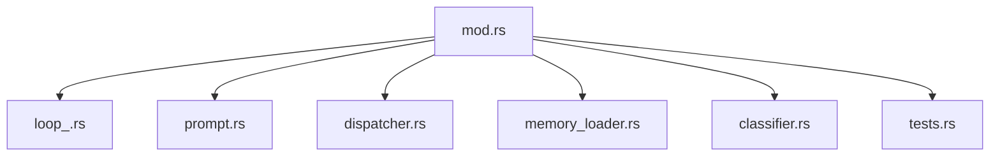
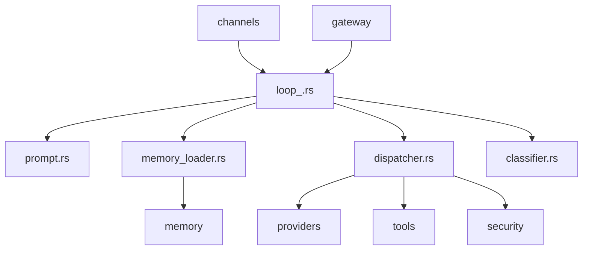
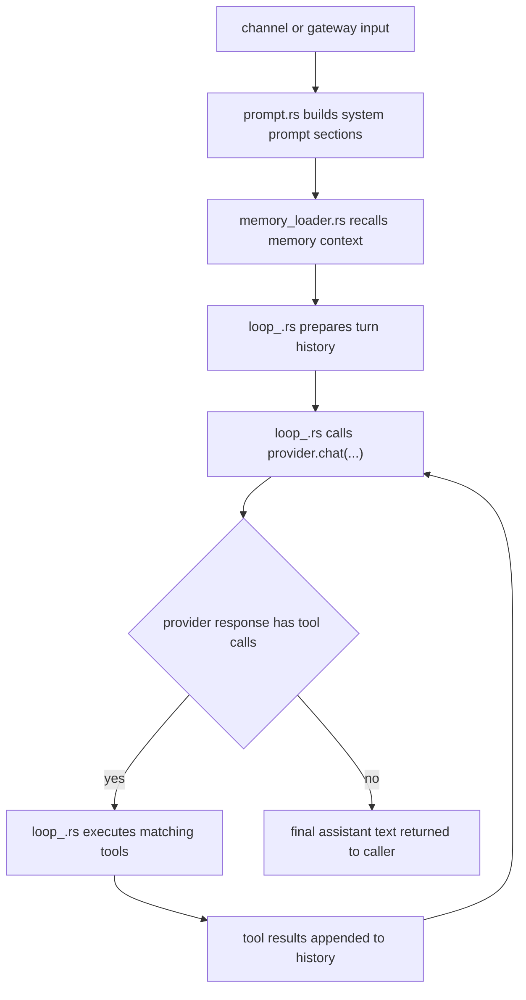

# Agent Context

## Local Purpose

`src/agent/` holds the core chat-loop machinery: prompt assembly, dispatch, classification, and loading memory into each run.

This subtree owns the current agent loop. It sits adjacent to the future Graph Engine seam, but it does not yet own a standalone Graph Context Engine, even though several of its files are likely insertion points for future context-resolution artifacts.

## What Belongs Here

- turn orchestration and dispatch behavior;
- prompt assembly and run preparation;
- source-adjacent `*.map.json` slices for turn coordination, context exploration, and orchestration seams;
- session-adjacent runtime flow for current agent execution.

## File / Folder Map

- `src/agent/mod.rs` - module entry and public surface
- `src/agent/loop_.rs` - main agent loop orchestration
- `src/agent/prompt.rs` - prompt construction and formatting
- `src/agent/dispatcher.rs` - model/tool dispatch path
- `src/agent/memory_loader.rs` - memory retrieval injected into runs
- `src/agent/classifier.rs` - request classification helpers
- `src/agent/turn-strategy-resolution.map.json` - graph slice for intent derivation, capability scoping, and strategy resolution
- `src/agent/context-exploration-edits.map.json` - graph slice for bounded exploration and explicit context edits
- `src/agent/orchestration-subagents.map.json` - graph slice for modular orchestration and sub-agent execution
- `src/agent/tests.rs` - focused tests for this subsystem

## Go Here For

- Prompt wording or prompt structure: `src/agent/prompt.rs`
- Turn loop behavior: `src/agent/loop_.rs`
- Dispatch decisions: `src/agent/dispatcher.rs`
- Memory hydration before inference: `src/agent/memory_loader.rs`
- Technical-map slices for this seam family: the local `*.map.json` files

## Current State

This is still the inherited agent runtime path. It is one of the most likely future insertion points for richer GraphClaw context resolution, but the area today is still prompt-and-dispatch centric.

The important documentary rule here is that the agent loop and the future Graph Engine are adjacent concerns, not identical ones.

Current process ownership in this subtree is roughly:

- `prompt.rs`: provider-visible prompt construction;
- `memory_loader.rs`: pre-inference memory hydration;
- `loop_.rs`: turn orchestration and execution flow;
- `dispatcher.rs`: dispatch and tool/provider result handling.

## Mermaid Maps

### Local Capacity Map

## Current Dependency Direction

- Usually entered from `src/main.rs` command paths, channel routing in `src/channels/`, and gateway-driven runs in `src/gateway/`.
- Calls outward into `src/providers/` for model inference, `src/tools/` for capability execution, `src/memory/` for recall and autosave, `src/security/` for policy checks, and `src/observability/` for trace/log emission.
- Uses `src/agent/prompt.rs` for system prompt assembly and `src/agent/memory_loader.rs` for pre-run context hydration.

### Current Interaction Map

### Current Sequential Turn Flow

## Routing

- changes to persistence, embeddings, or ranking logic belong in `src/memory/`
- changes to tool contracts belong in `src/tools/`
- changes to execution adapters belong in `src/runtime/`
- changes to stable context concepts belong in `docs/architecture/`

## GraphClaw Evolution Note

Do not document this folder as if GraphClaw already has a graph-native runtime planner here. Any future graph-aware work must layer onto the existing loop carefully.

## Likely Migration Seams

1. `src/agent/prompt.rs` is the clearest seam for separating static system prompt sections from future dynamic context-pack overlays.
2. `src/agent/memory_loader.rs` is the seam where flat recall can eventually give way to richer context selection and graph-backed evidence assembly.
3. `src/agent/loop_.rs` is the seam for introducing explicit turn artifacts such as `SessionWindow`, `ContextPack`, and `ResolutionTrace` records without rewriting the whole loop at once.
4. `src/agent/dispatcher.rs` is where tool-call planning and provider response handling may later consume a selected `ContextPack` and emit information that contributes to a `ResolutionTrace`, instead of only prompt text.

Likely future artifacts consumed or emitted here include:

- consumed: `View` decisions, packable-subgraph decisions, and final `ContextPack`;
- emitted or forwarded: turn-scoped `ResolutionTrace` data and inputs to future `ContextMutationProposal` handling.

Future GraphClaw framing in this subtree should preserve these distinctions:

- `ThinkingContext` is not the same thing as provider-visible prompt text;
- `ContextPack` is not the same thing as the whole turn loop;
- the agent loop may consume a `ContextPack` and related `ResolutionTrace` information without owning all Graph Engine policy itself.

What should not slide into this subtree during migration:

- canonical definitions of `View` or packability;
- the whole graph-backend model;
- a habit of treating every reflective context step as merely more prompt assembly.

This subtree should more often consume future context interfaces than define their full semantics.

## What Must Stay Stable During Migration

- Multi-turn tool execution semantics in `loop_.rs`
- Current provider and tool dispatch contracts
- Existing progress streaming, compaction, and approval behavior unless migration work explicitly changes them
- User-visible behavior for current `zeroclaw` command paths until compatibility plans exist

## Constraints / Cautions

- Small changes can affect every user interaction.
- Prompt, dispatch, and memory loading are separate concerns; keep them separate.
- Preserve inherited `zeroclaw` names unless the task is explicitly a rename migration.
- Do not relabel current memory hydration as a completed `SessionWindow` implementation without explicit runtime support.
- Do not treat local `*.map.json` slices as proof that their pictured runtime objects already exist in code.

## References

- `src/CONTEXT.md` - parent runtime routing
- `src/memory/CONTEXT.md` - persistence and retrieval boundary
- `src/tools/CONTEXT.md` - tool exposure boundary
- `docs/architecture/concepts/graph-context-engine.md` - target context-resolution model
- `docs/architecture/concepts/glossary.md` - stable concept vocabulary

## How Agents Should Work Here

Read the exact file that owns the behavior before editing.

Recommended exploration order:

1. `src/agent/prompt.rs`
2. `src/agent/memory_loader.rs`
3. `src/agent/loop_.rs`
4. `src/agent/dispatcher.rs`

Prefer tests-first changes for runtime behavior, keep cross-module changes explicit, and document seams instead of smuggling new architecture into generic helpers.
