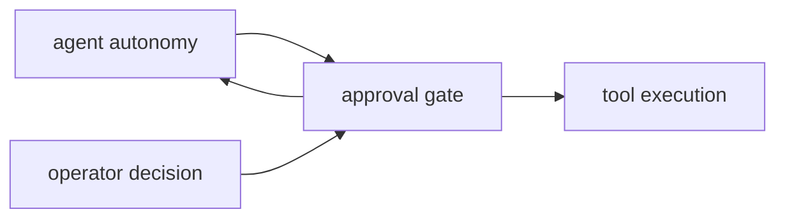

# Approval Context

## Purpose

`src/approval/` contains approval gating and operator-confirmation behavior that sits between autonomy and execution.

## File / Folder Map

- `src/approval/mod.rs` - approval models, decision flow, and public entrypoints

## Go Here For

- Approval mode changes: `src/approval/mod.rs`
- Confirmation flow or status representation: `src/approval/mod.rs`
- Coordination with tool execution: inspect callers in `src/tools/` and `src/agent/`

## Current State

This is a small subsystem with large behavioral impact. It is inherited runtime control logic, not a GraphClaw-specific policy engine.

## Interaction Sketch

Current responsibilities and main neighboring modules:

## GraphClaw Evolution Note

Future GraphClaw policy layers may consume or extend this seam, but they are not already implemented here.

## Constraints / Cautions

- Approval regressions directly affect user trust.
- Semantics must stay explicit; avoid hidden bypasses.
- Keep compatibility with existing autonomy and tooling expectations.

## How Agents Should Work Here

Treat edits as high-risk even if the file count is small. Read the whole module before changing it, add or update tests for behavior changes, and describe the user-visible approval consequence in your notes or commits.
