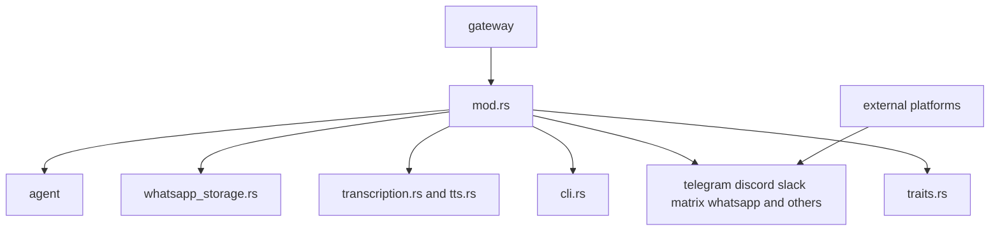
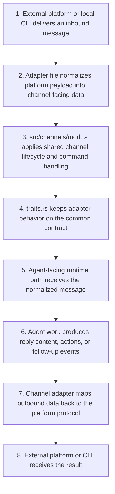

# Channels Context

## Purpose

`src/channels/` contains messaging-channel adapters and the runtime glue that lets the agent receive and send messages across external systems.

These modules are current runtime transport owners. They may later carry richer GraphClaw artifacts for upstream consumers, but they are not the Graph Engine itself.

## File / Folder Map

- `src/channels/mod.rs` - shared channel entrypoints and command handling
- `src/channels/traits.rs` - core channel contracts
- `src/channels/cli.rs` - local CLI channel behavior
- `src/channels/telegram.rs`, `discord.rs`, `slack.rs`, `matrix.rs`, `whatsapp.rs` - major channel adapters
- `src/channels/transcription.rs`, `tts.rs` - speech-related helpers
- `src/channels/whatsapp_storage.rs` - WhatsApp-specific storage support

## Go Here For

- Shared channel lifecycle or command handling: `src/channels/mod.rs`
- Channel interface changes: `src/channels/traits.rs`
- Provider-specific messaging bugs: the matching channel file
- Voice/transcription flow: `src/channels/transcription.rs` or `src/channels/tts.rs`

## Current State

This is a broad inherited integration surface with many operational edges. It is important for real deployments but is not the place to invent the future GraphClaw context engine.

## Mermaid Map

## Sequential Message Handling Path

## GraphClaw Evolution Note

GraphClaw may eventually route richer context through channels, but channel adapters today are still conventional transport integrations and likely future seam consumers rather than context owners.

## Constraints / Cautions

- Channel changes have high blast radius and often affect live operators.
- Each adapter has platform-specific assumptions and rate-limit behavior.
- Keep transport concerns separate from agent-core redesign work.

## How Agents Should Work Here

Read `src/channels/mod.rs`, `src/channels/traits.rs`, and the specific adapter you are changing. Keep fixes adapter-local when possible, avoid cross-channel rewrites, and document any user-visible protocol or config impact clearly.
