# Config Context

## Purpose

`src/config/` defines runtime configuration schema, loading behavior, validation, and config-facing traits.

## File / Folder Map

- `src/config/mod.rs` - config loading and module entrypoints
- `src/config/schema.rs` - schema definitions and validation helpers
- `src/config/traits.rs` - config-related traits and abstractions

## Go Here For

- New config keys or shape changes: `src/config/schema.rs`
- Load/init behavior: `src/config/mod.rs`
- Shared config contracts: `src/config/traits.rs`

## Current State

This folder still encodes inherited runtime names, defaults, and path assumptions, including `zeroclaw`-era compatibility surfaces.

## Current Dependency Direction

- Loaded early from `src/config/mod.rs` and then consumed across nearly every subsystem.
- `src/config/schema.rs` is the main compatibility surface for providers, channels, memory, security, gateway, runtime, scheduler, and agent behavior.
- Renames or structural changes here propagate into CLI flows, daemon startup, docs, tests, and operator-owned config files.

## Interaction Sketch

Current responsibilities and main neighboring modules:

```mermaid
flowchart LR
    Inputs[config files and env] --> Config[config loading and schema]
    Onboard[onboard] --> Config
    Config --> Agent[agent]
    Config --> Gateway[gateway]
    Config --> Runtime[runtime]
    Config --> Cron[cron]
    Config --> Daemon[daemon and service]
```

## GraphClaw Evolution Note

Do not present config as already migrated to GraphClaw-native naming. Any config rename needs an explicit compatibility and migration plan.

## Likely Migration Seams

1. Additive GraphClaw configuration should arrive as new sections or layered compatibility, not by replacing inherited sections in one step.
2. `src/config/schema.rs` is the seam for future graph-context settings, package import/export policy, or context-resolution options.
3. `src/config/mod.rs` is the seam for migration-time defaulting, compatibility shims, and config loading order when new GraphClaw features appear.

## What Must Stay Stable During Migration

- Existing config file paths, env-var overrides, and key names unless migration work explicitly includes compatibility handling
- Backward compatibility for current user installations
- Clear separation between new GraphClaw options and inherited `zeroclaw` compatibility surfaces

## Constraints / Cautions

- Config drift breaks CLI, daemon, gateway, and tests quickly.
- Backward compatibility matters for user files and environment overrides.
- Avoid casual renames of keys, sections, or config directories.

## How Agents Should Work Here

Treat schema changes as compatibility work. Update docs and callers together, prefer additive migration steps over replacement, and verify the affected command paths rather than assuming config changes are isolated.
