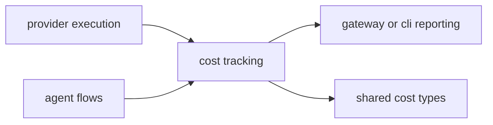

# Cost Context

## Local Purpose

`src/cost/` tracks usage accounting and cost-related types used by the runtime.

This subtree currently owns operational usage accounting. It may later inform GraphClaw context budgeting, but it does not yet define the budget semantics of the Graph Context Engine.

## What Belongs Here

- usage and accounting data types;
- runtime tracking logic for cost-related measurements;
- explicitly owned accounting rules.

## What Does Not Belong Here

- implicit context-packing policy;
- provider-specific billing logic scattered outside shared tracking;
- conceptual definitions for GraphClaw budget semantics that belong in `docs/architecture/`.

## File / Folder Map

- `src/cost/mod.rs` - module entry
- `src/cost/tracker.rs` - accounting logic and tracking flow
- `src/cost/types.rs` - shared cost data types

## Go Here For

- Usage accounting behavior: `src/cost/tracker.rs`
- Shared cost structs/enums: `src/cost/types.rs`

## Current State

This is a supporting inherited subsystem used by other runtime areas. It is operationally useful but not an architectural center of GraphClaw migration.

The main documentation distinction here is between current runtime accounting and future context-budget semantics. They are related, but they are not the same contract.

## Current Dependency Direction

- Used by provider execution paths to record usage and cost-related measurements.
- Reached indirectly from agent and gateway flows that surface or persist accounting outcomes.
- Adjacent to future GraphClaw budget semantics, but not currently the owner of `View` selection or `ContextPack` arbitration.

## Routing

- context-budget concepts belong in `docs/architecture/concepts/graph-context-engine.md`
- provider usage accounting belongs here
- changes to selection or packing logic belong in the future owning runtime seam, not automatically in this subtree

## Interaction Sketch

Current responsibilities and main neighboring modules:

## GraphClaw Evolution Note

Future graph-oriented planning may depend on better cost modeling, but that capability is not already implemented here.

Today, this area contributes operational measurements that can later inform budget policy, while remaining separate from the logic that decides what context is selected.

## Constraints / Cautions

- Silent accounting errors are hard to notice and hard to trust.
- Keep units and aggregation rules explicit.
- Avoid hiding billing logic inside unrelated provider code.
- Do not describe current usage accounting as a finished implementation of `ContextPack` budgeting.

## References

- `src/providers/CONTEXT.md` - main producer of usage measurements
- `src/gateway/CONTEXT.md` - external surface that may expose accounting results
- `docs/architecture/concepts/graph-context-engine.md` - target model for context cost and budget
- `docs/architecture/concepts/glossary.md` - stable terminology for `View`, `ContextPack`, and related budget concepts

## How Agents Should Work Here

Follow the data flow from producer to tracker before editing. Keep calculations obvious, add focused tests for changed accounting rules, and note any user-visible quota or budget impact.
