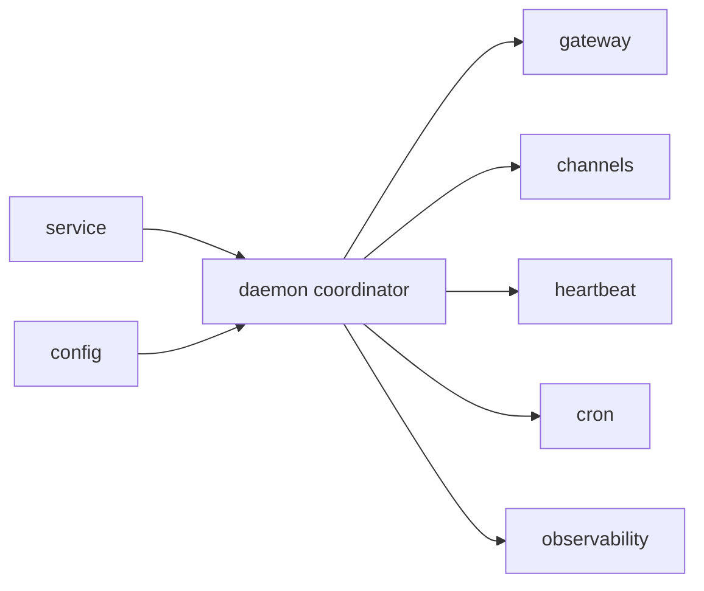

# Daemon Context

## Purpose

`src/daemon/` coordinates the long-running runtime that brings together gateway, channels, heartbeat, and scheduler behavior.

## File / Folder Map

- `src/daemon/mod.rs` - daemon startup and coordination logic

## Go Here For

- Long-running runtime boot flow: `src/daemon/mod.rs`
- Cross-subsystem startup ordering: `src/daemon/mod.rs`
- Service-facing runtime orchestration: inspect `src/service/` alongside this module

## Current State

The daemon is an inherited operational entrypoint that stitches existing subsystems together. It is central to deployment behavior even though the code footprint is small.

## Interaction Sketch

Current responsibilities and main neighboring modules:

## GraphClaw Evolution Note

Do not imply that the daemon already hosts a new graph-native engine. It currently runs inherited runtime pieces in one process.

## Constraints / Cautions

- Startup/shutdown ordering bugs can strand services or background tasks.
- Changes here often ripple into gateway, channels, cron, and heartbeat.
- Keep orchestration logic readable rather than clever.

## How Agents Should Work Here

Read the whole module and then inspect every subsystem it starts. Make coordination changes deliberately, verify affected runtime paths, and document any new lifecycle dependency.
