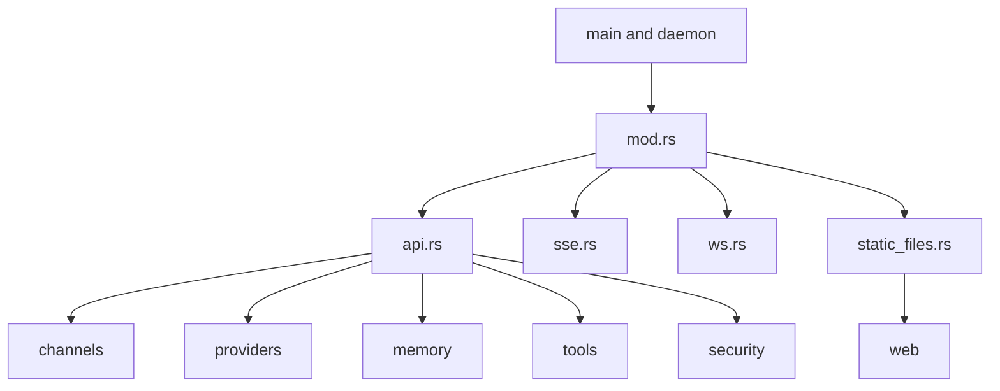
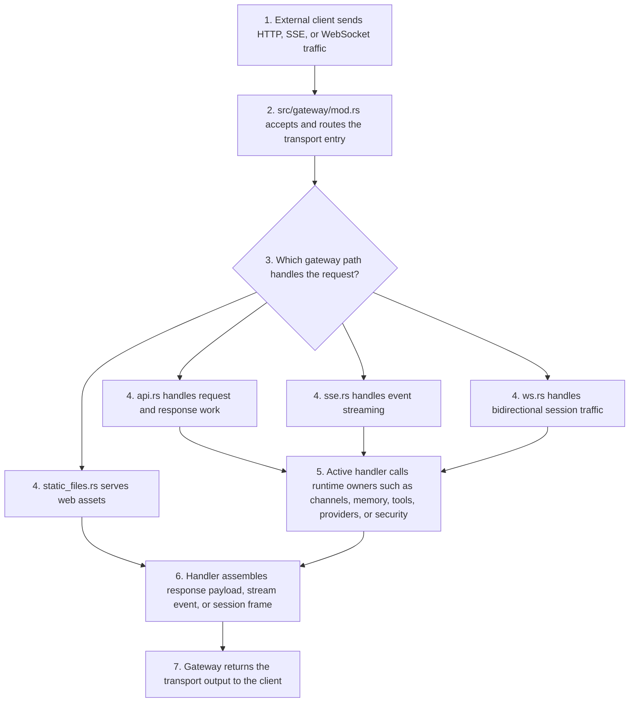

# Gateway Context

## Local Purpose

`src/gateway/` is the HTTP boundary for the runtime: REST-like endpoints, SSE, WebSocket handling, and static asset serving.

This subtree owns external transport contracts. It may later expose GraphClaw-facing session or context endpoints, but today it remains an inherited API boundary over the current runtime and a likely future seam consumer rather than the Graph Engine itself.

## What Belongs Here

- HTTP, SSE, and WebSocket transport behavior;
- request and response contract ownership;
- delivery of the current web-facing runtime surface.

## What Does Not Belong Here

- stable GraphClaw concept definitions that belong in `docs/architecture/`;
- internal context-resolution policy that belongs in the future owning runtime seam;
- web application implementation that belongs in `web/`.

## File / Folder Map

- `src/gateway/mod.rs` - gateway entry and shared glue
- `src/gateway/api.rs` - HTTP API handlers
- `src/gateway/sse.rs` - server-sent event streaming
- `src/gateway/ws.rs` - WebSocket handling
- `src/gateway/static_files.rs` - static file serving for the web surface

## Go Here For

- API request/response changes: `src/gateway/api.rs`
- Streaming event behavior: `src/gateway/sse.rs`
- WebSocket protocol behavior: `src/gateway/ws.rs`
- Web asset serving issues: `src/gateway/static_files.rs`

## Current State

This is a major inherited boundary between the runtime and external clients, including the web app and automation consumers.

It should be documented as a transport surface, not as proof that GraphClaw already has a public graph-native control plane or that transport owns Graph Engine semantics.

## Mermaid Map

## Current Dependency Direction

- Entered from runtime startup and command wiring in `src/main.rs` and daemon orchestration paths.
- Calls into channels, providers, memory, tools, security, and cost tracking from `src/gateway/mod.rs` and `src/gateway/api.rs`.
- Serves `web/` through `static_files.rs` and exposes streaming/session behavior through `sse.rs` and `ws.rs`.

## Sequential Request And Stream Path

## Routing

- transport contract changes belong here
- web UI behavior belongs in `web/`
- stable context-model questions belong in `docs/architecture/`
- runtime internals behind the transport belong in their owning `src/*` subtree

## GraphClaw Evolution Note

Do not document the gateway as exposing a finished graph-native control plane. It currently serves inherited runtime APIs and transport mechanisms while future Graph Engine artifacts would pass through it as consumers, not owners.

## Likely Migration Seams

1. `src/gateway/api.rs` is the seam for any future GraphClaw session, context, or package-management endpoints.
2. `src/gateway/sse.rs` and `src/gateway/ws.rs` are likely seams for streaming richer runtime artifacts such as `ResolutionTrace` records or `ContextPack` summaries.
3. `src/gateway/static_files.rs` is strictly a delivery seam for the current web app and should not absorb backend architecture logic.

## What Must Stay Stable During Migration

- Existing HTTP, SSE, and WebSocket contracts unless the migration task explicitly changes them
- Authentication, pairing, and rate-limiting behavior
- Compatibility with the current web dashboard and automation clients

## Constraints / Cautions

- Protocol changes are compatibility-sensitive.
- Gateway behavior affects clients, docs, and deployment setups.
- Authentication, pairing, and streaming semantics must stay explicit.

## References

- `src/CONTEXT.md` - parent runtime routing
- `web/CONTEXT.md` - UI boundary
- `docs/architecture/concepts/graph-context-engine.md` - target model for sessions, packs, and traces

## How Agents Should Work Here

Read the exact handler file plus `src/main.rs` or the caller path that wires it up. Treat API changes as contract changes, keep backward compatibility in mind, and document user-visible protocol shifts clearly.
