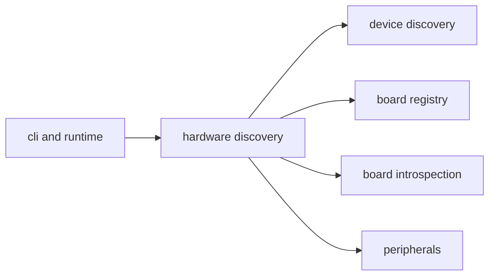

# Hardware Context

## Purpose

`src/hardware/` covers hardware discovery, board identification, and hardware metadata lookup used by the CLI and runtime.

## File / Folder Map

- `src/hardware/mod.rs` - command handling and module entry
- `src/hardware/discover.rs` - device discovery logic
- `src/hardware/introspect.rs` - board/device introspection
- `src/hardware/registry.rs` - known board registry and lookup data

## Go Here For

- USB or device discovery behavior: `src/hardware/discover.rs`
- Board introspection flow: `src/hardware/introspect.rs`
- Supported-board metadata: `src/hardware/registry.rs`

## Current State

This is inherited hardware support used to bridge the software runtime to physical boards and developer devices.

## Interaction Sketch

Current responsibilities and main neighboring modules:

## GraphClaw Evolution Note

GraphClaw may eventually attach richer context to hardware state, but this folder is currently about discovery and identification, not graph-native modeling.

## Constraints / Cautions

- Hardware assumptions are platform-specific and often environment-dependent.
- Discovery bugs are frustrating to reproduce remotely.
- Keep board metadata centralized instead of scattering constants elsewhere.

## How Agents Should Work Here

Identify whether the task is discovery, introspection, or registry data before editing. Keep platform-specific behavior local, avoid speculative abstraction, and verify any user-visible board support claim against the registry.
