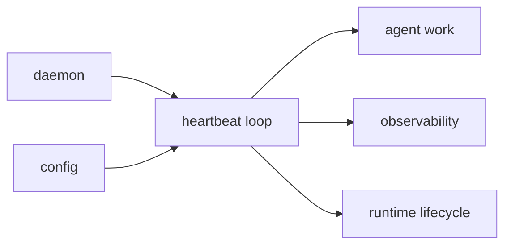

# Heartbeat Context

## Purpose

`src/heartbeat/` runs the background heartbeat loop and related lifecycle support.

## File / Folder Map

- `src/heartbeat/mod.rs` - module entry and public surface
- `src/heartbeat/engine.rs` - heartbeat scheduling and runtime behavior

## Go Here For

- Heartbeat cadence or loop logic: `src/heartbeat/engine.rs`
- Public wiring and exports: `src/heartbeat/mod.rs`

## Current State

This is inherited background-runtime infrastructure that keeps the system active and observable over time.

## Interaction Sketch

Current responsibilities and main neighboring modules:

## GraphClaw Evolution Note

Do not describe heartbeat as a graph-native orchestration engine. It is still a conventional background loop in the current runtime.

## Constraints / Cautions

- Hidden side effects are especially dangerous here.
- Timing changes can affect cost, load, and operator expectations.
- Keep the loop predictable and observable.

## How Agents Should Work Here

Inspect the engine and its callers together. Make cadence or lifecycle changes explicitly, avoid burying new work in periodic hooks, and verify any interaction with cron, daemon, or observability.
